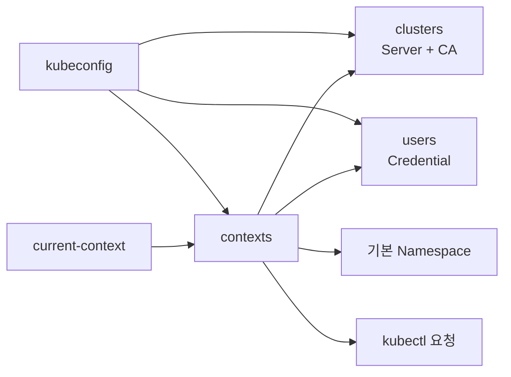

# 9. kubeconfig에 ServiceAccount 인증 정보 설정

ServiceAccount Token을 kubeconfig에 넣을 수 있지만 Token이 만료되면 kubeconfig도 사용할 수 없어진다. 이 방식은 짧은 진단 Session을 위한 예시이며 지속적인 사람·자동화 인증의 기본 방식이 아니다.

## kubeconfig 구조



### clusters

API Server 위치와 Server 인증서 검증 정보를 가진다.

```yaml
clusters:
  - name: study
    cluster:
      server: https://api.example.test:6443
      certificate-authority-data: <base64-encoded-ca>
```

### users

Client Credential 또는 Credential을 가져올 방법을 가진다.

```yaml
users:
  - name: temporary-pod-reader
    user:
      token: <short-lived-serviceaccount-token>
```

Token은 암호화되어 저장되지 않는다. kubeconfig File 자체를 Secret처럼 보호한다.

### contexts

Cluster, User와 기본 Namespace를 하나로 묶는다.

```yaml
contexts:
  - name: temporary-pod-reader@study
    context:
      cluster: study
      user: temporary-pod-reader
      namespace: apps
current-context: temporary-pod-reader@study
```

## 전체 kubeconfig 예시

```yaml
apiVersion: v1
kind: Config
clusters:
  - name: study
    cluster:
      server: https://api.example.test:6443
      certificate-authority-data: <base64-encoded-ca>
users:
  - name: temporary-pod-reader
    user:
      token: <short-lived-serviceaccount-token>
contexts:
  - name: temporary-pod-reader@study
    context:
      cluster: study
      user: temporary-pod-reader
      namespace: apps
current-context: temporary-pod-reader@study
```

Placeholder에 실제 Credential을 넣은 파일은 Git, Chat과 Wiki에 저장하지 않는다.

## 임시 kubeconfig 만들기

먼저 권한이 제한된 임시 File을 만든다.

```bash
AUTH_KUBECONFIG=$(mktemp)
chmod 600 "${AUTH_KUBECONFIG}"
```

현재 Context의 API Server와 CA를 준비한다.

```bash
SERVER=$(kubectl config view --minify \
  -o jsonpath='{.clusters[0].cluster.server}')

kubectl config view --raw --minify --flatten \
  -o jsonpath='{.clusters[0].cluster.certificate-authority-data}' \
  | openssl base64 -d -A > /tmp/study-kube-ca.crt
chmod 600 /tmp/study-kube-ca.crt
```

짧은 ServiceAccount Token을 발급한다.

```bash
TOKEN=$(kubectl create token pod-reader \
  --namespace apps \
  --duration 10m)
```

kubeconfig Entry를 구성한다.

```bash
kubectl config --kubeconfig="${AUTH_KUBECONFIG}" \
  set-cluster study \
  --server="${SERVER}" \
  --certificate-authority=/tmp/study-kube-ca.crt \
  --embed-certs=true

kubectl config --kubeconfig="${AUTH_KUBECONFIG}" \
  set-credentials temporary-pod-reader \
  --token="${TOKEN}"

kubectl config --kubeconfig="${AUTH_KUBECONFIG}" \
  set-context temporary-pod-reader@study \
  --cluster=study \
  --user=temporary-pod-reader \
  --namespace=apps

kubectl config --kubeconfig="${AUTH_KUBECONFIG}" \
  use-context temporary-pod-reader@study
```

## 사용과 결과

```bash
kubectl --kubeconfig="${AUTH_KUBECONFIG}" get pods
kubectl --kubeconfig="${AUTH_KUBECONFIG}" auth whoami
kubectl --kubeconfig="${AUTH_KUBECONFIG}" auth can-i list pods
kubectl --kubeconfig="${AUTH_KUBECONFIG}" auth can-i list secrets
```

예상 결과는 Pod 조회 `yes`, Secret 조회 `no`다.

Token이 만료되면 요청은 401로 실패한다. kubeconfig에 저장된 Token을 자동으로 재발급하는 기능은 이 정적 User Entry에 없다.

## 사용 후 정리

```bash
unset TOKEN
unset SERVER
rm "${AUTH_KUBECONFIG}"
rm /tmp/study-kube-ca.crt
unset AUTH_KUBECONFIG
```

임시 kubeconfig를 기본 `~/.kube/config`와 병합하지 않으면 Credential 잔존과 잘못된 Context 사용을 줄일 수 있다.

## 지속적인 접근의 대안

### 사람의 kubectl

```yaml
users:
  - name: organization-user
    user:
      exec:
        apiVersion: client.authentication.k8s.io/v1
        command: organization-k8s-login
        interactiveMode: IfAvailable
```

exec credential plugin이 OIDC·Cloud Login을 수행하고 만료가 있는 Credential을 반환하게 한다. 조직 Group을 RBAC에 연결하면 입사·이동·퇴사 Lifecycle을 관리하기 쉽다.

### Cluster 내부 Workload

kubeconfig를 Pod Image에 넣지 않고 `load_incluster_config()`나 `rest.InClusterConfig()`를 사용한다.

### 외부 CI와 Automation

Workload Identity Federation, OIDC, 관리형 Kubernetes의 전용 Login Plugin 또는 Credential Broker를 사용한다. 정적 ServiceAccount Token kubeconfig를 Secret Manager에 무기한 보관하는 구성을 피한다.

## kubeconfig 보안

- File 권한을 `0600`으로 제한한다.
- `client-key-data`, Token과 exec plugin Environment가 Credential임을 인식한다.
- 출처를 모르는 kubeconfig를 그대로 사용하지 않는다.
- kubeconfig의 exec plugin은 Command를 실행할 수 있으므로 Script와 같은 수준으로 검토한다.
- 여러 File을 `KUBECONFIG`로 Merge할 때 같은 이름의 Entry 충돌을 확인한다.
- Command에서 `--context`를 명시하거나 현재 Context를 확인한다.
- `kubectl config view --raw` 결과를 Log에 남기지 않는다.

## Context 확인 명령

```bash
kubectl config get-clusters
kubectl config get-users
kubectl config get-contexts
kubectl config current-context
kubectl config view --minify
```

## 참고 자료

- [kubeconfig 구성](https://kubernetes.io/docs/concepts/configuration/organize-cluster-access-kubeconfig/)
- [여러 Cluster 접근 구성](https://kubernetes.io/docs/tasks/access-application-cluster/configure-access-multiple-clusters/)
- [Client-go Exec Credential Plugin](https://kubernetes.io/docs/reference/access-authn-authz/authentication/#client-go-credential-plugins)
- [ServiceAccount TokenRequest](https://kubernetes.io/docs/tasks/configure-pod-container/configure-service-account/#manually-create-an-api-token-for-a-serviceaccount)
