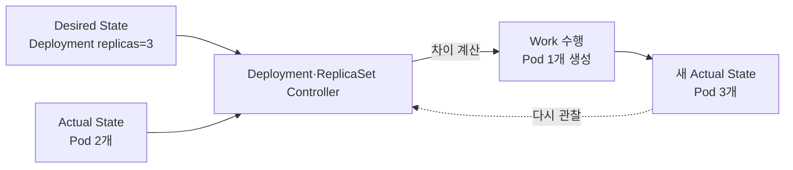
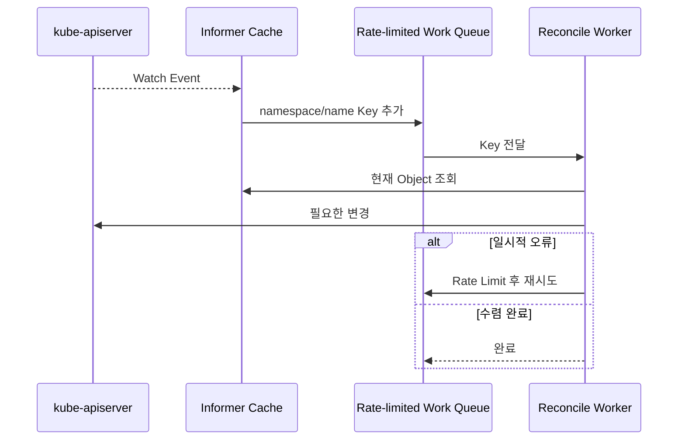
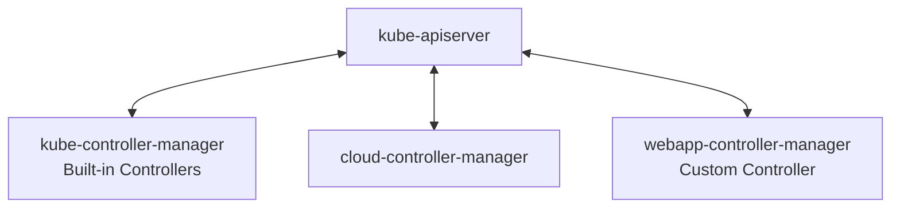

# 1. Kubernetes Controller와 Reconciliation

## 명령형과 선언형

Docker CLI의 일반적인 명령형 사용은 “지금 이 작업을 실행하라”고 지시한다.

```bash
docker run --name web -p 8080:80 nginx:1.29
docker stop web
docker rm web
```

Kubernetes의 선언형 방식은 API Object에 “계속 유지할 상태”를 기록한다.

```yaml
apiVersion: apps/v1
kind: Deployment
metadata:
  name: web
spec:
  replicas: 3
  selector:
    matchLabels:
      app: web
  template:
    metadata:
      labels:
        app: web
    spec:
      containers:
        - name: web
          image: nginx:1.29
```

Docker Compose도 선언형 구성을 제공하므로 Docker 전체가 명령형이라는 뜻은 아니다. 차이는 Kubernetes API에 저장된 Desired State를 Controller가 지속적으로 Reconcile한다는 데 있다.

## Controller란?

Controller는 Resource를 관찰하고 현재 상태를 원하는 상태에 가깝게 만드는 Control Loop다.



Controller는 사용자의 요청이 있을 때만 한 번 실행되는 Script가 아니다. Pod 삭제, Node 장애와 다른 Controller의 변경도 Watch하고 반복해서 수렴시킨다.

## Reconcile의 성질

Reconcile 함수는 보통 `namespace/name`을 입력받아 다음을 수행한다.

1. API에서 Desired State를 읽는다.
2. 관리하는 Child Resource나 외부 시스템의 현재 상태를 읽는다.
3. 차이가 있으면 생성·수정·삭제한다.
4. 관찰 결과를 `status`에 기록한다.
5. 완료하거나 이후 재확인 시점을 반환한다.

동일한 요청을 여러 번 처리해도 결과가 같도록 Idempotent하게 작성한다. Watch Event는 “정확히 한 번 전달되는 명령”이 아니라 다시 상태를 읽으라는 신호다.

## Event와 Work Queue



여러 Event가 하나의 Key로 합쳐질 수 있고, Event 순서와 개수를 Business Logic의 근거로 삼으면 안 된다.

## kube-controller-manager

`kube-controller-manager`는 Kubernetes 핵심 Controller들을 하나의 Process로 실행하는 Control Plane Component다.

- Deployment·ReplicaSet 관련 Controller
- Node Lifecycle Controller
- Job·CronJob Controller
- ServiceAccount·Namespace Controller
- EndpointSlice Controller

Cloud Load Balancer나 Route처럼 Provider 종속 기능은 `cloud-controller-manager`로 분리될 수 있다.

## Custom Controller Manager

Kubebuilder나 Operator SDK Project의 `controller-manager`는 kube-controller-manager를 수정하는 것이 아니다. 별도 Deployment로 실행되며 자신이 담당하는 CR과 관련 Resource만 Watch한다.



Manager는 Shared Cache, Client, Scheme, Leader Election, Metrics, Health Probe와 여러 Controller의 Lifecycle을 함께 관리한다.

## 확인 방법

```bash
kubectl get deployment web
kubectl get replicasets -l app=web
kubectl get pods -l app=web
kubectl delete pod -l app=web --field-selector=status.phase=Running
kubectl get pods -l app=web --watch
```

Pod가 삭제된 뒤 새 UID의 Pod가 생성되는 모습이 Reconciliation 결과다. 이 명령들은 학습 시나리오이며 여기서는 실행하지 않는다.

## 참고 자료

- [Kubernetes Controllers](https://kubernetes.io/docs/concepts/architecture/controller/)
- [kube-controller-manager](https://kubernetes.io/docs/reference/command-line-tools-reference/kube-controller-manager/)

