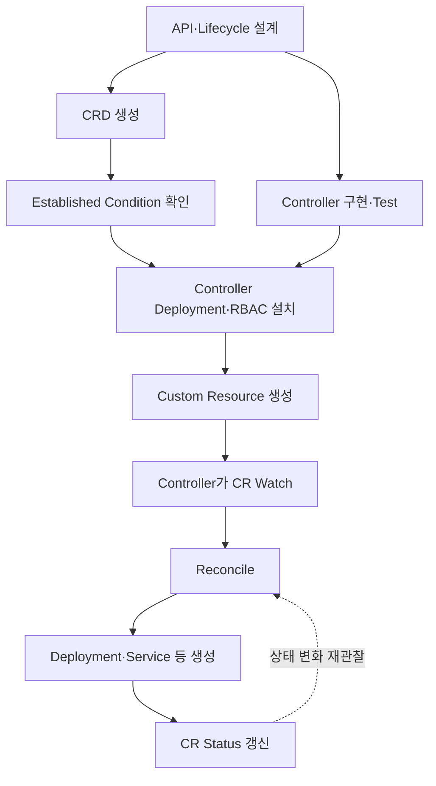
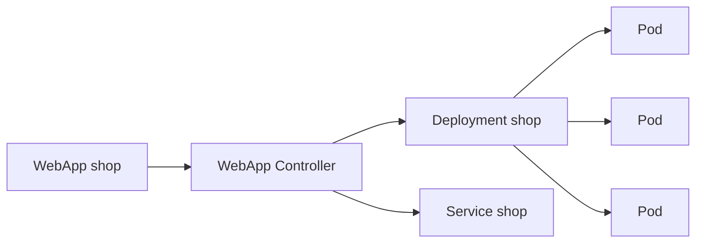

# 2. Custom Resource 개념과 도입 과정

## Custom Resource란?

Custom Resource, CR은 Kubernetes API에 사용자가 새 Kind를 추가한 Object다. CRD는 그 Kind의 이름·Schema·Version을 등록한다.

```text
CRD = API Type 정의
CR  = 그 Type으로 생성한 Instance
Controller = CR의 Desired State를 실제 상태로 구현
```

CRD만 설치해도 CRUD·Watch·Discovery·RBAC·etcd 저장을 사용할 수 있지만 자동화 동작은 생기지 않는다. Custom Controller와 결합해야 선언형 API가 된다.

## 언제 CRD를 사용하는가

적합한 경우:

- 여러 Kubernetes Resource를 하나의 Domain Object로 추상화
- Database Backup·Certificate·Message Cluster 같은 운영 지식 자동화
- `spec`, `status`와 Condition으로 Lifecycle 제공
- 다른 Controller와 kubectl이 Watch할 API가 필요

피해야 할 경우:

- Application Record나 Monitoring Sample을 대량 저장
- 단순 설정 하나면 ConfigMap으로 충분
- Reconciliation 없이 일회성 Script만 필요
- 강한 Transaction, 임의 Subresource나 별도 Storage Engine이 필요

CRD는 일반 Application Database를 대체하지 않는다.

## 전체 도입 단계



Production 배포에서는 CRD가 먼저 Established되어야 Controller와 CR 생성이 안정적으로 진행된다.

## 학습용 WebApp CR

사용자는 구현 세부 Resource 대신 원하는 Image와 Replica만 선언한다.

```yaml
apiVersion: platform.example.com/v1alpha1
kind: WebApp
metadata:
  name: shop
  namespace: apps
spec:
  image: ghcr.io/example/shop:1.0.0
  replicas: 3
  port: 8080
```

Controller가 이 CR을 보고 Deployment와 Service를 만든다고 가정한다.



## 설치와 확인 흐름

```bash
kubectl apply -f webapp-crd.yaml
kubectl wait --for=condition=Established \
  crd/webapps.platform.example.com \
  --timeout=60s

kubectl apply -f controller-rbac.yaml
kubectl apply -f controller-deployment.yaml
kubectl apply -f webapp-shop.yaml

kubectl api-resources --api-group=platform.example.com
kubectl get webapps -n apps
kubectl describe webapp shop -n apps
```

예상 결과:

```text
NAME   IMAGE                           DESIRED   READY   PHASE
shop   ghcr.io/example/shop:1.0.0      3         3       Ready
```

Printer Column과 Status가 정의되어 있어야 이처럼 유용한 출력이 나온다.

## CRD와 Controller 배포 책임

- CRD 변경은 Cluster-wide API 변경이므로 Platform 권한과 Review가 필요하다.
- Controller는 전용 ServiceAccount와 최소 RBAC으로 실행한다.
- CR은 Namespace 팀이 제한된 권한으로 생성하도록 분리할 수 있다.
- Controller가 만드는 Child에는 OwnerReference와 식별 Label을 둔다.
- CRD 삭제는 모든 CR과 저장 데이터 삭제로 이어질 수 있으므로 일반 App 배포처럼 취급하지 않는다.

## CRD와 Aggregated API

대부분의 선언형 확장은 CRD로 시작한다. Custom Storage, Protocol Buffer, 임의 Subresource나 API Server 수준의 특수 동작이 꼭 필요하면 Aggregated API Server를 검토하지만 운영 복잡도가 높다.

## 참고 자료

- [Custom Resources](https://kubernetes.io/docs/concepts/extend-kubernetes/api-extension/custom-resources/)
- [Extend the Kubernetes API with CRDs](https://kubernetes.io/docs/tasks/extend-kubernetes/custom-resources/custom-resource-definitions/)

