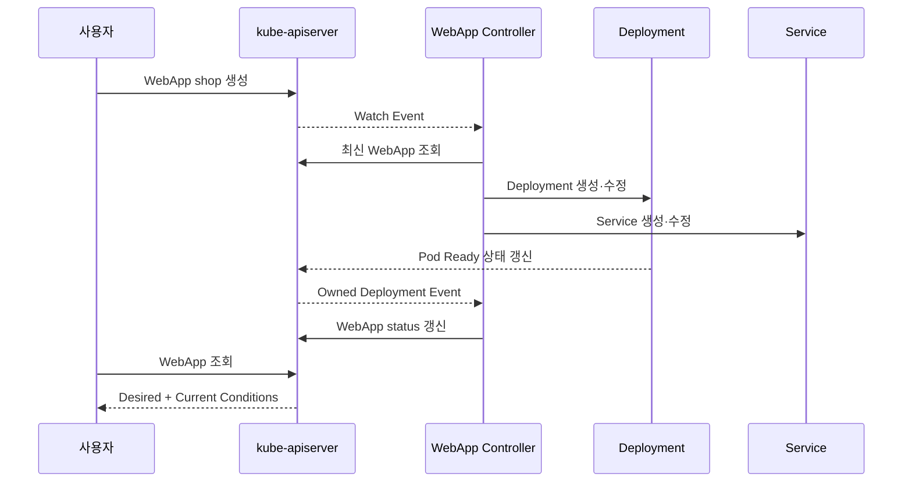
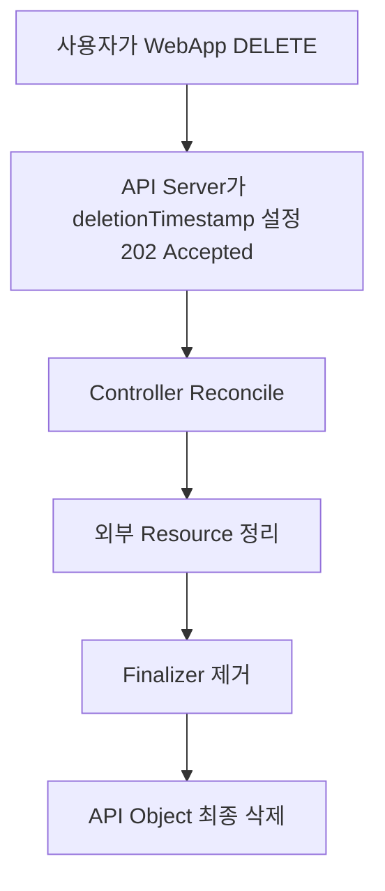

# 4. Custom Resource의 Lifecycle

## spec와 status

`spec`은 사용자가 원하는 상태이고 `status`는 Controller가 관찰한 현재 상태다.

```yaml
apiVersion: platform.example.com/v1alpha1
kind: WebApp
metadata:
  name: shop
  namespace: apps
spec:
  image: ghcr.io/example/shop:1.0.0
  replicas: 3
status:
  observedGeneration: 2
  readyReplicas: 3
  phase: Ready
  conditions:
    - type: Available
      status: "True"
      reason: MinimumReplicasAvailable
      message: 3개의 Replica가 준비되었습니다.
      observedGeneration: 2
      lastTransitionTime: "2026-07-28T09:00:00Z"
```

사용자나 일반 Client가 status를 수정하지 않도록 CRD의 `status` Subresource와 분리된 RBAC을 사용한다.

## generation과 observedGeneration

`metadata.generation`은 Desired State가 바뀌면 증가한다. Controller는 해당 Generation을 처리한 뒤 `status.observedGeneration`에 기록한다.

```text
metadata.generation = 4
status.observedGeneration = 3
→ 최신 Spec 변경을 아직 처리 중

metadata.generation = 4
status.observedGeneration = 4
→ 적어도 Generation 4를 관찰함
```

Ready Condition만 보고 최신 변경이 반영됐다고 오해하지 않도록 두 값을 함께 확인한다.

## Condition 설계

```yaml
status:
  conditions:
    - type: Available
      status: "False"
      reason: DeploymentNotReady
      message: Ready Replica가 1/3입니다.
      observedGeneration: 4
      lastTransitionTime: "2026-07-28T09:05:00Z"
```

- `type`은 사용자가 판단할 수 있는 의미로 정의한다.
- `status`는 문자열 `True`, `False`, `Unknown` 중 하나다.
- `reason`은 Machine-readable PascalCase 값으로 안정적으로 유지한다.
- `message`는 사람이 읽는 세부 설명이다.
- 상태가 실제로 전환될 때만 `lastTransitionTime`을 바꾼다.

단일 `phase`만으로 모든 실패 원인을 표현하기보다 Condition을 함께 제공한다.

## 전체 동작 순서



Controller는 Deployment Event도 Watch해 CR Status를 빠르게 다시 계산한다.

## OwnerReference와 Garbage Collection

WebApp이 만든 Namespaced Child Resource에는 Controller OwnerReference를 둔다.

```yaml
metadata:
  ownerReferences:
    - apiVersion: platform.example.com/v1alpha1
      kind: WebApp
      name: shop
      uid: <webapp-uid>
      controller: true
      blockOwnerDeletion: true
```

실제 코드는 UID를 직접 조립하기보다 `controllerutil.SetControllerReference`를 사용한다. Owner와 Dependent의 Scope 규칙을 지켜야 하며, 외부 Cloud Resource는 Kubernetes Garbage Collector가 삭제하지 못한다.

## Finalizer

외부 DNS·Bucket처럼 CR 삭제 전에 정리해야 하는 Resource가 있으면 Qualified Finalizer를 사용한다.

```text
platform.example.com/finalizer
```



Cleanup은 반복 호출되어도 안전해야 한다. 외부 API가 장기간 실패하면 CR이 Terminating에 남으므로 Timeout, Condition, Alert와 수동 복구 절차를 준비한다. 확인 없이 Finalizer를 강제로 제거하면 외부 Resource가 유실·잔존할 수 있다.

## API Version Lifecycle

```yaml
versions:
  - name: v1alpha1
    served: true
    storage: false
    deprecated: true
    deprecationWarning: platform.example.com/v1alpha1은 폐기 예정이며 v1을 사용하세요.
  - name: v1
    served: true
    storage: true
```

여러 Version은 같은 Storage Object로 변환되어야 한다. Field 이름·구조가 다르면 Conversion Webhook을 운영하고 기존 Object를 새 Storage Version으로 Migration한 뒤 `status.storedVersions`를 확인한다.

Version 제거 순서:

1. 새 Version Serve와 Conversion을 제공한다.
2. Client와 저장 Object를 Migration한다.
3. 이전 Version에 Deprecated Warning을 제공한다.
4. 사용량이 0인지 Audit한다.
5. 이전 Version의 `served`를 끈다.
6. 저장 Version에서 제거된 것을 확인한 뒤 CRD Version을 삭제한다.

## 확인 명령

```bash
kubectl get webapp shop -n apps -o yaml
kubectl get webapp shop -n apps \
  -o jsonpath='{.metadata.generation}{" "}{.status.observedGeneration}{"\n"}'
kubectl get crd webapps.platform.example.com \
  -o jsonpath='{.status.storedVersions}{"\n"}'
```

## 참고 자료

- [API Conventions](https://github.com/kubernetes/community/blob/master/contributors/devel/sig-architecture/api-conventions.md)
- [Finalizers](https://kubernetes.io/docs/concepts/overview/working-with-objects/finalizers/)
- [CRD Versioning](https://kubernetes.io/docs/tasks/extend-kubernetes/custom-resources/custom-resource-definition-versioning/)

