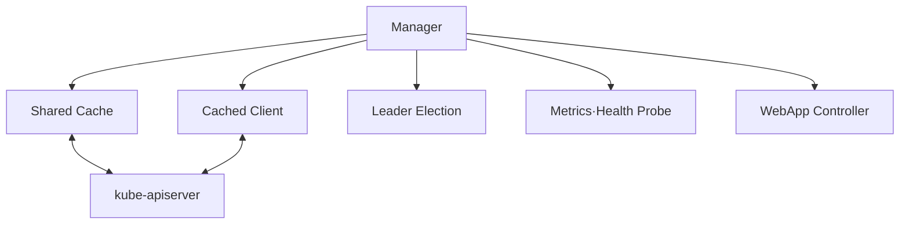

# 5. Custom Controller와 Reconcile 구현

## controller-runtime 구조



Kubebuilder와 Go 기반 Operator SDK는 모두 `controller-runtime`을 사용한다.

## Watch 구성

```go
func (r *WebAppReconciler) SetupWithManager(mgr ctrl.Manager) error {
	return ctrl.NewControllerManagedBy(mgr).
		For(&platformv1alpha1.WebApp{}).
		Owns(&appsv1.Deployment{}).
		Owns(&corev1.Service{}).
		Complete(r)
}
```

- `For`는 Primary Resource인 WebApp을 Watch한다.
- `Owns`는 OwnerReference로 연결된 Child 변경을 WebApp Reconcile로 Mapping한다.
- 관련 없는 Update로 Reconcile이 폭증하면 Predicate를 추가하되 필요한 상태 변화를 누락하지 않는다.

## Reconcile 기본 흐름

```go
func (r *WebAppReconciler) Reconcile(
	ctx context.Context,
	req ctrl.Request,
) (ctrl.Result, error) {
	var app platformv1alpha1.WebApp
	if err := r.Get(ctx, req.NamespacedName, &app); err != nil {
		return ctrl.Result{}, client.IgnoreNotFound(err)
	}

	if !app.DeletionTimestamp.IsZero() {
		return r.reconcileDelete(ctx, &app)
	}

	if err := r.reconcileDeployment(ctx, &app); err != nil {
		return ctrl.Result{}, err
	}
	if err := r.reconcileService(ctx, &app); err != nil {
		return ctrl.Result{}, err
	}
	if err := r.reconcileStatus(ctx, &app); err != nil {
		return ctrl.Result{}, err
	}

	return ctrl.Result{}, nil
}
```

Event 안의 오래된 Object를 Business Logic에 전달하지 않고 Reconcile 시작 시 Cache/API에서 현재 상태를 다시 읽는다.

## CreateOrUpdate

```go
func (r *WebAppReconciler) reconcileDeployment(
	ctx context.Context,
	app *platformv1alpha1.WebApp,
) error {
	deploy := &appsv1.Deployment{
		ObjectMeta: metav1.ObjectMeta{
			Name:      app.Name,
			Namespace: app.Namespace,
		},
	}

	_, err := controllerutil.CreateOrUpdate(ctx, r.Client, deploy, func() error {
		if err := controllerutil.SetControllerReference(app, deploy, r.Scheme); err != nil {
			return err
		}
		labels := map[string]string{
			"app.kubernetes.io/name": app.Name,
		}
		replicas := app.Spec.Replicas
		deploy.Spec.Replicas = &replicas
		deploy.Spec.Selector = &metav1.LabelSelector{MatchLabels: labels}
		deploy.Spec.Template.ObjectMeta.Labels = labels
		deploy.Spec.Template.Spec.Containers = []corev1.Container{{
			Name:  "app",
			Image: app.Spec.Image,
		}}
		return nil
	})
	return err
}
```

실제 Deployment에는 Port, SecurityContext, Resource와 Probe도 필요하다. 예시는 Reconcile 형태에 집중해 축약했다. Deployment Selector는 생성 후 변경할 수 없으므로 안정적인 Label Contract로 설계한다.

## 수렴과 소유권

Controller가 관리하는 Field와 사용자가 수정 가능한 Field를 명확히 정한다. 매 Reconcile마다 전체 Child Spec을 덮어쓰면 다른 Controller나 사용자의 Field와 Update Loop가 생길 수 있다.

- 자신의 Label·Annotation Prefix를 사용한다.
- Server-Side Apply를 사용한다면 Field Manager와 Conflict 정책을 설계한다.
- 외부 Resource 이름은 CR UID 등으로 결정적으로 생성한다.
- “없으면 생성”만 하지 말고 Drift가 있으면 Desired State로 복구한다.

## Error와 Requeue

| 상황 | 반환 |
|---|---|
| CR NotFound | 성공 종료 |
| API 일시 오류 | `error` 반환, Rate-limited 재시도 |
| 외부 작업 완료 대기 | `RequeueAfter` |
| Desired State 수렴 | 빈 Result와 nil |
| 사용자가 고쳐야 하는 Invalid Spec | Condition 갱신 후 무한 빠른 재시도 금지 |

```go
return ctrl.Result{RequeueAfter: 30 * time.Second}, nil
```

고정 주기 Poll보다 Watch 가능한 Resource는 Watch로 연결한다. Error를 Log만 남기고 nil로 반환하면 자동 재시도가 사라질 수 있다.

## Status Update

```go
base := app.DeepCopy()
app.Status.ObservedGeneration = app.Generation
meta.SetStatusCondition(&app.Status.Conditions, metav1.Condition{
	Type:               "Available",
	Status:             metav1.ConditionTrue,
	Reason:             "DeploymentAvailable",
	ObservedGeneration: app.Generation,
})
return r.Status().Patch(ctx, app, client.MergeFrom(base))
```

상태가 실제로 바뀌었을 때만 Patch해 자신의 Status Update가 불필요한 Reconcile을 계속 유발하지 않게 한다. Conflict는 최신 Object를 다시 읽고 재시도한다.

## Finalizer 흐름

1. 삭제 중이 아니고 Finalizer가 없으면 추가한다.
2. `deletionTimestamp`가 있으면 외부 Resource를 Idempotent하게 정리한다.
3. 정리 성공 후 Finalizer를 제거한다.
4. 실패하면 Condition과 Error를 남기고 재시도한다.

## RBAC Marker

```go
// +kubebuilder:rbac:groups=platform.example.com,resources=webapps,verbs=get;list;watch
// +kubebuilder:rbac:groups=platform.example.com,resources=webapps/status,verbs=get;update;patch
// +kubebuilder:rbac:groups=platform.example.com,resources=webapps/finalizers,verbs=update
// +kubebuilder:rbac:groups=apps,resources=deployments,verbs=get;list;watch;create;update;patch;delete
// +kubebuilder:rbac:groups=\"\",resources=services,verbs=get;list;watch;create;update;patch;delete
```

`make manifests`가 Marker로 RBAC YAML을 생성한다. Wildcard 대신 실제 사용하는 Resource와 Verb만 둔다.

## 참고 자료

- [Kubebuilder Controller Concepts](https://book.kubebuilder.io/cronjob-tutorial/controller-implementation)
- [controller-runtime](https://github.com/kubernetes-sigs/controller-runtime)
- [Using Finalizers](https://book.kubebuilder.io/reference/using-finalizers.html)
