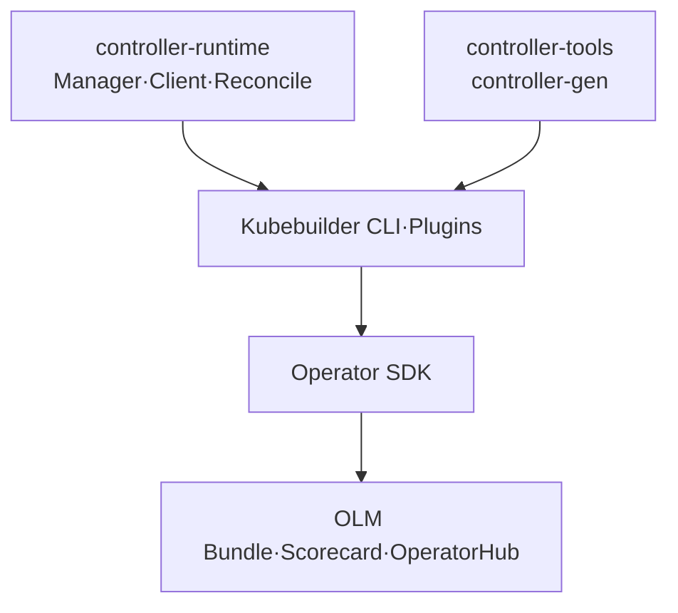

# 6. Kubebuilder와 Operator SDK

## 공통 기반

Kubebuilder와 Go 기반 Operator SDK는 경쟁하는 완전히 다른 Runtime이 아니다. 둘 다 `controller-runtime`, `controller-tools`와 Kubebuilder Plugin·Project Layout을 기반으로 한다.



Operator SDK로 생성한 Go Project도 기본 Controller Code와 Layout은 Kubebuilder Project와 유사하다.

## Kubebuilder

Kubernetes SIG API Machinery 생태계에서 Kubernetes API와 Go Controller를 만드는 기본 Scaffold다.

```bash
kubebuilder init \
  --domain example.com \
  --repo github.com/example/webapp-operator \
  --plugins=go/v4

kubebuilder create api \
  --group platform \
  --version v1alpha1 \
  --kind WebApp \
  --resource=true \
  --controller=true

make manifests
make generate
```

주요 결과:

```text
api/v1alpha1/                 API Go Type
internal/controller/         Reconcile 구현
config/crd/                   생성된 CRD
config/rbac/                  생성된 RBAC
config/manager/               Controller Deployment
config/samples/               CR Sample
```

Release Version을 고정하고 Scaffold된 `go.mod`, Makefile의 controller-runtime·client-go·controller-gen Compatibility 조합을 유지한다.

## Operator SDK

Go Operator에서는 Kubebuilder 기반 기능에 OLM Packaging과 Operator 생태계 도구를 추가한다.

```bash
operator-sdk init \
  --domain example.com \
  --repo github.com/example/webapp-operator \
  --plugins=go/v4

operator-sdk create api \
  --group platform \
  --version v1alpha1 \
  --kind WebApp \
  --resource=true \
  --controller=true

make bundle
operator-sdk bundle validate ./bundle
operator-sdk scorecard ./bundle
```

Operator SDK의 강점:

- Operator Lifecycle Manager용 Bundle·CSV 생성
- OperatorHub 또는 Catalog 배포 Workflow
- Scorecard를 이용한 Bundle 기반 점검
- Go 외에 지원되는 Helm·Ansible Operator Plugin 선택

OLM을 쓰지 않는 Cluster라면 이 추가 기능이 필요하지 않을 수 있다.

## 무엇이 가장 많이 쓰이는가?

전체 Kubernetes 생태계의 사용량을 증명하는 공인 통계는 없다. 따라서 단순히 “하나가 항상 가장 많이 쓰인다”고 단정하기보다 공통 기반과 배포 요구로 판단한다.

현재 합리적인 기본 선택:

| 상황 | 선택 |
|---|---|
| 새 Go Controller·Kubernetes API 개발 | Kubebuilder |
| OLM Bundle·Catalog·OperatorHub가 필수 | Operator SDK |
| 기존 Go Operator SDK Project | 그대로 Operator SDK 유지 |
| Helm Chart를 빠르게 Operator로 감싸기 | Operator SDK Helm Plugin 검토 |
| 복잡한 Domain Reconciliation | Go 기반 Controller |

Kubebuilder는 Upstream에 가까운 최소 기본값이고 Operator SDK는 그 위에 Operator Packaging 기능을 더한다. Go Controller 구현 역량은 어느 쪽을 선택해도 controller-runtime 중심으로 공유된다.

## “Operator”라는 이름

Custom Controller가 특정 Application의 설치, Upgrade, Backup, 장애 복구 같은 운영 지식을 자동화하면 보통 Operator라고 부른다. Operator SDK를 사용해야만 Operator가 되는 것은 아니다.

```text
Custom Resource + Domain-aware Controller = Operator Pattern
```

## 도구 선택보다 중요한 것

- API가 Kubernetes Convention을 따르는가
- Reconcile이 Idempotent하고 장애 후 수렴하는가
- Status와 Condition이 사용 가능한가
- Upgrade·Downgrade·Backup·Delete를 안전하게 처리하는가
- CRD와 Controller Version Compatibility가 문서화됐는가
- 최소 RBAC, Metrics, Alert와 Test가 있는가

Scaffold는 시작점이며 생성된 Code를 Fork한 뒤 Generator와 Version 관리를 버리면 유지보수가 어려워진다.

## Version 유지보수

controller-runtime은 Kubernetes Minor Release와 맞춘 Compatibility Matrix를 제공한다. Kubebuilder Release가 Scaffold한 조합을 기준으로 Upgrade한다.

```bash
kubebuilder version
operator-sdk version
go list -m sigs.k8s.io/controller-runtime
go list -m k8s.io/client-go
```

`latest` 설치 Script를 CI에서 매번 받기보다 Tool Version을 고정하고 Renovate 같은 자동 PR과 Compatibility Test로 올린다.

## 참고 자료

- [Kubebuilder](https://github.com/kubernetes-sigs/kubebuilder)
- [Kubebuilder Quick Start](https://book.kubebuilder.io/quick-start.html)
- [Operator SDK FAQ](https://sdk.operatorframework.io/docs/faqs/)
- [Operator SDK Go Tutorial](https://sdk.operatorframework.io/docs/building-operators/golang/tutorial/)

