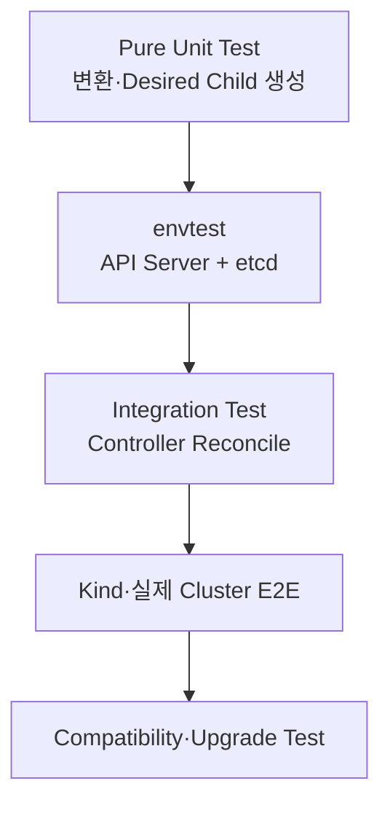

# 7. Custom Controller 운영과 테스트

## 테스트 계층



Business Logic을 API I/O와 분리하면 빠른 Unit Test가 가능하다. envtest는 kube-apiserver와 etcd를 실행하지만 kubelet·Scheduler·Built-in Controller 전체를 제공하지 않으므로 실제 Cluster E2E도 필요하다.

## 필수 Test Scenario

- CR 생성 시 Child Resource 생성
- Spec Update 시 Child Drift 복구
- Child 수동 삭제 후 재생성
- Invalid Spec의 Schema·CEL 거부
- Child Ready·Failed 상태의 Condition 반영
- 외부 API 일시 실패와 Rate-limited 재시도
- Controller 재시작 후 정상 수렴
- CR 삭제와 Finalizer Cleanup
- 중복 Event와 Conflict 처리
- 이전 CRD·Controller에서 Upgrade

## 생성과 배포 전 확인

```bash
make generate
make manifests
make test
make build

kubectl apply --dry-run=server -f config/crd/bases/
kubectl diff -k config/default
```

Generated CRD와 RBAC Diff를 Code Review한다. Marker 변경이 의도치 않게 Wildcard 권한이나 Schema 삭제를 만들 수 있다.

## Controller Deployment

```yaml
apiVersion: apps/v1
kind: Deployment
metadata:
  name: webapp-controller-manager
  namespace: webapp-system
spec:
  replicas: 2
  selector:
    matchLabels:
      control-plane: controller-manager
  template:
    metadata:
      labels:
        control-plane: controller-manager
    spec:
      serviceAccountName: webapp-controller-manager
      containers:
        - name: manager
          image: ghcr.io/example/webapp-operator@sha256:<digest>
          args:
            - --leader-elect
            - --health-probe-bind-address=:8081
          ports:
            - name: health
              containerPort: 8081
          readinessProbe:
            httpGet:
              path: /readyz
              port: health
          livenessProbe:
            httpGet:
              path: /healthz
              port: health
          resources:
            requests:
              cpu: 100m
              memory: 128Mi
            limits:
              memory: 256Mi
```

Replica를 둘 이상 실행할 때 Leader Election을 켠다. 일반적인 단일 Leader Controller는 Availability를 높이지만 처리량이 Replica 수만큼 늘지는 않는다.

## 관측성

기본적으로 다음을 관찰한다.

- Reconcile 총횟수·Error·Duration
- Work Queue Depth·Retry
- API Client Error와 Rate Limit
- Controller Process CPU·Memory·Restart
- Leader Election 상태
- CR Condition별 개수와 오래된 `observedGeneration`
- Finalizer에 오래 머무는 Object

Log에는 Namespace, Name, Reconcile ID와 Error 원인을 구조화해 남기고 Secret·Token·전체 CR Spec을 무조건 출력하지 않는다.

## RBAC와 보안

- Controller ServiceAccount에 필요한 API Group·Resource·Verb만 부여한다.
- `secrets get/list/watch`는 Credential 읽기 권한으로 취급한다.
- ClusterRole이 필요하지 않으면 Namespace Role을 사용한다.
- Webhook은 Certificate Rotation과 Failure Policy를 운영한다.
- Controller Image를 Non-root·Read-only Filesystem으로 실행하고 Digest로 고정한다.
- CR Field가 Command·URL·Image로 전달될 때 Injection과 SSRF를 검토한다.

## CRD Upgrade

CRD는 Controller Deployment보다 수명이 길고 Cluster Data를 담는다.

안전한 흐름:

1. 기존 CR과 CRD를 Backup한다.
2. 새 Controller가 구·신 CRD를 모두 처리 가능한지 확인한다.
3. Conversion과 Schema Compatibility를 Test한다.
4. CRD를 먼저 확장하는 호환 단계로 적용한다.
5. 새 Controller를 Rollout한다.
6. Stored Version Migration을 수행한다.
7. 사용하지 않는 Version은 Deprecated 기간 후 제거한다.

Field 삭제·Type 변경·Default 변경은 기존 저장 Object와 Client를 깨뜨릴 수 있다. Helm Uninstall이나 Kustomize Delete가 CRD를 자동 삭제하지 않도록 Packaging Policy를 명확히 한다.

## 장애와 복구

| 증상 | 확인 |
|---|---|
| CR이 변하지 않음 | Controller Ready·Leader·RBAC·Watch Namespace |
| Reconcile 반복 | Status가 매번 바뀌는지, Field Ownership Conflict |
| Child가 생성되지 않음 | Event·Controller Log·OwnerReference·API Error |
| CR이 Terminating | deletionTimestamp·Finalizer·외부 Cleanup |
| CRD 적용 실패 | Structural Schema·storedVersions·Webhook |
| Upgrade 후 Decode 실패 | served/storage Version과 Conversion |

Controller가 내려가도 CR은 API에 남지만 자동 수렴과 Status 갱신은 멈춘다. Runbook에 Controller 복구와 Finalizer Emergency 절차를 포함한다.

## 운영 완료 기준

- API 문서와 Sample CR이 Version별로 존재
- Status Condition과 Error Message가 사용 가능
- Upgrade·Rollback·Delete·Backup 절차가 검증됨
- 최소 RBAC과 Network 접근 범위가 Review됨
- Metrics·Dashboard·Alert·Runbook이 있음
- 지원 Kubernetes·Go·controller-runtime Version Matrix가 공개됨

## 참고 자료

- [Kubebuilder Testing](https://book.kubebuilder.io/reference/envtest)
- [Operator SDK Testing](https://sdk.operatorframework.io/docs/building-operators/golang/testing/)
- [controller-runtime Versioning](https://github.com/kubernetes-sigs/controller-runtime#versioning-maintenance-and-compatibility)
