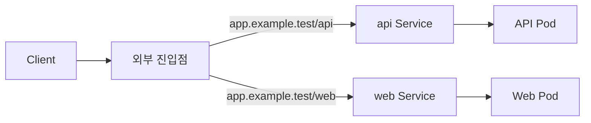
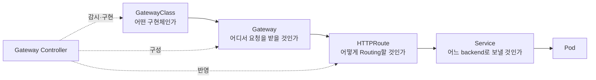

# 1. Ingress에서 Gateway API로

## Ingress란?

Ingress는 Cluster 외부의 HTTP·HTTPS 요청을 host와 path에 따라 Service로 전달하는 Kubernetes API다.



Ingress API는 안정적으로 유지되지만 새로운 기능 추가는 동결되었다. 기본 API가 단순해서 Header matching, Traffic 분할, Redirect와 Rewrite 같은 기능은 Controller별 Annotation에 의존하는 경우가 많았다.

## 기존 Controller에 대한 현재 정리

커뮤니티 Kubernetes ingress-nginx는 2026년 3월에 지원이 종료되었다. 기존 Cluster의 개념을 이해하기 위한 자료로는 사용할 수 있지만 신규 환경의 기본 선택으로 삼지 않는다. 이 프로젝트와 F5의 상용·오픈소스 NGINX 제품은 서로 다른 프로젝트다. 자세한 배경은 [Kubernetes 공식 지원 종료 공지](https://kubernetes.io/blog/2025/11/11/ingress-nginx-retirement/)를 참고한다.

## Gateway API란?

Gateway API는 Kubernetes의 L4·L7 Routing을 위한 공식 프로젝트다. Ingress, Load Balancing과 Service Mesh API의 다음 세대를 목표로 하며 다음 특징을 가진다.

- 역할 중심: 기반 구현, Network 진입점, 애플리케이션 Route의 소유권을 분리한다.
- 표현력: host와 path 외에도 Header, Query parameter, Method, Traffic weight와 Filter를 구조화된 필드로 표현한다.
- 이식성: 공통 API와 Conformance 기준을 통해 구현체 간 동작 범위를 확인할 수 있다.
- 확장성: Core 기능과 Extended 기능, 구현체 Extension을 구분한다.
- 공유성: 여러 Namespace와 팀이 하나의 Gateway를 안전하게 공유할 수 있다.

`GatewayClass`, `Gateway`와 `HTTPRoute`는 Standard Channel의 안정 API다.

## 핵심 리소스



### GatewayClass

Cluster에서 사용할 Gateway Controller의 종류를 나타내는 Cluster-scoped 리소스다.

```yaml
apiVersion: gateway.networking.k8s.io/v1
kind: GatewayClass
metadata:
  name: example
spec:
  controllerName: example.net/gateway-controller
```

실제 `controllerName`은 설치한 구현체가 정한다. 문서 예시의 `example` 값은 구조 설명용이며 그대로 적용하지 않는다.

### Gateway

Load Balancer나 Proxy의 논리적 Instance와 Listener를 정의한다.

```yaml
apiVersion: gateway.networking.k8s.io/v1
kind: Gateway
metadata:
  name: public-gateway
  namespace: gateway-system
spec:
  gatewayClassName: example
  listeners:
    - name: http
      protocol: HTTP
      port: 80
```

Listener에는 port, protocol, hostname, TLS와 연결을 허용할 Route 범위를 설정할 수 있다.

### HTTPRoute

HTTP 요청의 host, path와 Header 등을 판단해 backend Service로 전달한다.

```yaml
apiVersion: gateway.networking.k8s.io/v1
kind: HTTPRoute
metadata:
  name: web-route
  namespace: app
spec:
  parentRefs:
    - name: public-gateway
      namespace: gateway-system
  hostnames:
    - app.example.test
  rules:
    - matches:
        - path:
            type: PathPrefix
            value: /
      backendRefs:
        - name: web-service
          port: 80
```

## API와 구현체는 서로 다르다

Gateway API 리소스만 생성해도 실제 Traffic은 처리되지 않는다.

```text
Gateway API CRD
    + Gateway API를 지원하는 Controller
    + Controller가 생성·관리하는 Data plane
    + Service와 Ready Endpoint
    = 실제 요청 처리
```

환경을 선택할 때는 다음을 확인한다.

1. 사용할 Kubernetes 배포판이 Gateway API CRD를 제공하는가?
2. 선택한 Controller가 현재 Gateway API 버전을 지원하는가?
3. 필요한 Route 종류와 Filter가 Core인지 Extended인지 확인했는가?
4. 구현체가 공개한 Conformance report가 있는가?
5. LoadBalancer, NodePort와 Bare metal IP 할당 방식이 환경에 맞는가?

## 역할에 따른 소유권

| 역할 | 주로 관리하는 리소스 | 책임 |
|---|---|---|
| Infrastructure Provider | GatewayClass, Controller | 구현체 설치, 기능과 Lifecycle |
| Cluster Operator | Gateway | IP, Listener, TLS, 허용 Route 범위 |
| Application Developer | HTTPRoute, Service | host/path 규칙과 backend 선택 |

이 분리는 애플리케이션 팀이 Load Balancer와 인증서를 직접 관리하지 않고도 자신의 Route를 독립적으로 배포하게 해준다.

## 학습 기준

이후 문서는 Gateway API의 North-South HTTP Traffic을 중심으로 한다.

- `GatewayClass → Gateway → HTTPRoute → Service → Pod` 연결을 먼저 이해한다.
- 구현체 이름보다 표준 API 필드와 `status.conditions`를 먼저 확인한다.
- 구현체별 설치 명령과 Extension은 실제 실습 환경이 정해질 때 추가한다.
- YAML은 `gateway.networking.k8s.io/v1`의 안정 API를 우선 사용한다.

## 참고 자료

- [Gateway API 소개](https://gateway-api.sigs.k8s.io/docs/introduction/)
- [Gateway API 개념과 리소스](https://gateway-api.sigs.k8s.io/docs/concepts/api-overview/)
- [Gateway API 구현체와 Conformance](https://gateway-api.sigs.k8s.io/docs/implementations/list/)
- [Kubernetes Ingress](https://kubernetes.io/docs/concepts/services-networking/ingress/)
