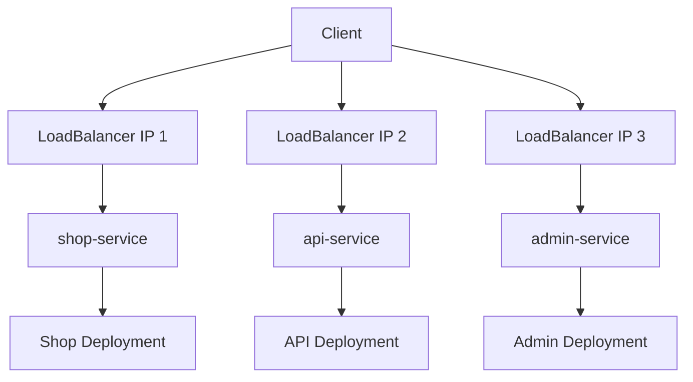
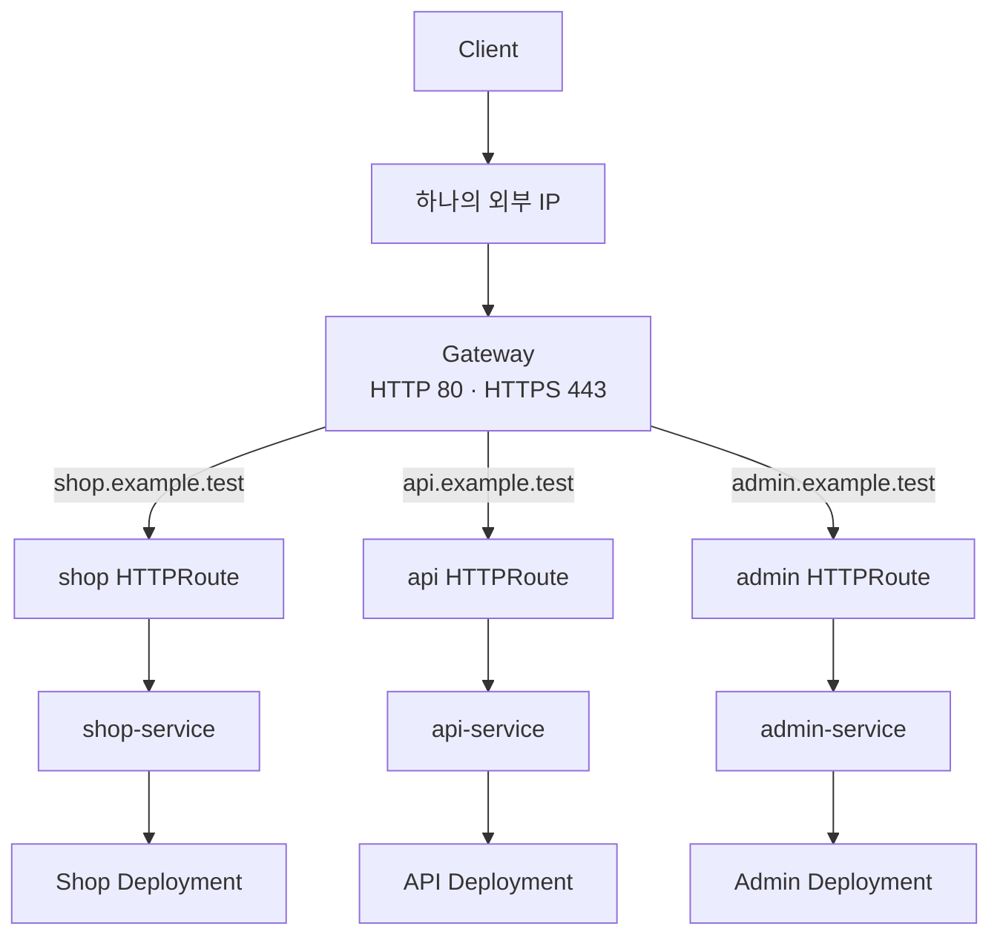
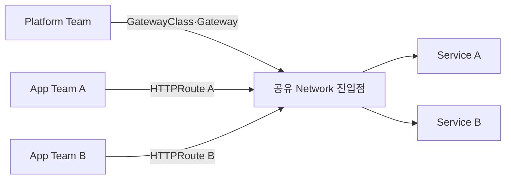

# 2. Gateway API를 사용하는 이유

## Service마다 외부 LoadBalancer를 두는 구조

애플리케이션마다 `type: LoadBalancer` Service를 만들면 구조는 단순하지만 외부 IP와 Load Balancer가 Service 수만큼 필요해진다.



이 방식의 특징은 다음과 같다.

- Service가 자신의 외부 진입점을 직접 소유한다.
- L4 TCP·UDP 노출에는 간단하고 적합할 수 있다.
- 애플리케이션이 늘면 IP, Load Balancer와 방화벽 규칙도 늘어난다.
- 여러 서비스가 하나의 Domain과 인증서를 공유하기 어렵다.
- host, path, Header를 이용한 L7 Routing은 별도 구성요소가 필요하다.

## 하나의 Gateway를 여러 Route가 공유하는 구조

Gateway API에서는 Network 진입점인 Gateway와 애플리케이션 규칙인 HTTPRoute를 분리한다.



이 구조에서는 하나의 IP, port와 TLS 진입점을 여러 팀이 공유하면서 Route는 독립적으로 관리할 수 있다.

| 항목 | Service별 LoadBalancer | 공유 Gateway |
|---|---|---|
| 외부 IP | Service마다 필요 | 여러 Route가 공유 가능 |
| L7 Routing | 기본 제공하지 않음 | host, path, Header, Method 등 |
| TLS 관리 | Service 외부에서 개별 구성 | Gateway Listener에서 중앙 관리 |
| 애플리케이션 규칙 | Network 진입점과 결합 | HTTPRoute로 분리 |
| Traffic 분할 | 별도 구현 필요 | `backendRefs.weight` 사용 |
| 팀 분리 | Service 권한 중심 | Gateway와 Route 권한 분리 |

## Host 기반 Routing

하나의 Gateway에서 Domain별로 다른 Service를 선택할 수 있다.

```yaml
apiVersion: gateway.networking.k8s.io/v1
kind: HTTPRoute
metadata:
  name: shop-route
  namespace: apps
spec:
  parentRefs:
    - name: public-gateway
      namespace: gateway-system
  hostnames:
    - shop.example.test
  rules:
    - backendRefs:
        - name: shop-service
          port: 80
```

`hostnames`는 HTTP Host Header와 비교된다. Gateway Listener에도 hostname이 있다면 Listener와 Route의 hostname이 서로 호환되어야 Route가 연결된다.

## Path 기반 Routing

하나의 Domain 아래에서 path별로 Service를 나눌 수 있다.

```yaml
apiVersion: gateway.networking.k8s.io/v1
kind: HTTPRoute
metadata:
  name: app-route
  namespace: apps
spec:
  parentRefs:
    - name: public-gateway
      namespace: gateway-system
  hostnames:
    - app.example.test
  rules:
    - matches:
        - path:
            type: PathPrefix
            value: /api
      backendRefs:
        - name: api-service
          port: 8080
    - matches:
        - path:
            type: PathPrefix
            value: /
      backendRefs:
        - name: web-service
          port: 80
```

더 구체적인 match가 우선한다. 따라서 `/api` 요청은 api-service로, 그 밖의 요청은 web-service로 전달된다.

## Header와 Method까지 사용한 Routing

HTTPRoute는 별도 Annotation 없이 구조화된 match를 제공한다.

```yaml
rules:
  - matches:
      - path:
          type: PathPrefix
          value: /api
        headers:
          - type: Exact
            name: env
            value: canary
        method: GET
    backendRefs:
      - name: api-canary
        port: 8080
```

이 규칙은 `GET /api` 요청 중 `env: canary` Header가 있는 Traffic만 선택한다.

## 가중치 기반 Traffic 분할

새 Version을 점진적으로 공개할 때 backend 비율을 지정할 수 있다.

```yaml
rules:
  - backendRefs:
      - name: web-v1
        port: 80
        weight: 90
      - name: web-v2
        port: 80
        weight: 10
```

weight는 절대 백분율이 아니라 전체 weight 합계에 대한 비율이다. 위 예시는 약 90:10으로 요청을 나눈다.

## 역할 분리가 주는 장점



- Platform Team은 IP, Listener, 인증서와 허용 Namespace를 관리한다.
- Application Team은 자신의 host, path와 backend를 관리한다.
- RBAC와 `allowedRoutes`로 서로의 책임 범위를 제한한다.
- Route 변경 때문에 공유 Load Balancer 설정 전체를 직접 수정할 필요가 없다.

## 어떤 경우에 적합한가?

Gateway API는 다음 요구에 특히 적합하다.

- 여러 HTTP·HTTPS 서비스를 하나의 진입점으로 제공한다.
- 중앙 TLS 정책과 팀별 Routing 규칙을 분리한다.
- Header matching, Rewrite, Redirect와 Canary Traffic이 필요하다.
- 여러 Namespace가 하나의 Load Balancer를 안전하게 공유한다.
- 표준 API와 구현체 Conformance를 기준으로 운영하고 싶다.

순수 TCP, UDP, TLS passthrough 또는 gRPC에는 목적에 맞는 `TCPRoute`, `UDPRoute`, `TLSRoute`, `GRPCRoute`를 검토한다. Route별 안정 단계와 선택한 구현체의 지원 범위는 적용 전에 확인한다.

## 참고 자료

- [Gateway API 소개](https://gateway-api.sigs.k8s.io/docs/introduction/)
- [HTTP Routing](https://gateway-api.sigs.k8s.io/guides/user-guides/http-routing/)
- [HTTPRoute API](https://gateway-api.sigs.k8s.io/reference/api-types/httproute/)

