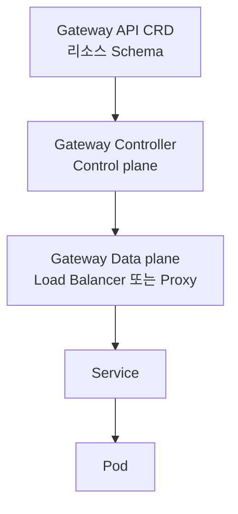
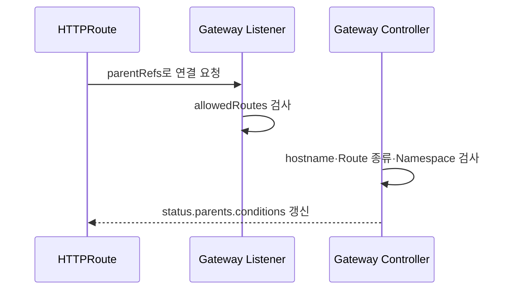

# 3. Gateway API 리소스와 구조

## 적용 전에 필요한 구성

Gateway API는 다음 세 층이 모두 준비되어야 동작한다.



- CRD: GatewayClass, Gateway와 HTTPRoute 같은 API를 Kubernetes에 등록한다.
- Controller: Gateway API 리소스를 감시하고 실제 구성을 조정한다.
- Data plane: Client 요청을 받아 Route 규칙에 따라 backend로 전달한다.

CRD와 Controller 설치 방식은 Kubernetes 배포판과 구현체마다 다르다. 구현체의 공식 설치 문서에서 지원 Gateway API Version과 Profile을 확인한다.

## 전체 YAML 구조

아래 `example.net/gateway-controller`와 `example` Class는 구조 설명용이다. 실제 값은 선택한 구현체가 제공한다.

```yaml
apiVersion: gateway.networking.k8s.io/v1
kind: GatewayClass
metadata:
  name: example
spec:
  controllerName: example.net/gateway-controller
---
apiVersion: gateway.networking.k8s.io/v1
kind: Gateway
metadata:
  name: public-gateway
  namespace: gateway-system
spec:
  gatewayClassName: example
  listeners:
    - name: http
      protocol: HTTP
      port: 80
      allowedRoutes:
        namespaces:
          from: All
---
apiVersion: gateway.networking.k8s.io/v1
kind: HTTPRoute
metadata:
  name: app-route
  namespace: apps
spec:
  parentRefs:
    - name: public-gateway
      namespace: gateway-system
      sectionName: http
  hostnames:
    - app.example.test
  rules:
    - matches:
        - path:
            type: PathPrefix
            value: /api
      backendRefs:
        - name: api-service
          port: 8080
```

## GatewayClass

GatewayClass는 Cluster-scoped 리소스이며 Gateway 구현 종류를 선택한다.

| 필드 | 의미 |
|---|---|
| `metadata.name` | Gateway의 `gatewayClassName`에서 참조할 이름 |
| `spec.controllerName` | 이 Class를 처리할 Controller 식별자 |
| `spec.parametersRef` | 구현체별 추가 설정 참조이며 선택 사항 |

일반적으로 Gateway Controller를 설치하면 사용할 GatewayClass가 함께 제공되거나, 설치 문서에 생성 방법이 제시된다.

## Gateway와 Listener

Gateway는 실제 Network 진입점의 원하는 상태를 정의한다.

```yaml
listeners:
  - name: web
    hostname: "*.example.test"
    protocol: HTTPS
    port: 443
    tls:
      mode: Terminate
      certificateRefs:
        - kind: Secret
          name: wildcard-example-tls
```

Listener의 주요 필드는 다음과 같다.

- `name`: HTTPRoute의 `parentRefs.sectionName`에서 특정 Listener를 선택한다.
- `hostname`: Listener가 받을 Domain 범위를 제한한다.
- `protocol`과 `port`: HTTP 80, HTTPS 443 같은 접속 지점을 정의한다.
- `tls`: 인증서와 TLS 종료 방식을 정의한다.
- `allowedRoutes`: 어떤 종류와 Namespace의 Route를 연결할지 제한한다.

## HTTPRoute

HTTPRoute는 요청을 일치시키고 처리한 뒤 backend로 전달한다.

| 필드 | 역할 |
|---|---|
| `parentRefs` | 연결하려는 Gateway 또는 Listener |
| `hostnames` | HTTP Host Header와 일치할 Domain |
| `rules.matches` | path, Header, Query parameter와 Method 조건 |
| `rules.filters` | Redirect, Rewrite와 Header 변경 |
| `rules.backendRefs` | 전달할 Service와 port, weight |
| `rules.timeouts` | 전체 요청과 backend 요청 제한 시간 |

Service를 backend로 사용할 때 `backendRefs.port`는 Service의 `spec.ports[].port`다. Pod의 `containerPort`나 Service의 `targetPort`를 적는 위치가 아니다.

## Route 연결은 양쪽이 허용해야 한다



Route가 Gateway를 `parentRefs`로 선택하고, Gateway Listener의 `allowedRoutes`가 해당 Route를 허용해야 연결된다.

## 외부 IP와 LoadBalancer

Gateway를 생성했을 때 외부 IP를 만드는 방식은 구현체와 환경에 따라 다르다.

```text
Cloud 환경
Gateway → Controller → Cloud Load Balancer와 외부 IP

Bare metal 환경
Gateway → Controller의 Data plane Service
        → LoadBalancer IP 제공 장치 또는 MetalLB
        → 외부 IP

제한된 실습 환경
Gateway → NodePort·Port forwarding 등 구현체가 지원하는 노출 방식
```

Gateway API가 MetalLB를 직접 대체하지는 않는다. Controller가 `LoadBalancer` Service를 생성하는 구조라면 MetalLB가 그 Service에 IP를 할당할 수 있지만 실제 연결 방식은 구현체 문서를 확인해야 한다.

Gateway가 받은 주소는 `status.addresses`에서 확인한다.

```bash
kubectl get gateway public-gateway -n gateway-system
kubectl get gateway public-gateway -n gateway-system -o yaml
```

## 상태 Condition

원하는 YAML이 저장되었다는 사실과 실제 Data plane에 반영되었다는 사실은 다르다.

- GatewayClass `Accepted`: Controller가 해당 Class를 인식했는가?
- Gateway `Accepted`: Gateway 설정을 Controller가 받아들였는가?
- Gateway `Programmed`: 실제 Data plane에 구성이 반영되었는가?
- HTTPRoute `Accepted`: Route가 Listener에 연결되었는가?
- HTTPRoute `ResolvedRefs`: Service, Secret 등의 참조가 유효한가?

```bash
kubectl describe gateway public-gateway -n gateway-system
kubectl describe httproute app-route -n apps
```

## curl로 Routing 확인

`192.0.2.50`을 실제 Gateway 주소로 바꾼다.

```bash
curl -i --resolve app.example.test:80:192.0.2.50 \
  http://app.example.test/api/health
```

정상 응답 예시는 다음과 같다.

```http
HTTP/1.1 200 OK
content-type: application/json

{"status":"ok","service":"api"}
```

응답별 첫 확인 지점은 다음과 같다.

| 응답 | 우선 확인 |
|---|---|
| 연결 실패 | `status.addresses`, 외부 IP와 방화벽 |
| 404 | Listener hostname, HTTPRoute hostname과 match |
| 500 | backend 없는 Rule 또는 Filter 구성 |
| 502·503 | Service port, EndpointSlice와 Ready Pod |
| 예상하지 않은 backend | match 우선순위와 Route 충돌 |

## 참고 자료

- [Gateway API 개요](https://gateway-api.sigs.k8s.io/docs/concepts/api-overview/)
- [Gateway API 간단한 Gateway 배포](https://gateway-api.sigs.k8s.io/guides/getting-started/simple-gateway/)
- [HTTPRoute API](https://gateway-api.sigs.k8s.io/reference/api-types/httproute/)
- [Gateway API 구현체 목록](https://gateway-api.sigs.k8s.io/docs/implementations/list/)

