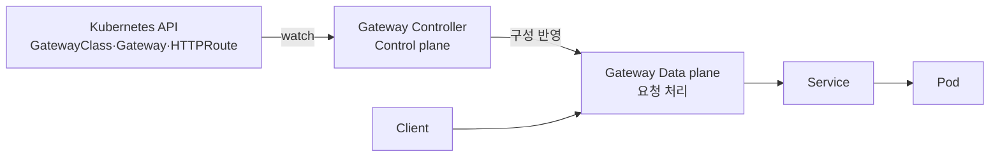
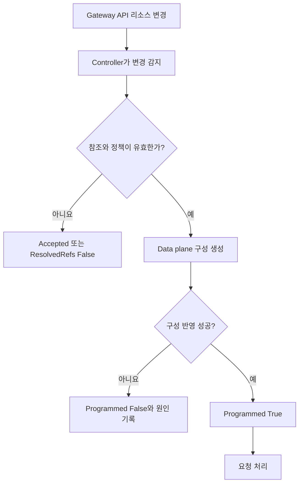
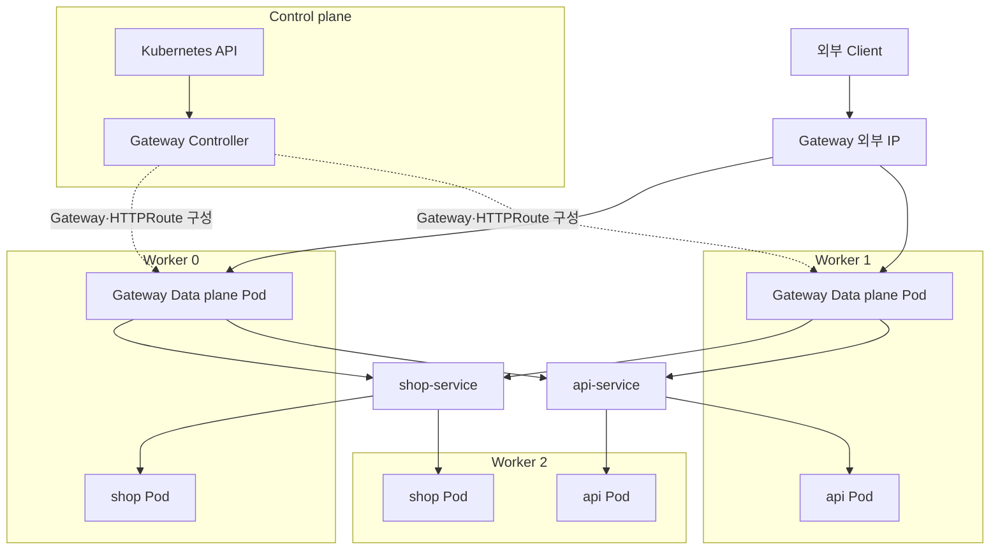
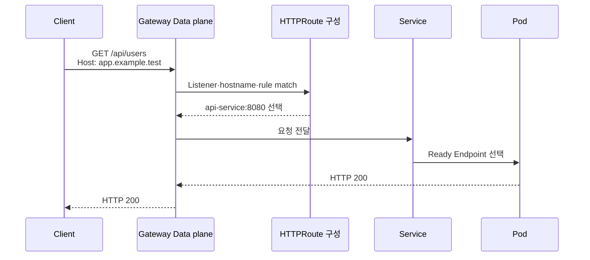

# 4. Gateway Controller의 동작 원리

## Controller와 Data plane

Gateway Controller는 Gateway API 리소스의 원하는 상태를 감시해 Load Balancer나 Proxy의 실제 구성을 계속 일치시키는 Control plane이다. Client 요청은 일반적으로 Controller Pod가 아니라 Controller가 관리하는 Data plane을 통과한다.



구현체에 따라 Controller와 Data plane이 하나의 제품 안에 함께 보이거나 별도 Deployment·Cloud Load Balancer로 나뉠 수 있다. 표준이 보장하는 것은 리소스의 의미와 상태이며 내부 배치 방식은 구현체가 정한다.

## Reconciliation 과정

1. Controller가 자신이 담당하는 `GatewayClass.spec.controllerName`을 찾는다.
2. 해당 Class를 참조하는 Gateway와 Listener를 읽는다.
3. Listener가 허용한 HTTPRoute와 Route의 `parentRefs`를 함께 검사한다.
4. host, path, Filter, backend Service와 참조 권한을 검증한다.
5. Load Balancer나 Proxy Data plane 구성을 생성·갱신한다.
6. Gateway와 HTTPRoute의 `status.conditions`에 결과를 기록한다.
7. 리소스가 변경되면 같은 과정을 반복해 현재 상태를 원하는 상태에 맞춘다.



## Worker Node 0에서 2까지 전체 구성

다음 그림은 Data plane Pod가 여러 Node에 배치되고 두 Service로 Routing하는 한 가지 예다. 실제 배치 개수와 외부 IP 구현은 선택한 Controller가 결정한다.



논리적인 요청 경로는 `Gateway → HTTPRoute 규칙 → Service → Ready Endpoint`다. Data plane이 Service VIP를 거치는지 Endpoint 정보를 직접 사용하는지는 구현체에 따라 달라질 수 있다.

## 요청 처리 순서



`HTTPRoute`는 요청 경로에 직접 들어가는 Proxy가 아니라 Data plane을 구성하는 선언형 리소스다.

## Gateway와 Route YAML

다음 예시는 `apps` Namespace의 Route가 `gateway-system` Namespace의 Gateway에 연결되는 구조다.

```yaml
apiVersion: v1
kind: Namespace
metadata:
  name: apps
  labels:
    shared-gateway-access: "true"
---
apiVersion: gateway.networking.k8s.io/v1
kind: Gateway
metadata:
  name: public-gateway
  namespace: gateway-system
spec:
  gatewayClassName: example
  listeners:
    - name: http
      protocol: HTTP
      port: 80
      hostname: app.example.test
      allowedRoutes:
        namespaces:
          from: Selector
          selector:
            matchLabels:
              shared-gateway-access: "true"
---
apiVersion: gateway.networking.k8s.io/v1
kind: HTTPRoute
metadata:
  name: app-route
  namespace: apps
spec:
  parentRefs:
    - name: public-gateway
      namespace: gateway-system
      sectionName: http
  hostnames:
    - app.example.test
  rules:
    - matches:
        - path:
            type: PathPrefix
            value: /shop
      backendRefs:
        - name: shop-service
          port: 80
    - matches:
        - path:
            type: PathPrefix
            value: /api
      backendRefs:
        - name: api-service
          port: 8080
```

Gateway의 `allowedRoutes`와 Route의 `parentRefs`가 서로 동의해야 Attachment가 성립한다. Gateway와 Route가 다른 Namespace에 있어도 이 연결에는 ReferenceGrant가 필요하지 않다. 반면 Route가 다른 Namespace의 backend Service를 직접 참조하려면 대상 Namespace에 ReferenceGrant가 필요하다.

## 상태를 기준으로 진단하기

```bash
kubectl get gatewayclass
kubectl get gateway -A
kubectl get httproute -A
kubectl describe gateway public-gateway -n gateway-system
kubectl describe httproute app-route -n apps
kubectl get endpointslice -n apps
```

확인 순서는 다음과 같다.

1. GatewayClass의 `Accepted`가 `True`인가?
2. Gateway의 `Accepted`와 `Programmed`가 `True`인가?
3. Gateway `status.addresses`에 접속 가능한 주소가 있는가?
4. HTTPRoute `status.parents`에 기대한 Gateway가 표시되는가?
5. HTTPRoute의 `Accepted`와 `ResolvedRefs`가 `True`인가?
6. backend Service port와 EndpointSlice가 올바른가?
7. Pod가 Ready 상태이며 애플리케이션이 요청 path를 처리하는가?

## 대표적인 실패 원인

| Condition 또는 증상 | 가능한 원인 |
|---|---|
| GatewayClass `Accepted=False` | Controller 미설치 또는 controllerName 불일치 |
| Gateway `Programmed=False` | 외부 IP, Data plane 생성 또는 Listener 구성 실패 |
| Route `Accepted=False` | parentRef, allowedRoutes, hostname 또는 Route 종류 불일치 |
| Route `ResolvedRefs=False` | Service 없음, port 오류 또는 ReferenceGrant 없음 |
| 404 | Route가 연결되지 않았거나 match가 요청과 다름 |
| 503 | Ready Endpoint 없음 |

Controller 로그는 구현체의 Namespace와 Deployment 이름을 확인한 후 조회한다. 문서에 특정 이름을 고정하지 않는 이유는 설치 방식마다 리소스 이름이 다르기 때문이다.

## 참고 자료

- [Gateway API Resource Model](https://gateway-api.sigs.k8s.io/docs/concepts/api-overview/)
- [Route Attachment](https://gateway-api.sigs.k8s.io/docs/concepts/api-overview/#attaching-routes-to-gateways)
- [Cross-Namespace Routing](https://gateway-api.sigs.k8s.io/guides/user-guides/multiple-ns/)
- [HTTPRoute Status](https://gateway-api.sigs.k8s.io/reference/api-types/httproute/#status)
