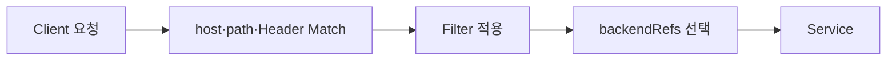

# 5. HTTPRoute Filter와 Traffic 제어

Gateway API는 Redirect, Rewrite와 Header 변경을 `HTTPRoute.rules.filters`의 구조화된 필드로 표현한다. 구현체별 문자열 설정 대신 API Server가 형태를 검증하고, 구현체의 Conformance로 지원 범위를 확인할 수 있다.

## Filter의 위치

```yaml
spec:
  rules:
    - matches:
        - path:
            type: PathPrefix
            value: /api
      filters:
        - type: URLRewrite
          urlRewrite:
            path:
              type: ReplacePrefixMatch
              replacePrefixMatch: /
      backendRefs:
        - name: api-service
          port: 8080
```

처리 순서는 개념적으로 다음과 같다.



여러 Filter를 조합할 때의 순서와 지원 범위는 구현체 문서를 확인해야 한다.

## URLRewrite로 Prefix 제거

외부 요청 `/api/users`를 backend의 `/users`로 전달하는 예시다.

```yaml
apiVersion: gateway.networking.k8s.io/v1
kind: HTTPRoute
metadata:
  name: api-rewrite
  namespace: apps
spec:
  parentRefs:
    - name: public-gateway
      namespace: gateway-system
      sectionName: https
  hostnames:
    - app.example.test
  rules:
    - matches:
        - path:
            type: PathPrefix
            value: /api
      filters:
        - type: URLRewrite
          urlRewrite:
            path:
              type: ReplacePrefixMatch
              replacePrefixMatch: /
      backendRefs:
        - name: api-service
          port: 8080
```

| Client 요청 | Match Prefix | backend 요청 |
|---|---|---|
| `/api` | `/api` | `/` |
| `/api/` | `/api` | `/` |
| `/api/users` | `/api` | `/users` |
| `/api/users/1` | `/api` | `/users/1` |

Captured group 정규 표현식 대신 `PathPrefix`와 `ReplacePrefixMatch`의 관계를 API 필드로 명확히 표현한다.

## RequestRedirect로 HTTP를 HTTPS로 전환

HTTP Listener에 연결되는 전용 HTTPRoute를 만들고 HTTPS로 Redirect한다.

```yaml
apiVersion: gateway.networking.k8s.io/v1
kind: HTTPRoute
metadata:
  name: http-to-https
  namespace: apps
spec:
  parentRefs:
    - name: public-gateway
      namespace: gateway-system
      sectionName: http
  hostnames:
    - app.example.test
  rules:
    - filters:
        - type: RequestRedirect
          requestRedirect:
            scheme: https
            statusCode: 301
```

Redirect는 backend로 요청을 보내는 것이 아니라 Client에 3xx 응답을 반환한다.

```http
HTTP/1.1 301 Moved Permanently
Location: https://app.example.test/api/users
```

POST·PUT처럼 HTTP Method를 유지해야 하는 Redirect에는 307 또는 308이 적합하지만, 해당 status code는 구현체의 Extended 기능 지원 여부를 확인한다.

> `URLRewrite`와 `RequestRedirect`는 같은 Rule에서 함께 사용할 수 없다. Rewrite는 Gateway 내부에서 upstream 요청을 바꾸고, Redirect는 Client에게 새 URL로 다시 요청하도록 지시하기 때문이다.

## RequestHeaderModifier

backend로 전달할 요청 Header를 추가·변경·삭제할 수 있다.

```yaml
filters:
  - type: RequestHeaderModifier
    requestHeaderModifier:
      add:
        - name: x-environment
          value: production
      set:
        - name: x-api-version
          value: v2
      remove:
        - x-legacy-header
```

인증이나 신뢰 경계에 사용하는 Header는 Client가 임의로 보낸 값을 그대로 신뢰하지 않도록 Gateway와 애플리케이션 양쪽 정책을 점검한다.

## ResponseHeaderModifier

구현체가 해당 기능을 지원하면 Client 응답 Header도 조정할 수 있다.

```yaml
filters:
  - type: ResponseHeaderModifier
    responseHeaderModifier:
      add:
        - name: x-content-type-options
          value: nosniff
```

보안 Header는 애플리케이션에서 설정할지 Gateway에서 중앙 설정할지 소유권을 정해 중복되거나 충돌하지 않게 한다.

## Traffic Weight

Filter가 아니지만 `backendRefs.weight`는 HTTPRoute의 대표적인 Traffic 제어 기능이다.

```yaml
rules:
  - backendRefs:
      - name: api-v1
        port: 8080
        weight: 95
      - name: api-v2
        port: 8080
        weight: 5
```

- weight 합계가 반드시 100일 필요는 없다.
- 요청별 정확한 백분율을 보장하는 값이 아니라 전체 비율의 목표다.
- Session persistence와 장기 연결은 관찰되는 분포에 영향을 줄 수 있다.
- 새 Version의 Health, Error rate와 Latency를 함께 관찰한다.

## Timeout

HTTPRoute Rule에서 전체 요청과 backend 요청 Timeout을 분리할 수 있다.

```yaml
rules:
  - timeouts:
      request: 10s
      backendRequest: 2s
    backendRefs:
      - name: api-service
        port: 8080
```

`backendRequest`는 `request`보다 클 수 없다. Timeout 필드는 Standard Channel에 포함되어 있지만 선택한 구현체와 Version이 지원하는지 확인한다.

## 지원 범위 확인

Gateway API 기능은 다음 범주로 구분된다.

- Core: 해당 Profile과 Route를 지원하는 구현체가 반드시 제공해야 하는 기능
- Extended: 구현체가 선택적으로 지원하고 Conformance report에 선언하는 기능
- Implementation-specific: 표준의 이식성 보장이 없는 기능

```bash
kubectl describe httproute api-rewrite -n apps
kubectl get httproute api-rewrite -n apps -o yaml
```

Filter가 지원되지 않거나 조합할 수 없다면 HTTPRoute의 `Accepted`가 `False`가 되고 `IncompatibleFilters` 같은 Reason이 기록될 수 있다. YAML 저장 성공만으로 기능 지원을 판단하지 않는다.

## 참고 자료

- [HTTP Redirect와 Rewrite](https://gateway-api.sigs.k8s.io/guides/user-guides/http-redirect-rewrite/)
- [HTTPRoute Filter](https://gateway-api.sigs.k8s.io/reference/api-types/httproute/#filters-optional)
- [HTTPRoute Traffic Weight와 Timeout](https://gateway-api.sigs.k8s.io/reference/api-types/httproute/)

