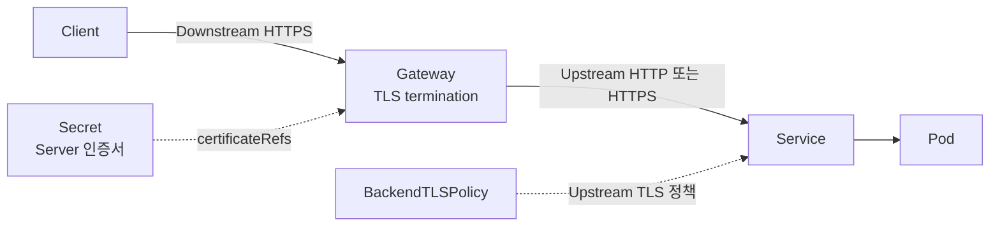

# 6. Gateway API에 SSL/TLS 적용

## TLS 구간 이해

Gateway API는 Client에서 Gateway까지의 downstream TLS와 Gateway에서 backend까지의 upstream TLS를 분리해서 설정한다.



- Downstream TLS: Gateway의 HTTPS Listener와 `certificateRefs`로 설정한다.
- Upstream TLS: Service를 대상으로 하는 `BackendTLSPolicy`로 설정한다.
- TLS passthrough: TLS Listener와 TLSRoute를 사용하며 HTTP 내용을 해석하지 않는다.

## TLS Secret 준비

기존 인증서와 Private key로 Kubernetes TLS Secret을 만들 수 있다.

```bash
kubectl create secret tls app-example-tls \
  --cert=./tls.crt \
  --key=./tls.key \
  --namespace=gateway-system \
  --dry-run=client \
  -o yaml
```

TLS Secret에는 `tls.crt`와 `tls.key`가 들어간다. Private key가 포함된 YAML을 Git에 Commit하지 않는다.

로컬 실습용 자체 서명 인증서는 다음처럼 만들 수 있다.

```bash
openssl req -x509 -nodes -days 30 -newkey rsa:2048 \
  -keyout tls.key \
  -out tls.crt \
  -subj "/CN=app.example.test" \
  -addext "subjectAltName=DNS:app.example.test"
```

자체 서명 인증서는 운영용이 아니며 Client가 기본적으로 신뢰하지 않는다.

## HTTP와 HTTPS Listener

Gateway는 Network 진입점과 인증서를 소유한다.

```yaml
apiVersion: gateway.networking.k8s.io/v1
kind: Gateway
metadata:
  name: public-gateway
  namespace: gateway-system
spec:
  gatewayClassName: example
  listeners:
    - name: http
      hostname: app.example.test
      protocol: HTTP
      port: 80
      allowedRoutes:
        namespaces:
          from: All
    - name: https
      hostname: app.example.test
      protocol: HTTPS
      port: 443
      tls:
        mode: Terminate
        certificateRefs:
          - group: ""
            kind: Secret
            name: app-example-tls
      allowedRoutes:
        namespaces:
          from: All
```

Gateway와 Secret이 같은 Namespace이면 `certificateRefs.namespace`를 생략한다.

## HTTPS HTTPRoute

애플리케이션 Route는 `sectionName: https`로 HTTPS Listener에 연결한다.

```yaml
apiVersion: gateway.networking.k8s.io/v1
kind: HTTPRoute
metadata:
  name: app-https
  namespace: apps
spec:
  parentRefs:
    - name: public-gateway
      namespace: gateway-system
      sectionName: https
  hostnames:
    - app.example.test
  rules:
    - matches:
        - path:
            type: PathPrefix
            value: /
      backendRefs:
        - name: web-service
          port: 80
```

Gateway Listener의 hostname, HTTPRoute의 hostname과 인증서 SAN이 서로 일치해야 한다.

## HTTP에서 HTTPS로 Redirect

HTTP Listener에는 backend Route 대신 Redirect 전용 Route를 연결한다.

```yaml
apiVersion: gateway.networking.k8s.io/v1
kind: HTTPRoute
metadata:
  name: app-http-redirect
  namespace: apps
spec:
  parentRefs:
    - name: public-gateway
      namespace: gateway-system
      sectionName: http
  hostnames:
    - app.example.test
  rules:
    - filters:
        - type: RequestRedirect
          requestRedirect:
            scheme: https
            statusCode: 301
```

`RequestRedirect`는 Client에게 새 URL을 알려주며 Service로 요청을 전달하지 않는다.

## 다른 Namespace의 인증서 참조

Gateway가 다른 Namespace의 Secret을 참조하려면 Secret이 있는 대상 Namespace에서 `ReferenceGrant`로 명시적으로 허용해야 한다.

```yaml
apiVersion: gateway.networking.k8s.io/v1
kind: ReferenceGrant
metadata:
  name: allow-gateway-certificate
  namespace: certificates
spec:
  from:
    - group: gateway.networking.k8s.io
      kind: Gateway
      namespace: gateway-system
  to:
    - group: ""
      kind: Secret
```

그 뒤 Gateway의 `certificateRefs`에 Secret Namespace를 지정한다.

```yaml
certificateRefs:
  - group: ""
    kind: Secret
    name: app-example-tls
    namespace: certificates
```

ReferenceGrant는 참조하는 쪽이 아니라 참조 대상 리소스의 소유자가 생성한다. 이를 통해 다른 Namespace가 Secret이나 Service를 임의로 가져다 쓰지 못하게 한다.

## curl로 확인하기

`192.0.2.50`을 실제 Gateway 주소로 바꾼다.

```bash
curl -I --resolve app.example.test:80:192.0.2.50 \
  http://app.example.test/
```

```http
HTTP/1.1 301 Moved Permanently
Location: https://app.example.test/
```

```bash
curl -I --resolve app.example.test:443:192.0.2.50 \
  https://app.example.test/
```

```http
HTTP/2 200
content-type: text/html
```

자체 서명 인증서 실습에서만 제한적으로 `curl -k`를 사용할 수 있다. 운영 문제 확인에서 `-k`를 사용하면 이름 불일치, 만료와 신뢰 Chain 오류를 숨기므로 먼저 인증서를 정상 검증한다.

## BackendTLSPolicy

Gateway에서 backend까지도 TLS가 필요하면 Service를 대상으로 `BackendTLSPolicy`를 적용한다. 이 리소스는 Standard Channel의 안정 API지만 구현체가 해당 기능을 지원하는지 확인해야 한다.

```yaml
apiVersion: gateway.networking.k8s.io/v1
kind: BackendTLSPolicy
metadata:
  name: api-backend-tls
  namespace: apps
spec:
  targetRefs:
    - group: ""
      kind: Service
      name: api-service
  validation:
    hostname: api.apps.svc.cluster.local
    caCertificateRefs:
      - group: ""
        kind: ConfigMap
        name: api-ca
```

- Policy와 대상 Service는 같은 Namespace에 둔다.
- `hostname`은 Gateway가 backend TLS 연결에 사용할 SNI이며 인증서와 일치해야 한다.
- `caCertificateRefs`는 backend 인증서를 검증할 CA Bundle을 참조한다.
- CA 참조와 Policy 대상은 Namespace 경계를 넘지 않는다.

## TLS passthrough

Gateway가 TLS를 종료하지 않고 backend까지 암호화된 연결을 그대로 보낼 때는 TLS Listener와 TLSRoute를 사용한다.

```text
HTTPS Listener + HTTPRoute
    → Gateway에서 TLS 종료
    → host, path, Header 기반 HTTP Routing 가능

TLS Listener + TLSRoute
    → TLS passthrough 가능
    → HTTP 내용을 볼 수 없어 path와 Header Routing 불가
```

필요한 기능이 L7 HTTP Routing인지, 암호화된 Stream 전달인지 먼저 구분한다.

## 자주 발생하는 문제

| 증상 | 확인할 항목 |
|---|---|
| 기본 인증서가 표시됨 | SNI, Listener hostname과 certificateRefs |
| Route가 연결되지 않음 | Listener `allowedRoutes`와 HTTPRoute `parentRefs` |
| `ResolvedRefs=False` | Secret·Service 이름, Namespace와 ReferenceGrant |
| 인증서 이름 불일치 | 인증서 SAN과 요청 host |
| 인증서 Chain 오류 | Leaf와 Intermediate 인증서 순서 |
| HTTPS는 되지만 backend 오류 | Service port, EndpointSlice와 BackendTLSPolicy |

```bash
kubectl describe gateway public-gateway -n gateway-system
kubectl describe httproute app-https -n apps
kubectl get secret app-example-tls -n gateway-system
openssl s_client -connect app.example.test:443 \
  -servername app.example.test -showcerts
```

## 참고 자료

- [Gateway API TLS 구성](https://gateway-api.sigs.k8s.io/guides/user-guides/tls/)
- [HTTP Redirect](https://gateway-api.sigs.k8s.io/guides/user-guides/http-redirect-rewrite/)
- [ReferenceGrant](https://gateway-api.sigs.k8s.io/api-types/referencegrant/)
- [BackendTLSPolicy](https://gateway-api.sigs.k8s.io/reference/api-types/policy/backendtlspolicy/)

