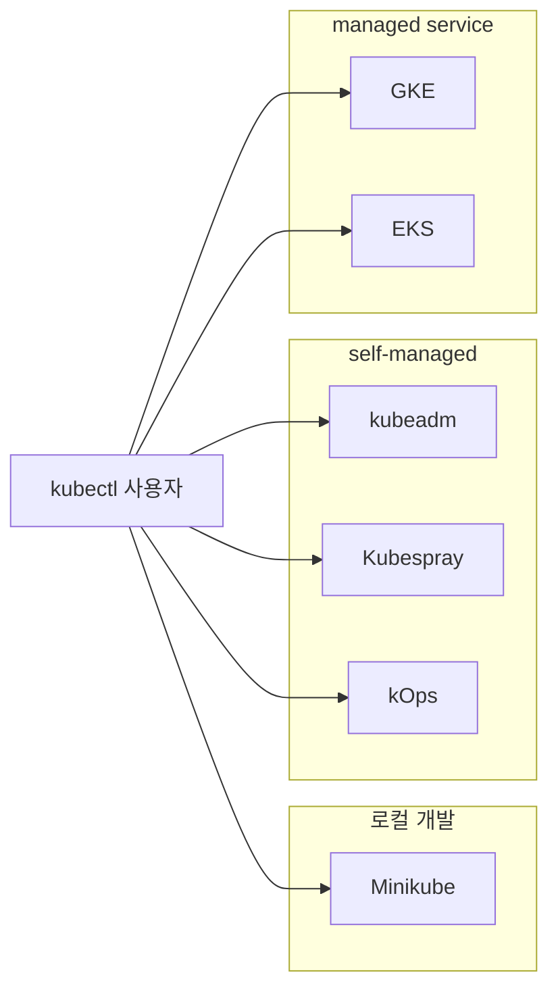
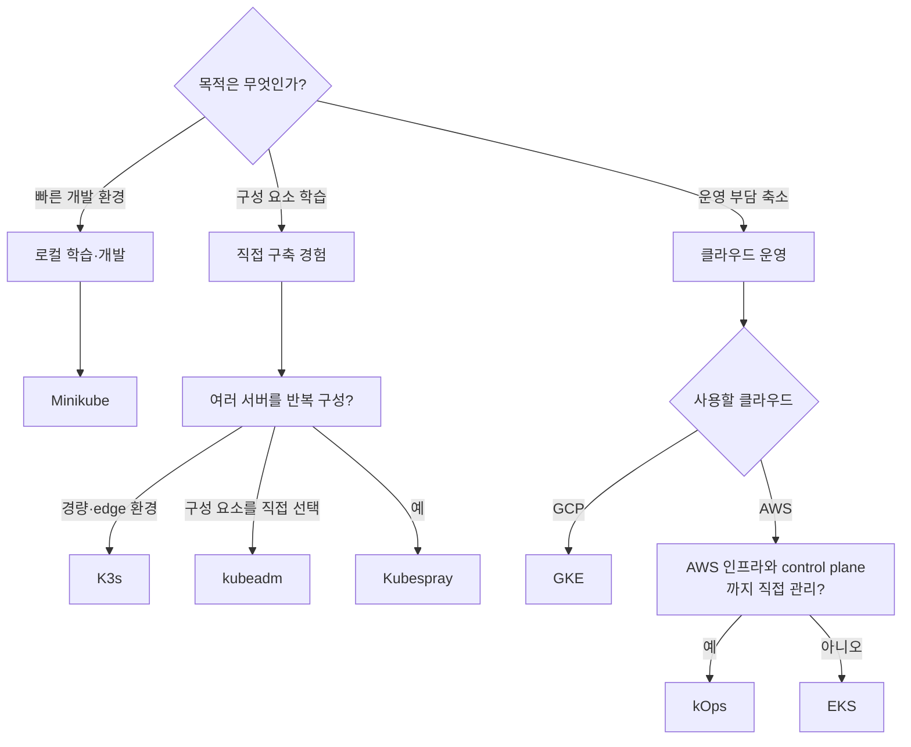

# 1. 쿠버네티스 설치 환경의 종류

쿠버네티스 클러스터를 준비하는 방법은 크게 로컬 개발 환경, 직접 구축하는 self-managed 환경, 클라우드 사업자가 제어 영역을 관리하는 managed 환경으로 나뉜다.

어떤 방법을 사용하더라도 최종적으로는 `kubectl`이 Kubernetes API Server와 통신한다. 차이는 control plane과 worker node를 누가 만들고 운영하는가에 있다.



## 설치 환경을 나누는 기준

### 로컬 개발 환경

개인 컴퓨터 안에 학습과 개발용 클러스터를 만든다. 짧은 시간에 생성하고 삭제하기 쉽지만, 실제 여러 서버의 장애와 네트워크 구조를 그대로 재현하지는 못한다.

대표 도구는 Minikube와 kind이다. 이 학습에서는 사용자가 정한 방향에 따라 Minikube를 기본 개발 환경으로 사용한다.

### Self-managed 환경

서버, 네트워크, 운영체제, container runtime, control plane, 인증서와 업그레이드를 사용자가 직접 관리한다.

설치 과정에서 Kubernetes 구성 요소의 관계를 깊게 이해할 수 있고 환경을 세밀하게 제어할 수 있다. 반면 고가용성, 백업, 보안 패치와 장애 복구에 대한 운영 책임도 사용자가 가진다.

### Managed Kubernetes 환경

클라우드 사업자가 API Server와 etcd를 포함한 control plane을 관리한다. 사용자는 node와 workload에 집중하거나, Autopilot·Auto Mode 같은 형태에서는 node 관리의 상당 부분도 클라우드에 맡길 수 있다.

운영 부담이 줄고 클라우드의 IAM, Load Balancer, Storage와 쉽게 연동할 수 있지만 사용 비용, 클라우드 종속성과 서비스별 제약을 고려해야 한다.

## 설치 방법 비교

| 방식 | 실행 위치 | Control plane 관리 | 주요 특징 | 적합한 용도 |
| --- | --- | --- | --- | --- |
| Minikube | 개인 PC | Minikube | 생성·삭제가 빠르고 driver 선택 가능 | 학습, 로컬 개발, 기능 확인 |
| K3s | 저사양 Linux, edge·VM·bare metal | 사용자와 K3s | 의존성을 묶은 경량 Kubernetes 배포판 | edge, IoT, 소규모 self-managed cluster |
| kubeadm | 물리·가상 서버, 클라우드 VM | 사용자 | 공식 bootstrap 도구, 구성 요소를 직접 선택 | 구조 학습, on-premises, 맞춤형 구축 |
| Kubespray | SSH 가능한 여러 서버 | 사용자 | Ansible로 kubeadm 기반 설치를 자동화 | 반복 가능한 다중 노드 구축 |
| kOps | 주로 AWS | 사용자와 kOps | 클라우드 인프라와 Kubernetes 수명주기를 함께 관리 | AWS의 self-managed 클러스터 |
| GKE | Google Cloud | Google | Standard와 Autopilot 제공 | GCP 기반 운영 환경 |
| EKS | AWS | AWS | Standard, Auto Mode와 AWS 서비스 통합 | AWS 기반 운영 환경 |

## 도구별 특징

### Minikube

Minikube는 로컬 컴퓨터에 단일 노드 또는 소규모 다중 노드 Kubernetes 클러스터를 만든다. Docker, 가상 머신 등 여러 driver 중 하나를 사용해 node 환경을 준비하고 kubeadm 등의 구성 요소로 Kubernetes를 구성한다.

장점:

- 설치와 삭제가 간단하다.
- 여러 profile을 만들어 서로 다른 실습 환경을 분리할 수 있다.
- dashboard, ingress, metrics-server 같은 addon을 쉽게 활성화할 수 있다.
- 실제 Kubernetes API와 `kubectl`을 사용한다.

한계:

- 기본적으로 한 대의 개발 컴퓨터 안에서 동작한다.
- 호스트 장애, 실제 Load Balancer, 여러 데이터센터 네트워크를 그대로 재현하지 못한다.
- production 클러스터 운영 도구로 사용하지 않는다.

### kubeadm

`kubeadm`은 Kubernetes control plane과 node를 bootstrap하는 공식 도구이다.

다음 작업을 수행한다.

- 인증서와 kubeconfig 생성
- API Server, Controller Manager, Scheduler와 etcd 구성
- kubelet 설정과 bootstrap token 생성
- worker 또는 추가 control plane node가 참여할 `join` 명령 생성

반면 다음 영역은 직접 결정해야 한다.

- 서버와 OS 준비
- container runtime 설치
- CNI plugin 선택과 설치
- Load Balancer와 control plane 고가용성
- storage, ingress, monitoring, backup
- 버전 업그레이드와 node 교체

즉, kubeadm은 완성된 플랫폼 설치 프로그램이라기보다 표준적인 Kubernetes 클러스터를 만드는 핵심 building block이다.

### K3s

K3s는 containerd, Flannel, CoreDNS, Traefik, ServiceLB와 local-path provisioner 등 Kubernetes 실행에 필요한 여러 구성 요소를 하나의 경량 배포판으로 묶는다.

단일 server는 SQLite를 기본 datastore로 사용해 빠르게 시작할 수 있다. 여러 server로 고가용성을 구성할 때는 embedded etcd 또는 외부 데이터베이스를 사용할 수 있다.

Minikube와 달리 Linux 서버에 system service로 직접 설치해 장기간 실행할 수 있으며 edge, IoT, ARM과 소규모 on-premises 환경에도 사용할 수 있다. 설치가 간단하더라도 인증서, backup, upgrade, node 보안과 장애 대응 책임은 사용자에게 있다.

### Kubespray

Kubespray는 Ansible playbook을 이용해 여러 서버에 production-ready Kubernetes 클러스터를 구성하는 프로젝트이다. 내부적으로 kubeadm과 여러 Kubernetes 구성 요소를 조합한다.

```text
Ansible 실행 호스트
   └─ inventory와 group_vars
       ├─ control-plane-1
       ├─ control-plane-2
       ├─ worker-1
       └─ worker-2
```

장점:

- 여러 node의 OS 설정과 패키지 설치를 반복 가능하게 자동화한다.
- 다양한 Linux 배포판과 CNI 선택을 지원한다.
- inventory를 통해 node 역할을 명확히 관리한다.
- 수동 kubeadm 설치보다 동일한 구성을 재현하기 쉽다.

주의점:

- Ansible, SSH, inventory와 변수 구조를 이해해야 한다.
- 자동화가 문제를 없애 주는 것은 아니다. 실패 시 생성된 설정과 playbook을 분석할 수 있어야 한다.
- 프로젝트 버전별 지원 Kubernetes와 Ansible 버전을 맞춰야 한다.

### kOps

kOps는 Kubernetes Operations의 줄임말로, Kubernetes 클러스터뿐 아니라 AWS의 VPC, EC2 Auto Scaling Group, Load Balancer, IAM 등의 인프라도 함께 구성한다.

kOps는 클러스터의 원하는 구성을 S3 state store에 저장하고, 현재 AWS 리소스와 비교해 생성하거나 변경한다. AWS에서 Kubernetes의 내부 구성까지 직접 관리하고 싶을 때 사용할 수 있다.

kOps와 EKS의 가장 큰 차이는 control plane 관리 주체이다.

```text
kOps: control plane VM과 etcd까지 사용자가 운영
EKS : control plane은 AWS가 관리
```

### GKE

Google Kubernetes Engine은 Google Cloud의 managed Kubernetes 서비스이다.

- Standard: Google이 control plane을 관리하고 사용자가 node pool 구성을 세밀하게 제어한다.
- Autopilot: node 준비, 확장과 여러 보안 기본값까지 Google이 더 많이 관리한다.

Google Cloud의 IAM, VPC, Cloud Load Balancing, Persistent Disk, Cloud Logging과 자연스럽게 통합된다.

### EKS

Amazon Elastic Kubernetes Service는 AWS의 managed Kubernetes 서비스이다.

- EKS Standard: AWS가 control plane을 관리하고 사용자가 managed node group, self-managed node 등의 compute 방식을 선택한다.
- EKS Auto Mode: node 준비, 확장, 운영체제 패치와 여러 인프라 기능까지 AWS가 더 넓게 관리한다.

AWS IAM, VPC, ECR, EBS·EFS, Elastic Load Balancing과 통합된다. 이 문서에서는 비교 대상으로만 다루고 별도 설치 절차는 작성하지 않는다.

## 선택 기준



## 이 학습에서의 사용 방향

1. 일상적인 개발과 Kubernetes 리소스 학습은 Minikube를 사용한다.
2. 경량 Linux cluster와 batteries-included 구성을 K3s로 이해한다.
3. 여러 서버의 구성과 control plane 구조는 kubeadm 설치 과정을 통해 이해한다.
4. CNI는 Calico 설치 예시를 기준으로 하고 Cilium과 Multus의 역할 차이를 비교한다.
5. kOps와 GKE는 구조와 주요 CLI 옵션을 이해하는 수준으로 정리하며 실제 클라우드 리소스는 만들지 않는다.

## 참고

- [Kubernetes production environment](https://kubernetes.io/docs/setup/production-environment/)
- [Minikube 공식 문서](https://minikube.sigs.k8s.io/docs/)
- [K3s 공식 문서](https://docs.k3s.io/)
- [Kubespray 공식 저장소](https://github.com/kubernetes-sigs/kubespray)
- [kOps 공식 문서](https://kops.sigs.k8s.io/)
- [GKE 공식 문서](https://cloud.google.com/kubernetes-engine/docs)
- [Amazon EKS 개요](https://docs.aws.amazon.com/eks/latest/userguide/what-is-eks.html)
