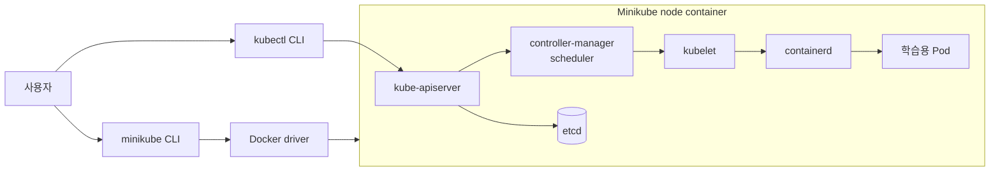
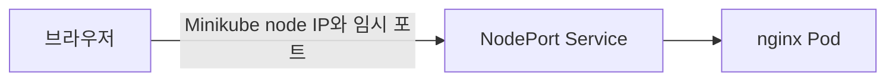

# 2. Minikube 개발 환경 설치

Minikube는 개인 컴퓨터 안에 학습과 개발용 Kubernetes 클러스터를 만든다. Linux, macOS와 Windows를 지원하며 Docker container 또는 가상 머신을 node로 사용할 수 있다.

이 문서는 현재 개발 환경인 macOS와 Docker driver를 중심으로 설명한다. 명령은 예시이며 아직 실행한 결과가 아니다.

## Minikube 구조

Minikube와 `kubectl`의 역할은 다르다.

- `minikube`: 로컬 Kubernetes 클러스터 자체의 생성, 시작, 중지와 삭제를 관리한다.
- `kubectl`: 만들어진 Kubernetes API Server에 요청을 보내 Pod, Deployment, Service 같은 리소스를 관리한다.



Docker driver를 사용해도 Kubernetes Pod가 현재 호스트의 Docker 컨테이너와 같은 계층에 바로 만들어지는 것은 아니다. Minikube node 역할의 컨테이너가 먼저 만들어지고, 그 내부의 container runtime이 Pod 컨테이너를 관리한다.

## 사전 조건

기본적으로 다음 도구가 필요하다.

- Minikube CLI
- Kubernetes CLI인 `kubectl`
- Docker Desktop 또는 다른 지원 driver
- 클러스터에 할당할 CPU, 메모리와 디스크 공간

현재 Minikube 공식 문서에서는 macOS의 Docker driver를 권장 driver 중 하나로 안내한다.

## Minikube와 kubectl 설치

macOS에서 Homebrew를 사용하면 다음과 같이 설치할 수 있다.

```bash
brew install minikube
brew install kubectl
```

설치 여부와 버전은 다음 명령으로 확인한다.

```bash
minikube version
kubectl version --client
```

`kubectl`은 control plane과 한 minor version 이내의 버전을 사용하는 것이 안전하다. 예를 들어 1.36 control plane은 일반적으로 1.35, 1.36, 1.37 `kubectl`과 호환 범위에 있다.

## 클러스터 시작

가장 단순한 Docker driver 시작 명령은 다음과 같다.

```bash
minikube start --driver=docker
```

개발 환경의 자원과 버전을 명시하면 재현하기 쉬워진다.

```bash
minikube start \
  --profile=docker-study \
  --driver=docker \
  --container-runtime=containerd \
  --cpus=4 \
  --memory=6g \
  --kubernetes-version=stable \
  --nodes=1
```

### 주요 `start` 옵션

| 옵션 | 의미 | 예시 |
| --- | --- | --- |
| `-p`, `--profile` | 여러 Minikube 클러스터를 구분하는 이름 | `--profile=docker-study` |
| `--driver` | node를 만들 방식 | `--driver=docker` |
| `--container-runtime` | node 안에서 Pod를 실행할 CRI runtime | `containerd`, `docker`, `cri-o` |
| `--cpus` | 클러스터에 할당할 CPU | `--cpus=4` |
| `--memory` | 클러스터에 할당할 메모리 | `--memory=6g` |
| `--disk-size` | node 디스크 크기 | `--disk-size=30g` |
| `--kubernetes-version` | 사용할 Kubernetes 버전 | `stable`, `v1.36.0` |
| `--nodes` | 생성할 전체 node 수 | `--nodes=3` |
| `--addons` | 시작 시 활성화할 addon 목록 | `--addons=metrics-server` |

`stable`은 시간이 지나면 다른 버전을 가리킬 수 있다. 팀에서 동일한 환경을 재현해야 한다면 검증한 정확한 Kubernetes 버전을 고정한다.

## Profile

Profile은 서로 다른 Minikube 클러스터를 같은 컴퓨터에서 구분하는 이름이다.

```bash
minikube start -p docker-study --driver=docker
minikube start -p test-cluster --driver=docker
minikube profile list
```

Profile을 지정해 만든 클러스터에는 이후 명령에도 `-p`를 사용한다.

```bash
minikube status -p docker-study
minikube stop -p docker-study
```

Minikube가 클러스터를 만들면 kubeconfig에 context도 추가한다. 현재 context는 다음 명령으로 확인한다.

```bash
kubectl config current-context
kubectl config get-contexts
```

여러 클러스터를 사용할 때는 명령을 보내기 전에 현재 context를 확인하는 습관이 중요하다.

## 클러스터 상태 확인

```bash
minikube status -p docker-study
kubectl cluster-info
kubectl get nodes -o wide
kubectl get pods --all-namespaces
```

정상적으로 시작되면 node의 상태가 `Ready`가 되고 `kube-system` namespace의 주요 Pod가 `Running` 상태가 된다.

`kubectl`이 별도로 설치되지 않았더라도 Minikube가 제공하는 버전을 사용할 수 있다.

```bash
minikube kubectl -p docker-study -- get nodes
```

`--` 앞은 Minikube 옵션이고 뒤는 `kubectl`에 전달할 인자이다.

## 기본 애플리케이션 흐름 예시

다음은 Minikube 사용 흐름을 보여 주는 예시이며 이 문서 작성 과정에서는 실행하지 않는다.

```bash
kubectl create deployment web --image=nginx:alpine
kubectl expose deployment web --type=NodePort --port=80
kubectl get deployment,pod,service
minikube service web --url -p docker-study
```



`minikube service`는 driver와 운영체제에 맞는 접근 경로를 계산하고, 필요한 경우 tunnel을 유지한다. 반환된 URL은 개발용 접근 경로이며 production Load Balancer와 동일한 구조는 아니다.

## 자주 사용하는 명령

### 상태와 정보

```bash
minikube status -p docker-study
minikube ip -p docker-study
minikube node list -p docker-study
minikube logs -p docker-study
```

### Node 내부 확인

```bash
minikube ssh -p docker-study
```

Minikube node의 운영체제, kubelet과 container runtime 상태를 확인할 때 사용한다. 일반적인 애플리케이션 관리는 node에 SSH로 접속하기보다 `kubectl`을 사용한다.

### 일시 중지와 다시 시작

```bash
minikube pause -p docker-study
minikube unpause -p docker-study

minikube stop -p docker-study
minikube start -p docker-study
```

- `pause`: 실행 상태를 보존하면서 Kubernetes 관련 프로세스의 자원 사용을 줄인다.
- `stop`: node를 중지하지만 profile과 클러스터 데이터는 남긴다.
- `start`: 기존 profile이 있으면 해당 클러스터를 다시 시작한다.

### 클러스터 삭제

```bash
minikube delete -p docker-study
```

해당 profile의 node와 클러스터 데이터를 제거한다. 클러스터 안의 Pod, Secret과 local storage가 함께 사라질 수 있으므로 profile 이름을 확인한 뒤 실행한다.

## Addon

Minikube addon은 로컬 학습에서 자주 사용하는 기능을 간단히 추가한다.

```bash
minikube addons list -p docker-study
minikube addons enable metrics-server -p docker-study
minikube addons enable ingress -p docker-study
minikube addons disable ingress -p docker-study
```

주요 addon 예시:

| Addon | 용도 |
| --- | --- |
| `metrics-server` | `kubectl top`, HPA 학습에 필요한 resource metric 제공 |
| `ingress` | Ingress Controller를 이용한 HTTP routing 학습 |
| `dashboard` | Kubernetes Dashboard UI |
| `registry` | Minikube 내부 개발용 image registry |

addon 지원 여부는 driver와 운영체제에 따라 다를 수 있다. 예를 들어 Docker driver의 ingress 접근 방식은 Linux와 macOS에서 차이가 날 수 있다.

## 다중 Node Minikube

```bash
minikube start \
  -p multi-node \
  --driver=docker \
  --nodes=3 \
  --cpus=2 \
  --memory=3g
```

다중 node scheduling, label, taint를 연습할 수 있지만 모든 node가 같은 개발 컴퓨터 안에서 실행된다. 실제 서버 장애와 네트워크 분리를 완전히 재현하는 고가용성 환경은 아니다.

## 자주 발생하는 문제

### Docker daemon이 실행되지 않음

```text
Exiting due to PROVIDER_DOCKER_NOT_RUNNING
```

Docker Desktop의 실행 상태와 현재 Docker context를 확인한다.

```bash
docker info
docker context show
```

### 자원 부족

Pod가 `Pending`이거나 시스템 Pod가 불안정하면 Minikube에 할당한 CPU와 메모리를 확인한다. 기존 profile의 자원 설정을 크게 바꾸는 경우 새 profile을 만들거나 기존 profile을 삭제 후 재생성하는 편이 명확하다.

### 잘못된 kubectl context

Minikube는 정상인데 `kubectl`이 다른 클러스터를 보고 있을 수 있다.

```bash
kubectl config current-context
kubectl config use-context docker-study
```

### Image를 찾지 못함

호스트 Docker daemon과 Minikube node 내부 runtime의 image 저장소는 서로 다를 수 있다.

```bash
minikube image load example/app:dev -p docker-study
minikube image ls -p docker-study
```

로컬 image를 사용한다면 Pod spec의 `imagePullPolicy`와 image tag도 함께 확인한다.

## 참고

- [Minikube 시작하기](https://minikube.sigs.k8s.io/docs/start/)
- [Minikube driver](https://minikube.sigs.k8s.io/docs/drivers/)
- [Minikube Docker driver](https://minikube.sigs.k8s.io/docs/drivers/docker/)
- [`minikube start` 옵션](https://minikube.sigs.k8s.io/docs/commands/start/)
- [macOS에 kubectl 설치](https://kubernetes.io/docs/tasks/tools/install-kubectl-macos/)
