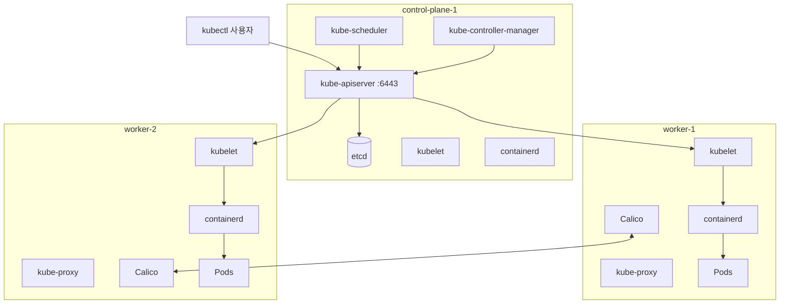
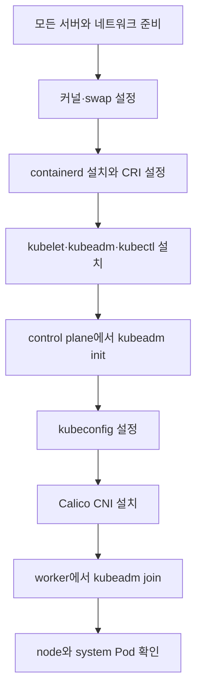
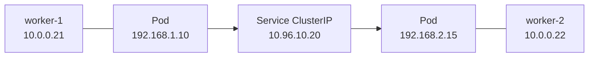
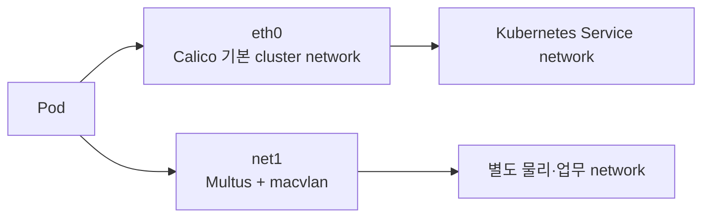

# 3. kubeadm 다중 노드 클러스터 설치

`kubeadm`은 Kubernetes control plane과 worker node를 표준적인 방법으로 bootstrap하는 공식 도구이다. 서버 생성, 운영체제 설정, container runtime, CNI, Load Balancer와 storage까지 자동으로 준비해 주는 도구는 아니다.

이 문서는 다음 환경을 기준으로 한다.

- Kubernetes 1.36
- Ubuntu 또는 Debian 계열 Linux
- containerd runtime
- control plane 1대와 worker 2대
- Calico CNI

명령은 학습용 예시이며 실제 서버의 IP 주소, 네트워크 대역, Kubernetes와 Calico 버전을 확인한 뒤 사용해야 한다.

## 클러스터 구조



### Control plane 구성 요소

| 구성 요소 | 역할 |
| --- | --- |
| `kube-apiserver` | 모든 Kubernetes API 요청의 진입점 |
| `etcd` | 클러스터의 원하는 상태와 실제 상태를 저장하는 분산 key-value 저장소 |
| `kube-scheduler` | 새 Pod를 실행할 적절한 node 선택 |
| `kube-controller-manager` | Deployment, Node 등 리소스의 원하는 상태를 지속적으로 조정 |

### 모든 Node의 구성 요소

| 구성 요소 | 역할 |
| --- | --- |
| `kubelet` | API Server로부터 PodSpec을 받고 node에서 Pod 실행 상태 관리 |
| `containerd` | CRI를 통해 Pod의 container와 image 관리 |
| `kube-proxy` | Service의 가상 IP와 트래픽 전달 규칙 구성 |
| CNI plugin | Pod IP 할당과 node 사이 Pod network 구성 |

## 설치 흐름



## 1. 사전 조건

공식 kubeadm 문서의 기본 요구 조건은 다음과 같다.

- 각 node에 2GB 이상의 RAM
- control plane node에 2개 이상의 CPU
- node 사이의 완전한 네트워크 연결
- node마다 고유한 hostname, MAC address와 `product_uuid`
- control plane과 worker 통신에 필요한 port 허용
- 지원되는 Linux kernel과 CRI runtime

학습용 예시 주소는 다음과 같이 가정한다.

| 역할 | Hostname | 주소 |
| --- | --- | --- |
| Control plane | `control-plane-1` | `10.0.0.10` |
| Worker | `worker-1` | `10.0.0.21` |
| Worker | `worker-2` | `10.0.0.22` |

실제 환경에서는 DHCP 변경으로 node 주소가 바뀌지 않도록 고정 주소 또는 안정적인 DNS 구성을 사용한다.

### 고유 식별자 확인

각 node에서 확인한다.

```bash
hostnamectl
ip link
sudo cat /sys/class/dmi/id/product_uuid
```

가상 머신을 복제하면 MAC address나 `product_uuid`가 중복될 수 있다. Kubernetes는 이를 node 식별에 사용하므로 VM template 설정을 확인해야 한다.

### 주요 Port

| 대상 | Port | 용도 |
| --- | --- | --- |
| Control plane | `6443/tcp` | Kubernetes API Server |
| Control plane | `2379-2380/tcp` | etcd client와 peer 통신 |
| Control plane | `10250/tcp` | kubelet API |
| Control plane | `10257/tcp` | controller-manager |
| Control plane | `10259/tcp` | scheduler |
| Worker | `10250/tcp` | kubelet API |
| Worker | `30000-32767/tcp,udp` | 기본 NodePort 범위 |

CNI plugin은 별도의 통신 port를 요구할 수 있다. 방화벽은 인터넷 전체에 개방하지 않고 cluster node와 관리 주소에 필요한 범위만 허용한다.

### 시간 동기화

Kubernetes 인증서와 분산 시스템은 node 간 시간 차이에 민감하다. 각 node에서 systemd-timesyncd, chrony 같은 시간 동기화가 정상인지 확인한다.

```bash
timedatectl status
```

## 2. 모든 Node의 Linux 설정

이 절의 명령은 control plane과 모든 worker node에서 수행한다.

### Kernel module

```bash
cat <<EOF | sudo tee /etc/modules-load.d/k8s.conf
overlay
br_netfilter
EOF

sudo modprobe overlay
sudo modprobe br_netfilter
```

- `overlay`: container image의 layered filesystem에 사용된다.
- `br_netfilter`: Linux bridge를 통과하는 트래픽이 netfilter 규칙의 영향을 받을 수 있게 한다.

선택한 CNI와 운영체제에 따라 필요한 kernel module이 다를 수 있으므로 CNI의 system requirement도 함께 확인한다.

### 네트워크 sysctl

```bash
cat <<EOF | sudo tee /etc/sysctl.d/99-kubernetes-cri.conf
net.bridge.bridge-nf-call-iptables  = 1
net.bridge.bridge-nf-call-ip6tables = 1
net.ipv4.ip_forward                 = 1
EOF

sudo sysctl --system
```

`net.ipv4.ip_forward=1`은 서로 다른 interface와 node 사이에서 Pod 트래픽을 전달할 수 있게 한다.

### Swap

kubelet의 기본 동작은 swap이 활성화되어 있으면 시작에 실패하는 것이다.

```bash
sudo swapoff -a
swapon --show
```

재부팅 후에도 비활성화하려면 `/etc/fstab` 또는 swap을 만든 systemd 설정에서 해당 항목을 확인해야 한다. `/etc/fstab`을 무조건 자동 수정하기보다 현재 swap 구성과 서버 운영 정책을 먼저 확인한다.

Kubernetes는 swap 사용 설정도 지원하지만 `failSwapOn`, `memorySwap.swapBehavior` 등을 의도적으로 구성해야 한다. 기본 설치 학습에서는 swap을 비활성화한다.

## 3. containerd 설치

Kubernetes 1.36은 CRI v1을 지원하는 container runtime이 필요하다. Docker Engine은 CRI를 직접 구현하지 않으므로 별도의 `cri-dockerd`가 없다면 kubelet의 runtime으로 직접 사용할 수 없다. 여기서는 containerd를 사용한다.

### 설치와 기본 설정 생성

배포판 저장소 또는 containerd 공식 설치 방법으로 package를 설치한다. Ubuntu repository를 사용하는 단순 예시는 다음과 같다.

```bash
sudo apt-get update
sudo apt-get install -y containerd

sudo mkdir -p /etc/containerd
containerd config default | sudo tee /etc/containerd/config.toml
```

package가 제공하는 containerd 버전과 Kubernetes 지원 범위를 확인한다.

### CRI plugin 확인

`/etc/containerd/config.toml`의 `disabled_plugins`에 `cri`가 포함되어 있으면 kubelet이 containerd를 CRI runtime으로 사용할 수 없다.

```toml
# 다음과 같이 cri가 비활성 목록에 있으면 제거한다.
disabled_plugins = ["cri"]
```

### systemd cgroup driver

systemd를 init system으로 사용하는 Linux에서는 kubelet과 containerd 모두 systemd cgroup driver를 사용하는 것이 권장된다.

containerd 1.x:

```toml
[plugins."io.containerd.grpc.v1.cri".containerd.runtimes.runc]
  [plugins."io.containerd.grpc.v1.cri".containerd.runtimes.runc.options]
    SystemdCgroup = true
```

containerd 2.x:

```toml
[plugins.'io.containerd.cri.v1.runtime'.containerd.runtimes.runc]
  [plugins.'io.containerd.cri.v1.runtime'.containerd.runtimes.runc.options]
    SystemdCgroup = true
```

설치된 containerd major version에 맞는 경로를 사용한다. 서로 다른 위치에 설정하면 문법은 정상이어도 실제 runtime에 적용되지 않을 수 있다.

```bash
containerd --version
sudo systemctl restart containerd
sudo systemctl enable --now containerd
sudo systemctl status containerd
```

기본 CRI socket은 다음 경로이다.

```text
unix:///run/containerd/containerd.sock
```

## 4. Kubernetes 저장소와 도구 설치

현재 공식 package 저장소는 `pkgs.k8s.io`이며 Kubernetes minor version마다 저장소가 분리되어 있다. 다음은 Kubernetes 1.36용 Debian 계열 예시이다.

```bash
KUBERNETES_MINOR="v1.36"

sudo apt-get update
sudo apt-get install -y apt-transport-https ca-certificates curl gpg
sudo mkdir -p -m 755 /etc/apt/keyrings

curl -fsSL "https://pkgs.k8s.io/core:/stable:/${KUBERNETES_MINOR}/deb/Release.key" \
  | sudo gpg --dearmor -o /etc/apt/keyrings/kubernetes-apt-keyring.gpg

echo "deb [signed-by=/etc/apt/keyrings/kubernetes-apt-keyring.gpg] https://pkgs.k8s.io/core:/stable:/${KUBERNETES_MINOR}/deb/ /" \
  | sudo tee /etc/apt/sources.list.d/kubernetes.list

sudo apt-get update
sudo apt-get install -y kubelet kubeadm kubectl
sudo apt-mark hold kubelet kubeadm kubectl
sudo systemctl enable --now kubelet
```

| 도구 | 역할 |
| --- | --- |
| `kubeadm` | 클러스터 초기화와 node 참여 |
| `kubelet` | 각 node에서 Pod 실행 상태 관리 |
| `kubectl` | Kubernetes API 조작 |

`apt-mark hold`는 일반 system upgrade에서 Kubernetes package가 임의로 올라가는 것을 막는다. Kubernetes upgrade는 control plane, kubelet과 node의 version skew 정책에 맞는 별도 절차로 진행해야 한다.

`kubeadm init` 전 kubelet이 재시작을 반복할 수 있다. 아직 kubeadm이 kubelet 설정을 만들지 않았기 때문에 예상되는 상태이다.

## 5. Control plane 초기화

이 절은 첫 번째 control plane node에서만 수행한다.

### Image 사전 확인

```bash
sudo kubeadm config images list --kubernetes-version v1.36.0
sudo kubeadm config images pull --kubernetes-version v1.36.0
```

정확한 patch version은 설치된 `kubeadm version`과 사용할 cluster version에 맞춘다. 외부 registry 접근이 제한된 환경에서는 필요한 image mirror와 registry 설정을 별도로 준비한다.

### `kubeadm init` 예시

```bash
sudo kubeadm init \
  --kubernetes-version=v1.36.0 \
  --apiserver-advertise-address=10.0.0.10 \
  --control-plane-endpoint=k8s-api.example.internal:6443 \
  --pod-network-cidr=192.168.0.0/16 \
  --service-cidr=10.96.0.0/12 \
  --cri-socket=unix:///run/containerd/containerd.sock \
  --upload-certs
```

단일 control plane 학습 환경에서는 `--control-plane-endpoint`와 `--upload-certs`를 생략할 수 있다. 여러 control plane을 구성하려면 처음부터 Load Balancer 또는 안정적인 DNS endpoint를 `--control-plane-endpoint`로 사용하는 것이 좋다.

### 주요 CLI 인자

| 인자 | 의미 | 주의점 |
| --- | --- | --- |
| `--kubernetes-version` | 초기화할 control plane 버전 | 설치한 kubeadm과 version skew 정책 확인 |
| `--apiserver-advertise-address` | 현재 control plane node에서 API Server가 알릴 주소 | node 사이에서 접근 가능한 고정 주소 사용 |
| `--control-plane-endpoint` | 모든 control plane을 대표하는 안정적인 주소 | HA에서는 Load Balancer 또는 DNS 필요 |
| `--pod-network-cidr` | CNI가 Pod IP에 사용할 대역 | Calico 설정과 일치해야 하며 host network와 겹치면 안 됨 |
| `--service-cidr` | ClusterIP Service에 사용할 가상 IP 대역 | Pod, node, 사내/VPN 대역과 겹치지 않게 설계 |
| `--service-dns-domain` | cluster DNS suffix | 기본값 `cluster.local` |
| `--cri-socket` | kubelet이 사용할 CRI endpoint | runtime이 여러 개일 때 명시하면 혼동 방지 |
| `--image-repository` | control plane image registry 변경 | 폐쇄망 또는 mirror 사용 시 필요 |
| `--apiserver-cert-extra-sans` | API Server 인증서에 추가할 DNS와 IP | 외부 DNS·Load Balancer 주소가 인증서에 필요할 때 사용 |
| `--upload-certs` | 추가 control plane join용 인증서를 임시 Secret에 암호화해 업로드 | 출력되는 certificate key는 민감 정보이며 기본적으로 유효 시간이 제한됨 |
| `--config` | CLI flag 대신 kubeadm YAML 설정 사용 | 반복 가능한 설치에 권장 |
| `--ignore-preflight-errors` | 선택한 preflight 오류를 무시 | 원인을 이해하지 못한 채 `all` 사용 금지 |

### `--pod-network-cidr`와 `--service-cidr`

```text
Node network   : 10.0.0.0/24
Pod network    : 192.168.0.0/16
Service network: 10.96.0.0/12
```

세 대역은 역할이 다르며 서로 또는 VPN·사내망과 겹치지 않아야 한다.



### 설정 파일 방식

운영 환경이나 반복 설치에서는 긴 CLI보다 설정 파일을 version control로 관리하는 편이 명확하다.

```yaml
apiVersion: kubeadm.k8s.io/v1beta4
kind: InitConfiguration
localAPIEndpoint:
  advertiseAddress: 10.0.0.10
  bindPort: 6443
nodeRegistration:
  criSocket: unix:///run/containerd/containerd.sock
---
apiVersion: kubeadm.k8s.io/v1beta4
kind: ClusterConfiguration
kubernetesVersion: v1.36.0
controlPlaneEndpoint: k8s-api.example.internal:6443
networking:
  podSubnet: 192.168.0.0/16
  serviceSubnet: 10.96.0.0/12
  dnsDomain: cluster.local
---
apiVersion: kubelet.config.k8s.io/v1beta1
kind: KubeletConfiguration
cgroupDriver: systemd
```

```bash
sudo kubeadm init --config kubeadm-config.yaml --upload-certs
```

사용할 Kubernetes 버전에서 지원하는 kubeadm configuration API version을 확인한다.

## 6. kubectl 설정

`kubeadm init`이 성공하면 일반 사용자가 control plane의 admin kubeconfig를 사용하도록 설정한다.

```bash
mkdir -p "$HOME/.kube"
sudo cp -i /etc/kubernetes/admin.conf "$HOME/.kube/config"
sudo chown "$(id -u):$(id -g)" "$HOME/.kube/config"
```

```bash
kubectl cluster-info
kubectl get nodes
kubectl get pods --all-namespaces
```

`admin.conf`에는 강한 cluster-admin 권한과 client credential이 포함되어 있다. Git에 저장하거나 불필요하게 다른 시스템에 복사하지 않는다.

CNI를 설치하기 전에는 node가 `NotReady`이고 CoreDNS Pod가 `Pending`일 수 있다.

## 7. Container Network Interface

Kubernetes는 Pod network 구현을 CNI plugin에 맡긴다. kubeadm은 특정 CNI를 자동으로 선택하거나 설치하지 않는다.

### CNI가 담당하는 것

- Pod에 IP 주소 할당과 회수
- Pod network interface 생성
- 같은 node와 다른 node 사이의 Pod 통신
- Service routing과 NetworkPolicy 지원 여부
- overlay 또는 native routing 구성

### CNI 비교

| CNI | 핵심 방식 | NetworkPolicy | 특징 | 주로 고려할 상황 |
| --- | --- | --- | --- | --- |
| Calico | routing, BGP, VXLAN, eBPF 선택 | 지원 | 다양한 환경과 정책, 비교적 넓은 사용 사례 | 일반 on-premises, cloud, 정책 학습 |
| Cilium | Linux eBPF, overlay 또는 native routing | L3~L7 확장 정책 지원 | kube-proxy 대체 가능, Hubble 관측성 | eBPF, 보안·관측성, 대규모 network |
| Flannel | 단순 overlay 중심 | 자체 정책 기능 없음 | 구조가 단순하고 학습이 쉬움 | 기본 Pod 연결이 우선인 단순 환경 |
| Multus | 다른 CNI를 호출하는 meta-plugin | 기본 CNI에 따름 | 한 Pod에 여러 network interface 연결 | NFV, storage·management network 분리 |

Multus는 보통 Calico나 Cilium을 대체하는 기본 Pod network가 아니다. 먼저 default CNI를 설치한 뒤 추가 interface가 필요할 때 함께 사용한다.



### CNI 선택 기준

- host와 Pod CIDR, encapsulation 방식
- NetworkPolicy 수준과 보안 요구
- Linux kernel과 eBPF 지원 여부
- 기존 BGP·VLAN·cloud network와의 통합
- 암호화, 관측성과 troubleshooting 도구
- 운영 인력이 이해하고 지원할 수 있는 복잡도

## 8. Calico 설치

이 문서는 Calico Open Source 3.32의 Tigera Operator 방식을 기준으로 한다. 버전은 예시이므로 설치 시점의 Calico system requirement와 지원 Kubernetes 버전을 다시 확인한다.

앞의 `kubeadm init`에서 다음 Pod CIDR을 사용했다고 가정한다.

```text
192.168.0.0/16
```

### Manifest 검토

원격 manifest를 바로 적용하기보다 먼저 내려받아 image, 권한과 IP pool 설정을 확인하는 것이 안전하다.

```bash
CALICO_VERSION="v3.32.1"

curl -LO "https://raw.githubusercontent.com/projectcalico/calico/${CALICO_VERSION}/manifests/v1_crd_projectcalico_org.yaml"
curl -LO "https://raw.githubusercontent.com/projectcalico/calico/${CALICO_VERSION}/manifests/tigera-operator.yaml"
curl -LO "https://raw.githubusercontent.com/projectcalico/calico/${CALICO_VERSION}/manifests/custom-resources-bpf.yaml"
```

다음을 확인한다.

- manifest URL과 tag가 공식 projectcalico repository인지
- IP pool CIDR이 kubeadm의 `--pod-network-cidr`와 일치하는지
- 선택한 encapsulation과 eBPF data plane이 host 환경에 적합한지
- image registry에 모든 node가 접근 가능한지

### Operator와 Custom Resource 설치

현재 Calico quickstart는 큰 CRD bundle에서 request size 문제를 피하기 위해 `kubectl create` 또는 `replace` 사용을 안내한다.

```bash
kubectl create -f v1_crd_projectcalico_org.yaml
kubectl create -f tigera-operator.yaml
kubectl create -f custom-resources-bpf.yaml
```

이 예시는 Calico eBPF data plane manifest를 사용한다. iptables data plane이나 다른 routing 방식을 원하면 공식 Calico 설치 옵션에서 해당 환경에 맞는 Installation custom resource를 선택한다.

### 설치 상태 확인

```bash
kubectl get pods -n tigera-operator
kubectl get pods -n calico-system
kubectl get tigerastatus
kubectl get nodes
```

Calico 구성 요소가 정상화되면 CoreDNS Pod와 node가 `Running`, `Ready` 상태로 전환된다.

```bash
kubectl get pods -n kube-system
kubectl get nodes -o wide
```

## 9. Worker Node 참여

`kubeadm init` 마지막에 출력된 join 명령을 각 worker node에서 root 권한으로 실행한다.

```bash
sudo kubeadm join k8s-api.example.internal:6443 \
  --token <BOOTSTRAP_TOKEN> \
  --discovery-token-ca-cert-hash sha256:<CA_CERT_HASH> \
  --cri-socket=unix:///run/containerd/containerd.sock
```

| 값 | 의미 |
| --- | --- |
| API endpoint | worker가 접속할 control plane 주소 |
| bootstrap token | 짧은 수명의 node bootstrap 인증 token |
| CA cert hash | 올바른 cluster CA인지 확인해 중간자 공격 방지 |
| CRI socket | kubelet이 사용할 container runtime endpoint |

Token이 만료되었거나 join 명령을 잃어버렸다면 control plane에서 다시 생성할 수 있다.

```bash
sudo kubeadm token create --print-join-command
```

Bootstrap token은 credential이므로 문서, 공개 채팅이나 Git에 실제 값을 저장하지 않는다.

### 추가 Control plane 참여

HA control plane은 worker join 명령에 다음 항목을 추가한다.

```text
--control-plane
--certificate-key <CERTIFICATE_KEY>
```

그 전에 Load Balancer로 사용하는 `--control-plane-endpoint`가 모든 control plane node에서 접근 가능해야 한다. `--upload-certs`의 certificate key와 Secret은 제한된 시간만 유효하므로 필요하면 다시 업로드한다.

## 10. 최종 확인

```bash
kubectl get nodes -o wide
kubectl get pods --all-namespaces -o wide
kubectl cluster-info
kubectl get --raw='/readyz?verbose'
```

예상 구조:

```text
NAME              STATUS   ROLES           VERSION
control-plane-1   Ready    control-plane   v1.36.x
worker-1          Ready    <none>          v1.36.x
worker-2          Ready    <none>          v1.36.x
```

간단한 Pod network 확인 예시:

```bash
kubectl create deployment web --image=nginx:alpine --replicas=3
kubectl get pods -o wide
kubectl expose deployment web --port=80
kubectl run network-test --rm -it --image=curlimages/curl -- curl http://web
```

이 명령들은 실제 실습 단계에서 사용하며 현재 문서 작성 과정에서는 실행하지 않는다.

## 문제 확인 순서

### Node가 `NotReady`

```bash
kubectl describe node <NODE_NAME>
kubectl get pods -n calico-system -o wide
sudo journalctl -u kubelet --no-pager -n 200
sudo crictl info
```

다음을 확인한다.

- CNI Pod가 해당 node에서 실행 중인지
- `/etc/cni/net.d`에 CNI 설정이 생성되었는지
- containerd CRI plugin이 활성화되어 있는지
- kubelet과 containerd의 cgroup driver가 일치하는지
- Pod CIDR이 host와 충돌하지 않는지

### `kubeadm init` preflight 실패

오류를 `--ignore-preflight-errors=all`로 숨기지 않는다. swap, port 사용, container runtime, hostname 중 어떤 조건이 실패했는지 먼저 수정한다.

```bash
sudo kubeadm init phase preflight --config kubeadm-config.yaml
```

### API Server에 연결되지 않음

```bash
sudo crictl ps -a
sudo crictl logs <APISERVER_CONTAINER_ID>
sudo ss -lntp | grep 6443
```

Load Balancer DNS, 인증서 SAN, firewall, node address와 static Pod 상태를 확인한다.

## 초기화와 재설치 주의

```bash
sudo kubeadm reset
```

`kubeadm reset`은 해당 node에서 kubeadm이 만든 구성을 되돌리는 명령이며 실행 중인 cluster의 상태를 파괴할 수 있다. CNI 설정, iptables 규칙, `$HOME/.kube/config`와 일부 data는 별도로 남을 수 있다. 대상 node와 보존할 etcd·application data를 확인한 뒤 실습 환경에서만 사용한다.

## 참고

- [kubeadm 설치](https://kubernetes.io/docs/setup/production-environment/tools/kubeadm/install-kubeadm/)
- [kubeadm으로 클러스터 생성](https://kubernetes.io/docs/setup/production-environment/tools/kubeadm/create-cluster-kubeadm/)
- [`kubeadm init` reference](https://kubernetes.io/docs/reference/setup-tools/kubeadm/kubeadm-init/)
- [Kubernetes container runtime](https://kubernetes.io/docs/setup/production-environment/container-runtimes/)
- [Kubernetes cluster networking](https://kubernetes.io/docs/concepts/cluster-administration/networking/)
- [Calico kubeadm quickstart](https://docs.tigera.io/calico/latest/getting-started/kubernetes/k8s-single-node)
- [Cilium과 Hubble](https://docs.cilium.io/en/stable/overview/intro/)
- [Multus CNI](https://github.com/k8snetworkplumbingwg/multus-cni)
