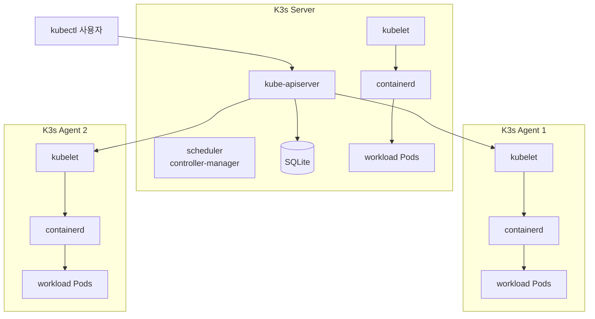
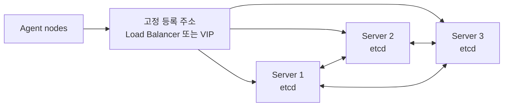

# 4. K3s 경량 클러스터

K3s는 CNCF conformant Kubernetes를 설치와 운영이 간단한 하나의 경량 배포판으로 묶은 프로젝트이다. Kubernetes API와 `kubectl` 사용 방식은 일반 Kubernetes와 같지만, 기본 runtime·network·ingress·storage를 함께 제공해 준비할 항목을 줄인다.

K3s는 다음 환경에 잘 맞는다.

- edge와 IoT 장비
- ARM 또는 자원이 제한된 Linux 서버
- 소규모 bare metal·VM cluster
- CI와 개발용 임시 cluster
- Kubernetes 구성 요소를 직접 모두 조립할 필요가 없는 self-managed 환경

## Minikube, K3s, kubeadm 비교

| 구분 | Minikube | K3s | kubeadm |
| --- | --- | --- | --- |
| 기본 목적 | 개인 PC의 개발 cluster | 경량 self-managed Kubernetes | 표준 Kubernetes bootstrap |
| 실행 환경 | Docker·VM driver | Linux host에 system service | Linux host에 kubelet·runtime 설치 |
| 기본 datastore | Minikube가 관리 | 단일 server는 SQLite | 일반적으로 etcd |
| CNI·Ingress·Storage | addon으로 선택 | 여러 기본 구성 요소 포함 | 사용자가 선택해 설치 |
| 다중 서버 | 학습용 다중 node | server·agent, HA 지원 | control plane·worker 직접 구성 |
| 운영 책임 | 로컬 개발 수준 | 사용자 | 사용자 |

Minikube는 빠른 로컬 개발에 집중하고 K3s는 실제 Linux host에서 경량 cluster를 오래 실행할 수 있다. kubeadm은 구성 요소를 더 직접 선택하고 표준 설치 구조를 학습할 때 유리하다.

## 기본 구성 요소

K3s는 기본적으로 다음 기능을 함께 제공한다.

| 구성 요소 | 역할 |
| --- | --- |
| containerd | Pod container runtime |
| Flannel | 기본 CNI와 Pod network |
| CoreDNS | cluster 내부 DNS |
| Traefik | 기본 Ingress Controller |
| ServiceLB | `LoadBalancer` Service를 위한 경량 controller |
| local-path-provisioner | node local directory 기반 동적 volume |
| metrics-server | CPU·memory resource metric |
| Helm Controller | HelmChart custom resource 배포 |

기본 구성은 빠른 시작에 유리하지만 production 요구와 맞지 않으면 설치 시 비활성화하고 외부 CNI, Ingress Controller, CSI 또는 Load Balancer를 선택해야 한다.

## Server와 Agent 구조

- Server: control plane, datastore와 agent 기능을 함께 실행한다.
- Agent: datastore와 control plane 없이 workload 실행 기능만 제공한다.



단일 server도 control plane과 workload를 모두 실행하는 완전한 cluster이다. Agent는 처리 용량을 늘리지만 server 하나가 중단되면 control plane을 사용할 수 없으므로 고가용성이 생기는 것은 아니다.

## Datastore 선택

### SQLite

별도 설정이 없는 단일 server의 기본 datastore이다. 설치가 단순하고 작은 cluster에 적합하지만 여러 server가 동시에 공유할 수 없으므로 HA control plane에는 사용할 수 없다.

### Embedded etcd

세 개 이상의 server를 홀수 개로 구성해 quorum 기반 HA를 만들 수 있다. etcd는 disk latency에 민감하므로 느린 SD card나 불안정한 storage를 피한다.



세 server의 quorum은 2이다. 한 server가 중단되어도 동작하지만 두 server가 중단되면 etcd가 쓰기 quorum을 잃는다.

### External datastore

여러 server가 외부 etcd, MySQL, MariaDB 또는 PostgreSQL을 공유할 수 있다. Database의 HA, backup, TLS와 연결 수 관리는 별도 운영 책임이다.

## 설치 전 확인

- 지원되는 Linux와 cgroup mount
- 각 node의 고유 hostname
- Server와 Agent 사이의 네트워크 연결
- Pod·Service CIDR과 기존 network의 중복 여부
- Server API의 `6443/tcp` 접근
- Flannel backend가 요구하는 node 간 port
- 충분한 memory와 안정적인 disk

K3s 공식 resource profiling 결과에서 단일 server의 기본 memory 요구량은 약 1.6GB 수준이지만, 실제 workload·addon·resource object 수에 따라 더 필요하다.

## 단일 Server 설치

K3s는 공식 설치 스크립트를 제공한다.

```bash
curl -sfL https://get.k3s.io | sh -
```

이 스크립트는 다음 작업을 수행한다.

- K3s binary 다운로드와 systemd 또는 OpenRC service 등록
- 재부팅과 process 종료 시 자동 재시작 설정
- `kubectl`, `crictl`, `ctr` wrapper 설치
- `/etc/rancher/k3s/k3s.yaml` kubeconfig 생성
- uninstall과 killall script 생성

원격 script를 바로 root 권한으로 실행하기 전에는 내용을 내려받아 version과 동작을 검토하는 것이 안전하다.

```bash
curl -sfL https://get.k3s.io -o install-k3s.sh
less install-k3s.sh
```

Version과 option을 고정하는 예시:

```bash
INSTALL_K3S_VERSION="v1.36.0+k3s1"

curl -sfL https://get.k3s.io \
  | INSTALL_K3S_VERSION="$INSTALL_K3S_VERSION" \
    sh -s - server \
      --write-kubeconfig-mode=0640
```

실제 설치 시점에 존재하고 지원되는 K3s release tag를 공식 release에서 확인한다.

## 구성 파일 사용

긴 CLI flag 대신 `/etc/rancher/k3s/config.yaml`에 server 설정을 기록할 수 있다.

```yaml
write-kubeconfig-mode: "0640"
cluster-cidr: 10.42.0.0/16
service-cidr: 10.43.0.0/16
cluster-domain: cluster.local
flannel-backend: vxlan
secrets-encryption: true
disable:
  - traefik
```

HA server에서는 network CIDR, cluster domain, Flannel backend, secrets encryption과 비활성화할 핵심 component 설정을 모든 server에서 동일하게 유지해야 한다.

## 상태 확인

K3s가 설치한 kubectl은 기본 kubeconfig를 자동으로 사용한다.

```bash
sudo k3s kubectl get nodes -o wide
sudo k3s kubectl get pods --all-namespaces
sudo systemctl status k3s
sudo journalctl -u k3s --no-pager -n 200
```

일반 `kubectl`에서 사용하려면 kubeconfig를 읽을 수 있는 안전한 위치로 복사하고 server 주소와 파일 권한을 확인한다. `/etc/rancher/k3s/k3s.yaml`에는 cluster-admin credential이 포함되어 있으므로 공개하거나 Git에 저장하지 않는다.

## Agent Node 참여

Server에서 node token을 확인한다.

```bash
sudo cat /var/lib/rancher/k3s/server/node-token
```

이 token은 cluster 참여 credential이므로 실제 값을 문서나 Git에 남기지 않는다.

Agent에서 다음 구조로 설치한다.

```bash
K3S_SERVER_URL="https://k3s-server.example.internal:6443"
K3S_NODE_TOKEN="<SERVER_NODE_TOKEN>"

curl -sfL https://get.k3s.io \
  | K3S_URL="$K3S_SERVER_URL" \
    K3S_TOKEN="$K3S_NODE_TOKEN" \
    sh -
```

`K3S_URL`이 있으면 설치 스크립트가 server가 아니라 agent service를 구성한다.

Agent 상태:

```bash
sudo systemctl status k3s-agent
sudo journalctl -u k3s-agent --no-pager -n 200
```

Server에서 참여 결과:

```bash
sudo k3s kubectl get nodes -o wide
```

## HA Embedded etcd 예시

첫 번째 server:

```bash
curl -sfL https://get.k3s.io \
  | K3S_TOKEN="<SHARED_SERVER_TOKEN>" \
    sh -s - server --cluster-init
```

추가 server:

```bash
curl -sfL https://get.k3s.io \
  | K3S_TOKEN="<SHARED_SERVER_TOKEN>" \
    sh -s - server \
      --server https://k3s-server-1.example.internal:6443
```

Production에서는 agent가 한 server IP에 고정되지 않도록 Load Balancer, virtual IP 또는 안정적인 DNS를 fixed registration address로 둔다.

## Network와 기본 Component

K3s의 기본 Pod CIDR은 `10.42.0.0/16`, Service CIDR은 `10.43.0.0/16`, Flannel backend는 VXLAN이다. 기존 사내망·VPN과 겹치면 설치 전에 변경한다.

Traefik과 ServiceLB가 활성화된 기본 구성에서는 node의 80·443 port가 Traefik LoadBalancer Service에 사용될 수 있다. 다른 Ingress Controller나 외부 Load Balancer를 사용할 계획이라면 설치 전에 비활성화를 검토한다.

```bash
curl -sfL https://get.k3s.io \
  | sh -s - server \
      --disable=traefik \
      --disable=servicelb
```

Calico 또는 Cilium 같은 다른 CNI를 사용하려면 기본 Flannel과 network policy controller를 비활성화하고 선택한 CNI의 K3s 설치 요구 사항을 따른다.

```text
--flannel-backend=none
--disable-network-policy
```

기본 CNI와 새 CNI를 동시에 무계획하게 적용하면 node가 `NotReady`가 되거나 route·iptables가 충돌할 수 있다.

## 중지와 제거

Server service 중지와 시작:

```bash
sudo systemctl stop k3s
sudo systemctl start k3s
```

Agent:

```bash
sudo systemctl stop k3s-agent
sudo systemctl start k3s-agent
```

`k3s-killall.sh`는 K3s container와 network 상태를 정리하지만 cluster datastore를 삭제하지 않는다.

```bash
sudo /usr/local/bin/k3s-killall.sh
```

완전 제거 script는 cluster data도 삭제할 수 있는 파괴적인 작업이다.

```bash
sudo /usr/local/bin/k3s-uninstall.sh
sudo /usr/local/bin/k3s-agent-uninstall.sh
```

Server 제거 전 datastore snapshot, token, PersistentVolume과 다른 node의 quorum을 확인한다.

## Backup

- SQLite: `/var/lib/rancher/k3s/server/db/`와 server token을 함께 백업한다.
- Embedded etcd: `k3s etcd-snapshot`을 사용하고 snapshot 보관 정책을 구성한다.
- External database: 해당 database의 backup과 restore 체계를 사용한다.

Server token은 datastore의 기밀 정보를 암호화하는 데도 사용되므로 snapshot과 함께 안전하게 보관해야 한다.

## 참고

- [K3s Quick Start](https://docs.k3s.io/quick-start)
- [K3s Architecture](https://docs.k3s.io/architecture)
- [K3s Datastore](https://docs.k3s.io/datastore)
- [K3s HA Embedded etcd](https://docs.k3s.io/datastore/ha-embedded)
- [K3s Packaged Components](https://docs.k3s.io/installation/packaged-components)
- [K3s Backup과 Restore](https://docs.k3s.io/datastore/backup-restore)
