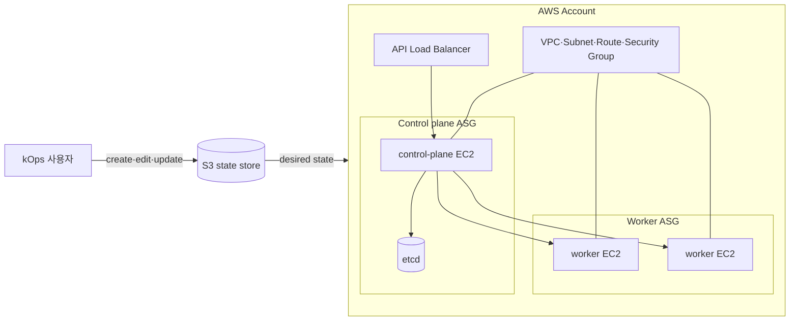

# 5. kOps로 AWS 클러스터 구성

kOps는 Kubernetes 클러스터와 AWS 인프라의 수명주기를 함께 관리하는 도구이다. EC2, Auto Scaling Group, VPC, Load Balancer, IAM, DNS와 Kubernetes control plane을 원하는 상태에 맞춰 구성한다.

이 문서는 구조와 명령 흐름을 이해하기 위한 자료이며 실제 AWS 리소스를 만들지 않는다. 아래 명령을 실행하면 비용이 발생할 수 있다.

## kOps 구조



S3 state store에는 cluster spec, instance group와 PKI 등 중요한 정보가 저장된다. kOps는 이 원하는 상태와 실제 AWS 리소스를 비교해 생성하거나 변경한다.

## kOps와 EKS 차이

| 구분 | kOps | EKS |
| --- | --- | --- |
| Control plane | 사용자 AWS 계정의 EC2에서 운영 | AWS가 관리 |
| etcd와 인증서 | 사용자가 관리·백업 | AWS가 관리 |
| Node | kOps가 ASG 구성 | managed node group, Auto Mode 등 선택 |
| 구성 자유도 | 높음 | EKS 지원 범위 내에서 선택 |
| 운영 책임 | control plane과 data plane 모두 사용자 | control plane 운영 부담 감소 |

AWS에서 Kubernetes 내부 구조까지 직접 제어하려면 kOps를, control plane 운영 부담을 줄이려면 EKS를 우선 검토한다.

## 사전 조건

- AWS account와 필요한 IAM permission
- AWS CLI 인증과 region 설정
- `kops`, `kubectl` CLI
- EC2 SSH key
- S3 state store
- public DNS 사용 시 Route 53 hosted zone과 domain
- VPC, subnet, Pod·Service CIDR 계획

개인 장기 access key보다 IAM Identity Center, assume-role 또는 임시 credential 사용을 우선한다.

```bash
aws sts get-caller-identity
aws configure get region
kops version
kubectl version --client
```

출력되는 AWS account와 ARN이 실습 대상으로 정한 계정인지 먼저 확인한다.

## Cluster 이름과 DNS

실제 domain을 사용하면 다음처럼 cluster 이름을 정할 수 있다.

```text
cluster.study.example.com
```

DNS delegation 없이 gossip discovery를 사용할 때는 `.k8s.local`로 끝나는 이름을 사용할 수 있다.

```text
study.k8s.local
```

Production에서는 API endpoint, DNS delegation과 인증서 구조를 명확히 설계한다.

## S3 State Store

Bucket 이름은 전 세계 S3에서 고유해야 한다.

```bash
KOPS_STATE_BUCKET="replace-with-unique-kops-state"
AWS_REGION="us-east-1"

aws s3api create-bucket \
  --bucket "$KOPS_STATE_BUCKET" \
  --region "$AWS_REGION"
```

`us-east-1` 이외 region에서는 create bucket에 `LocationConstraint` 설정이 필요하다.

Versioning과 server-side encryption 예시:

```bash
aws s3api put-bucket-versioning \
  --bucket "$KOPS_STATE_BUCKET" \
  --versioning-configuration Status=Enabled

aws s3api put-bucket-encryption \
  --bucket "$KOPS_STATE_BUCKET" \
  --server-side-encryption-configuration \
  '{"Rules":[{"ApplyServerSideEncryptionByDefault":{"SSEAlgorithm":"AES256"}}]}'
```

Bucket에는 public access block과 최소 IAM permission도 적용한다.

```bash
KOPS_STATE_STORE="s3://${KOPS_STATE_BUCKET}"
KOPS_CLUSTER_NAME="study.k8s.local"
```

State store는 여러 cluster가 공유할 수 있으므로 개별 cluster 삭제와 bucket 삭제를 같은 작업으로 취급하지 않는다.

## 클러스터 구성 생성

사용 가능한 Availability Zone 확인:

```bash
aws ec2 describe-availability-zones \
  --region ap-northeast-2 \
  --query 'AvailabilityZones[].ZoneName'
```

기본 cluster spec 예시:

```bash
kops create cluster \
  --name "$KOPS_CLUSTER_NAME" \
  --state "$KOPS_STATE_STORE" \
  --cloud aws \
  --zones ap-northeast-2a,ap-northeast-2c \
  --control-plane-count 1 \
  --node-count 2 \
  --control-plane-size t3.medium \
  --node-size t3.medium \
  --networking calico
```

이 단계는 state store에 cluster 구성을 만들며 보통 AWS 리소스를 즉시 생성하지 않는다. 실제 적용은 `update --yes`에서 일어난다.

### 주요 옵션

| 옵션 | 의미 |
| --- | --- |
| `--name` | cluster 고유 이름 |
| `--state` | S3 state store URI |
| `--cloud` | cloud provider |
| `--zones` | node를 배치할 Availability Zone |
| `--control-plane-count` | control plane node 수 |
| `--node-count` | worker node 수 |
| `--control-plane-size` | control plane EC2 type |
| `--node-size` | worker EC2 type |
| `--networking` | CNI provider |
| `--kubernetes-version` | Kubernetes version 고정 |

고가용성은 control plane 수만 늘린다고 완성되지 않는다. 홀수 etcd member, 여러 failure domain, Load Balancer, subnet과 비용을 함께 설계한다.

## Spec 확인과 수정

```bash
kops get cluster \
  --name "$KOPS_CLUSTER_NAME" \
  --state "$KOPS_STATE_STORE" \
  -o yaml

kops edit cluster \
  --name "$KOPS_CLUSTER_NAME" \
  --state "$KOPS_STATE_STORE"

kops get instancegroups \
  --name "$KOPS_CLUSTER_NAME" \
  --state "$KOPS_STATE_STORE"
```

CLI option도 최종적으로 cluster와 instance group spec에 저장된다.

## 변경 계획과 실제 적용

먼저 `--yes` 없이 변경 계획을 확인한다.

```bash
kops update cluster \
  --name "$KOPS_CLUSTER_NAME" \
  --state "$KOPS_STATE_STORE"
```

생성될 VPC, EC2, IAM, Load Balancer와 DNS 리소스를 검토한 후 적용한다.

```bash
kops update cluster \
  --name "$KOPS_CLUSTER_NAME" \
  --state "$KOPS_STATE_STORE" \
  --yes \
  --admin
```

- `--yes`: AWS에 실제 변경 적용
- `--admin`: 제한된 유효 기간의 admin kubeconfig 생성

생성은 비동기적으로 진행되므로 EC2가 실행된 후에도 image pull과 control plane 초기화에 시간이 필요하다.

## 상태 확인

```bash
kops validate cluster \
  --name "$KOPS_CLUSTER_NAME" \
  --state "$KOPS_STATE_STORE" \
  --wait 10m

kubectl get nodes -o wide
kubectl get pods --all-namespaces
```

Validation 실패 시 다음 계층을 구분해 확인한다.

1. IAM permission과 AWS credential
2. DNS와 API Load Balancer
3. VPC, route table, NAT와 security group
4. EC2와 Auto Scaling Group
5. control plane, kubelet과 CNI

## 변경과 Rolling Update

Cluster spec 변경은 `kops update cluster`로 AWS 구성을 반영한다. Machine image 또는 instance group 변경으로 node 교체가 필요하면 rolling update 계획을 확인한다.

```bash
kops rolling-update cluster \
  --name "$KOPS_CLUSTER_NAME" \
  --state "$KOPS_STATE_STORE"
```

실제 적용에는 `--yes`가 필요하다. PodDisruptionBudget, replica, storage와 node drain 가능 여부를 먼저 검토한다.

## 클러스터 삭제

삭제될 리소스 미리 보기:

```bash
kops delete cluster \
  --name "$KOPS_CLUSTER_NAME" \
  --state "$KOPS_STATE_STORE"
```

실제 삭제:

```bash
kops delete cluster \
  --name "$KOPS_CLUSTER_NAME" \
  --state "$KOPS_STATE_STORE" \
  --yes
```

`--yes`는 EC2, Load Balancer와 Auto Scaling Group 등 실제 AWS 리소스를 제거하는 파괴적 옵션이다. EBS, DNS, S3와 별도 생성 리소스는 남을 수 있으므로 AWS Console과 billing에서 잔여 리소스를 확인한다.

## 추가로 알아둘 점

- State store는 cluster 구성의 source of truth이므로 versioning, encryption과 접근 제어가 필요하다.
- S3 state backup은 etcd application data backup을 대신하지 않는다.
- Console에서 kOps 관리 리소스를 직접 수정하면 state와 실제 환경이 달라질 수 있다.
- EC2뿐 아니라 EBS, Load Balancer, NAT Gateway, public IPv4와 data transfer도 비용을 발생시킨다.
- kOps release마다 지원 Kubernetes version 범위를 확인해야 한다.

## 참고

- [kOps AWS 시작하기](https://kops.sigs.k8s.io/getting_started/aws/)
- [kOps State Store](https://kops.sigs.k8s.io/state/)
- [kOps CLI](https://kops.sigs.k8s.io/cli/kops/)
- [Amazon EKS 개요](https://docs.aws.amazon.com/eks/latest/userguide/what-is-eks.html)
