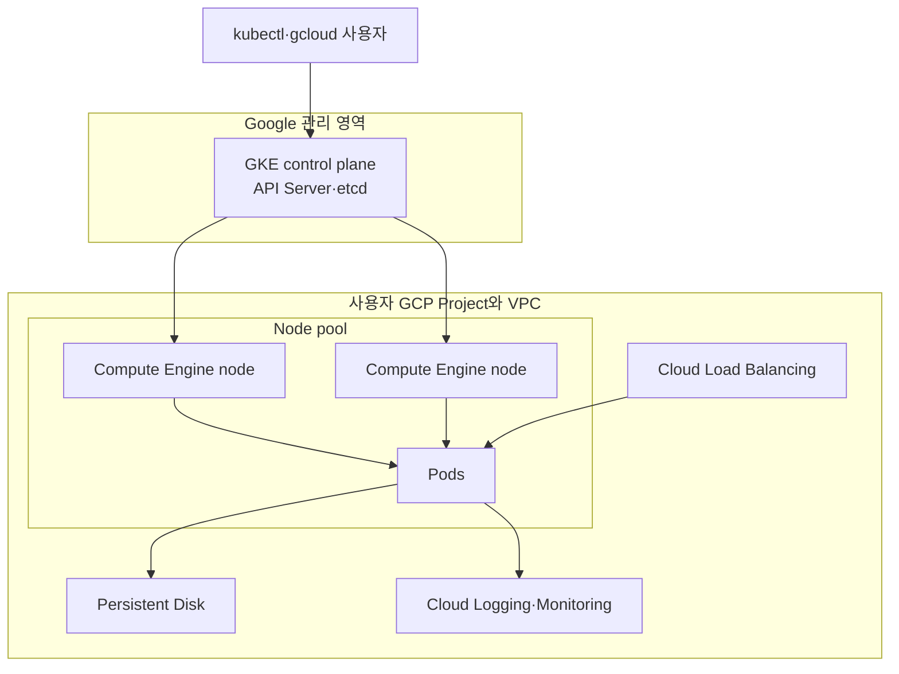
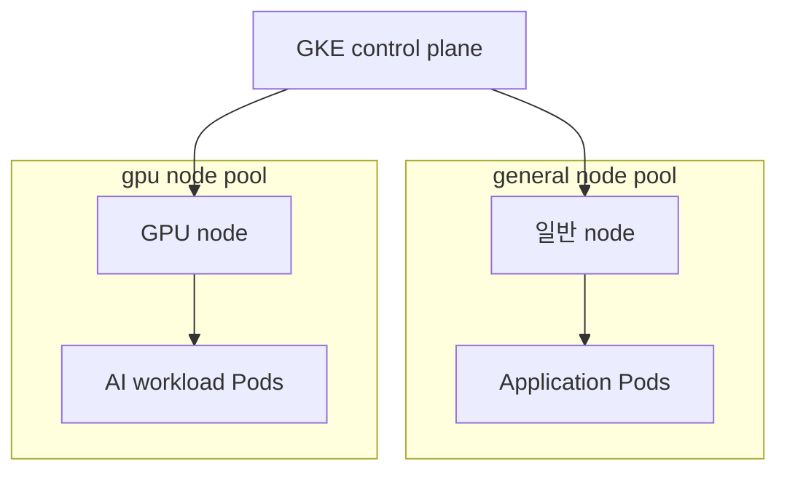

# 6. GKE로 GCP 클러스터 구성

Google Kubernetes Engine은 Google Cloud의 managed Kubernetes 서비스이다. Google이 Kubernetes control plane을 관리하고, 사용자는 GKE mode에 따라 node를 직접 구성하거나 Google에 더 많이 위임한다.

이 문서는 구조와 주요 `gcloud` 명령을 이해하기 위한 자료이다. 실제 cluster를 만들지 않으며, 명령을 실행하면 compute, network와 cluster 관리 비용이 발생할 수 있다.

## GKE 구조



Control plane을 Google이 관리해도 workload manifest, RBAC, image 보안, resource request·limit와 application data 보호 책임은 사용자에게 남는다.

## Autopilot과 Standard

### Autopilot

Google이 node provisioning, scaling, 보안 기본값과 운영을 더 넓게 관리한다. 사용자는 Pod의 resource request와 Kubernetes workload를 중심으로 구성한다.

장점:

- node pool과 VM 운영 부담이 작다.
- workload 요구에 따라 compute가 자동으로 준비된다.
- 관리형 기본값으로 cluster 구성이 단순해진다.

고려 사항:

- privileged workload와 host 접근 등 일부 저수준 기능에 제약이 있다.
- Pod resource request가 scheduling과 비용에서 중요하다.
- node 설정을 완전히 제어해야 하는 workload에는 맞지 않을 수 있다.

### Standard

Google이 control plane을 관리하고 사용자는 node pool의 machine type, 수량, autoscaling, image와 upgrade 정책을 세밀하게 선택한다.

장점:

- node와 node pool 제어 범위가 넓다.
- GPU, 특수 machine과 node-level agent 요구에 대응하기 쉽다.
- 기존 Kubernetes node 운영 방식을 적용하기 편하다.

고려 사항:

- node 용량, upgrade, autoscaling과 비용을 직접 관리해야 한다.
- Regional cluster의 node 수는 zone별 수량으로 계산될 수 있다.

### 비교

| 구분 | Autopilot | Standard |
| --- | --- | --- |
| Control plane | Google 관리 | Google 관리 |
| Node 준비와 확장 | Google이 대부분 관리 | 사용자가 node pool 관리 |
| 저수준 node 제어 | 제한적 | 상대적으로 높음 |
| 비용 관점 | 주로 요청한 workload resource 중심 | 실행 중인 node VM 중심 |
| 적합한 경우 | 운영 단순화, 일반 workload | 특수 node, 세밀한 인프라 제어 |

## 사전 조건

- 결제가 연결된 Google Cloud project
- GKE API 활성화와 cluster 생성 IAM permission
- `gcloud`, `kubectl`, GKE auth plugin
- 사용할 region·zone, VPC와 IP range 계획

```bash
gcloud version
kubectl version --client
gke-gcloud-auth-plugin --version
```

CLI 설치 방식에 따라 GKE auth plugin을 별도 package 또는 component로 설치해야 할 수 있다.

## Project와 인증

```bash
gcloud auth login
gcloud projects list
```

예시 변수:

```bash
GCP_PROJECT_ID="replace-with-project-id"
GCP_REGION="asia-northeast3"
GKE_CLUSTER_NAME="study-cluster"
```

```bash
gcloud config set project "$GCP_PROJECT_ID"
gcloud config set compute/region "$GCP_REGION"
gcloud config list
```

실행 전 `core.project`가 의도한 계정과 실습 project인지 확인한다.

GKE API 활성화:

```bash
gcloud services enable container.googleapis.com \
  --project "$GCP_PROJECT_ID"
```

## Location 선택

```text
Zone  : asia-northeast3-a
Region: asia-northeast3
```

- Zonal: 한 zone 중심이며 학습 환경의 VM 수와 비용을 줄이기 쉽다.
- Regional: control plane과 node pool을 여러 zone에 분산할 수 있어 가용성이 높다.

운영 환경에서는 failure domain이 중요하지만 학습 환경에서는 regional node 수와 Load Balancer 비용을 확인해야 한다.

## Autopilot Cluster 생성

```bash
gcloud container clusters create-auto "$GKE_CLUSTER_NAME" \
  --project "$GCP_PROJECT_ID" \
  --location "$GCP_REGION" \
  --release-channel regular
```

### 주요 옵션

| 옵션 | 의미 |
| --- | --- |
| `--project` | cluster를 만들 GCP project |
| `--location` | region 또는 zone |
| `--release-channel` | Kubernetes upgrade channel |
| `--network`, `--subnetwork` | 사용할 VPC와 subnet |
| `--cluster-ipv4-cidr` | Pod IP 범위 또는 secondary range |
| `--services-ipv4-cidr` | Service IP 범위 |
| `--enable-private-nodes` | node에 external IP를 부여하지 않음 |
| `--enable-master-authorized-networks` | control plane 접근 network 제한 |

Autopilot도 network, security, release channel과 workload resource를 의도적으로 정해야 한다.

## Standard Cluster 생성

학습용 regional Standard 예시:

```bash
gcloud container clusters create "$GKE_CLUSTER_NAME" \
  --project "$GCP_PROJECT_ID" \
  --region "$GCP_REGION" \
  --release-channel regular \
  --machine-type e2-standard-2 \
  --num-nodes 1 \
  --enable-ip-alias \
  --enable-autorepair \
  --enable-autoupgrade
```

Regional Standard cluster에서 `--num-nodes=1`은 전체 cluster가 아니라 node zone마다 하나를 뜻할 수 있다. 생성 계획에서 총 VM 수와 비용을 확인한다.

| 옵션 | 의미 | 주의점 |
| --- | --- | --- |
| `--machine-type` | node VM type | CPU·memory와 비용 영향 |
| `--num-nodes` | 초기 node 수 | regional 구성은 zone별 수량 확인 |
| `--enable-autoscaling` | node pool autoscaling | min·max 범위 필요 |
| `--min-nodes`, `--max-nodes` | autoscaling 범위 | location별·전체 기준 확인 |
| `--enable-autorepair` | 비정상 node 자동 복구 | workload disruption 대비 |
| `--enable-autoupgrade` | node 자동 upgrade | maintenance window 검토 |
| `--spot` | Spot VM 사용 | 중단 가능한 workload에만 사용 |
| `--enable-dataplane-v2` | eBPF 기반 GKE Dataplane V2 | network policy 호환성 확인 |

## Release Channel

| Channel | 개념 |
| --- | --- |
| `rapid` | 새 Kubernetes version과 기능을 빠르게 받음 |
| `regular` | 기능 도입과 안정성 사이의 일반적인 균형 |
| `stable` | 새 minor version 도입이 상대적으로 느림 |

Channel만으로 upgrade 안전성이 보장되지는 않는다. Maintenance window, PodDisruptionBudget과 deprecated API 사용 여부를 함께 확인한다.

## kubectl Credential 구성

```bash
gcloud container clusters get-credentials "$GKE_CLUSTER_NAME" \
  --project "$GCP_PROJECT_ID" \
  --region "$GCP_REGION"
```

이 명령은 현재 kubeconfig에 GKE context를 추가한다.

```bash
kubectl config current-context
kubectl cluster-info
kubectl get nodes -o wide
kubectl get pods --all-namespaces
```

여러 project와 cluster를 사용할 때는 작업 전 current context를 확인한다.

## Cluster 정보 확인

```bash
gcloud container clusters list \
  --project "$GCP_PROJECT_ID"

gcloud container clusters describe "$GKE_CLUSTER_NAME" \
  --project "$GCP_PROJECT_ID" \
  --region "$GCP_REGION"
```

확인할 항목:

- Autopilot 또는 Standard mode
- endpoint의 public·private 접근 방식
- release channel과 Kubernetes version
- VPC, subnet, Pod·Service CIDR
- node pool 수, location과 machine type
- logging, monitoring과 security 설정

## Node Pool

Standard cluster에서는 workload 특성에 따라 node pool을 나눌 수 있다.



```bash
gcloud container node-pools create batch-pool \
  --cluster "$GKE_CLUSTER_NAME" \
  --region "$GCP_REGION" \
  --machine-type e2-standard-4 \
  --num-nodes 1 \
  --enable-autoscaling \
  --min-nodes 0 \
  --max-nodes 3 \
  --node-labels workload=batch
```

Node label·taint와 Pod의 affinity·toleration을 함께 사용해 workload를 적절한 pool에 배치한다.

## Cluster 삭제

대상 확인:

```bash
gcloud container clusters list \
  --project "$GCP_PROJECT_ID"
```

실제 삭제:

```bash
gcloud container clusters delete "$GKE_CLUSTER_NAME" \
  --project "$GCP_PROJECT_ID" \
  --region "$GCP_REGION"
```

Cluster 삭제는 node와 Kubernetes object를 제거하는 파괴적인 작업이다. Persistent Disk, Load Balancer IP, Artifact Registry image, logging data와 별도 VPC 리소스는 남을 수 있으므로 billing과 잔여 리소스를 확인한다.

## 추가로 알아둘 점

- GCP IAM과 Kubernetes RBAC은 서로 다른 계층의 권한을 제어한다.
- Pod에 service account key를 저장하기보다 Workload Identity Federation for GKE를 검토한다.
- Private node는 external IP가 없으므로 Google API와 외부 registry로 나갈 egress 경로가 필요하다.
- Node VM 외에도 cluster 관리, disk, Load Balancer, Cloud NAT, public IPv4, log와 egress 비용이 발생할 수 있다.

## 참고

- [GKE 구성 선택](https://cloud.google.com/kubernetes-engine/docs/concepts/configuration-overview)
- [GKE mode 선택](https://cloud.google.com/kubernetes-engine/docs/concepts/choose-cluster-mode)
- [Autopilot Cluster 생성](https://cloud.google.com/kubernetes-engine/docs/how-to/creating-an-autopilot-cluster)
- [`gcloud container clusters create-auto`](https://cloud.google.com/sdk/gcloud/reference/container/clusters/create-auto)
- [`gcloud container clusters create`](https://cloud.google.com/sdk/gcloud/reference/container/clusters/create)
