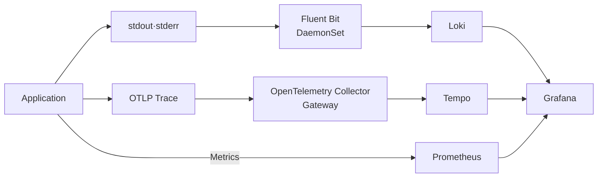
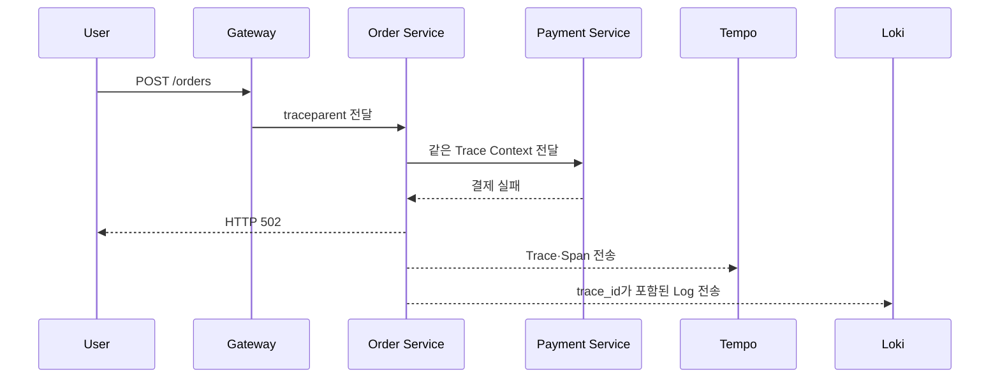

# 1. Logging과 Tracing 기본 구조

## Metrics 다음에 필요한 이유

Metrics는 장애가 발생했다는 사실과 범위를 빠르게 보여주지만, 개별 요청이 왜 실패했는지까지 설명하지 못한다. Logs와 Traces를 함께 사용하면 집계된 증상에서 실제 Event와 요청 경로로 이동할 수 있다.

| Signal | 주로 답하는 질문 | 대표 Backend |
| --- | --- | --- |
| Metrics | 얼마나 많이·느리게·실패하는가? | Prometheus·Thanos |
| Logs | 당시 어떤 Event와 Message가 발생했는가? | Loki |
| Traces | 하나의 요청이 어느 Service에서 지연·실패했는가? | Tempo |

이번 과정은 기존 `k8s-monitor/`의 Metrics Pipeline을 대체하지 않는다. Loki와 Tempo를 추가해 Grafana에서 세 Signal을 서로 연결하는 과정이다.

## 기본 책임 분리

- Application: 구조화 Log 작성, Trace Instrumentation과 Context 전파
- Node Agent: Container Log 파일 Tail, Kubernetes Metadata 추가, Buffering
- Telemetry Gateway: OTLP 수신, Batch·Sampling·Redaction, Backend 전달
- Backend: Log·Trace 저장, Index·Query와 Retention
- Grafana: Data Source 연결, 탐색과 Signal 간 Link
- Platform 운영자: 용량·보안·Tenant·Upgrade·장애 대응

하나의 Agent가 여러 Signal을 모두 처리할 수도 있지만, 학습 구성에서는 Log File Tail에 Fluent Bit, Application Trace에 OpenTelemetry Collector를 사용해 역할을 분명히 한다. 같은 Log를 Fluent Bit와 Collector가 동시에 Tail하면 중복 수집될 수 있으므로 실제 운영에서는 Source별 Owner를 하나만 정한다.

## 전체 요청 흐름 예시

운영자는 Error Rate Metric의 Exemplar에서 Trace로 이동하고, 실패 Span의 `trace_id`를 이용해 같은 시간대의 Log를 찾는다.

## 먼저 정할 Contract

도구 설치보다 다음 이름과 책임을 먼저 통일한다.

- `service.name`: Service의 안정적인 논리 이름
- `deployment.environment.name`: `dev`, `stage`, `prod` 같은 환경
- `k8s.cluster.name`: Cluster 구분
- `trace_id`, `span_id`: Log와 Trace 연결
- Timezone: Timestamp는 UTC와 명확한 Offset 사용
- Retention: Signal·환경·규정별 보존 기간
- Tenant: 팀·환경·고객 데이터 격리 단위
- Owner: 수집 실패와 Backend 장애의 대응 팀

Pod 이름처럼 수명이 짧은 값은 조사에는 유용하지만 Service Identity를 대신하지 못한다.

## 도구 선택 기준

### Fluent Bit

Node마다 DaemonSet으로 실행하기 가볍고, CRI Log Tail·Kubernetes Metadata Enrichment와 Loki Output을 제공한다.

### Loki

Log 전체 내용을 모두 Indexing하지 않고 Label로 Stream을 찾은 뒤 내용을 Filtering한다. Label Cardinality 설계가 비용과 성능에 직접 영향을 준다.

### OpenTelemetry

Vendor 중립 API·SDK·Protocol과 Collector Pipeline을 제공한다. Instrumentation을 Backend 전용 SDK에 직접 결합하는 일을 줄인다.

### Tempo

Trace를 Object Storage 중심으로 저장하고 Trace ID·TraceQL로 조회한다. Tempo 3.0은 Monolithic과 Microservices Mode의 운영 요구가 크게 다르므로 규모에 맞게 선택한다.

## 이번 과정의 완료 기준

1. Application이 JSON Log와 Trace를 생성한다.
2. Fluent Bit가 Kubernetes Metadata를 붙여 Loki로 전달한다.
3. OpenTelemetry Collector가 OTLP Trace를 받아 Tempo로 전달한다.
4. Grafana에서 LogQL과 TraceQL로 데이터를 조회한다.
5. Metric→Trace→Log와 Log→Trace 이동 경로를 설명한다.
6. Drop, Backpressure, Retention, Cardinality와 민감정보 책임을 설명한다.

## 참고 자료

- [Kubernetes Observability](https://kubernetes.io/docs/concepts/cluster-administration/observability/)
- [OpenTelemetry Signals](https://opentelemetry.io/docs/concepts/signals/)
- [Grafana의 Trace·Log 연결](https://grafana.com/docs/grafana/latest/datasources/tempo/configure-tempo-data-source/configure-trace-to-logs/)
