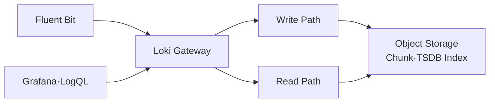

# 4. Loki와 LogQL

## Loki의 저장 방식

Loki는 Log Message의 모든 Field를 Index로 만들지 않는다. 낮은 Cardinality의 Label Set으로 Log Stream을 찾고, 선택된 Stream의 내용이나 Structured Metadata를 Filtering한다.

```text
{cluster="prod", namespace="shop", service_name="order-api"}
  ├─ 10:00:01 JSON log line
  ├─ 10:00:02 JSON log line
  └─ 10:00:03 JSON log line
```

- Index Label: 어떤 Stream을 먼저 읽을지 선택
- Structured Metadata: Log 한 줄에 연결된 고 Cardinality Metadata
- Log Body: 원문 또는 구조화 JSON

`trace_id`, Order ID, User ID, Pod UID와 Timestamp를 Label로 만들면 Stream 수가 폭증한다. 이런 값은 Structured Metadata나 Log Body에 둔다.

## 현재 배포 Mode

| Mode | 용도 | 현재 판단 |
| --- | --- | --- |
| Monolithic | 학습·개발·소규모 | 운영이 가장 단순한 시작점 |
| Simple Scalable | Read·Write·Backend 분리 | Loki 4 이전 제거 예정이므로 신규 장기 설계에서 피함 |
| Distributed | 대규모·독립 확장·HA | 복잡하지만 장기 확장 경로 |

학습에서는 Monolithic으로 Data Flow와 Query를 익히고, Production 규모에서는 Ingestion Volume, Query 동시성, Tenant와 장애 영역을 근거로 Distributed Mode를 검토한다. “중간 규모니까 무조건 Simple Scalable”이라는 과거 권장은 현재 유지보수 방향과 맞지 않는다.

Promtail은 Loki 3.7.3에서 제거되었다. 신규 Pipeline은 Fluent Bit 공식 Loki Output, Grafana Alloy 또는 OpenTelemetry Collector의 Loki OTLP 수신 경로 중 하나를 선택한다.

## Storage 구조



Production은 TSDB Index와 Object Storage를 기준으로 설계한다. Local Filesystem은 학습과 단일 Instance에는 간단하지만 Pod·Node 장애, 수평 확장과 Backup에 적합하지 않다.

Object Storage를 쓴다고 자동 Backup이 완성되지는 않는다. Bucket Versioning, Lifecycle, 암호화, 삭제 권한, Retention과 복구 절차를 별도로 설계한다.

## Label 설계

권장 예시:

```text
cluster=prod-seoul
namespace=shop
service_name=order-api
deployment_environment=prod
```

피해야 할 예시:

```text
trace_id=4bf92f...
request_id=8f1b...
pod_uid=매번 변경
customer_id=사용자마다 변경
```

Pod 이름도 Replica 교체 때 계속 바뀌므로 신규 Loki 구성에서는 Structured Metadata로 두는 방향을 우선 검토한다.

## LogQL 기본

### Stream 선택

```logql
{cluster="prod-seoul", namespace="shop", service_name="order-api"}
```

### 문자열 Filtering

```logql
{namespace="shop", service_name="order-api"} |= "payment failed"
```

### JSON Parsing과 Field 조건

```logql
{namespace="shop", service_name="order-api"}
| json
| severity = "ERROR"
| http_response_status_code >= 500
```

### Trace ID 검색

```logql
{namespace="shop", service_name="order-api"}
| json
| trace_id = "4bf92f3577b34da6a3ce929d0e0e4736"
```

Trace ID가 Loki Structured Metadata로 전달됐다면 해당 Metadata Field를 이용해 Filtering할 수 있다. 실제 Field 이름과 Query 문법은 수집 Pipeline이 만든 Schema를 기준으로 확인한다.

### Log에서 Metric 만들기

```logql
sum by (service_name) (
  count_over_time(
    {namespace="shop"}
    | json
    | severity = "ERROR" [5m]
  )
)
```

```logql
sum by (service_name) (
  rate({namespace="shop"} |= "timeout" [5m])
)
```

Log 기반 Metric은 원인 탐색과 보조 Alert에 유용하지만, 높은 Volume을 매번 Parsing하는 Query는 비싸다. 지속적인 SLI는 Application Metric으로 직접 Instrumentation하는 것이 일반적으로 더 안정적이다.

## Query 순서

1. 시간 범위를 최대한 좁힌다.
2. 낮은 Cardinality Label로 Stream을 먼저 선택한다.
3. 문자열 Filter로 읽을 양을 줄인다.
4. 필요한 경우에만 `json`, `regexp`와 집계를 적용한다.
5. Dashboard Query의 최대 범위와 동시 실행을 제한한다.

처음부터 `{namespace=~".+"} | json`처럼 전체 Cluster를 Parsing하면 Query 비용이 커진다.

## Retention과 삭제

- 환경·Tenant별 보존 기간을 정책으로 정한다.
- 법적 보존과 개인정보 삭제 요구를 함께 검토한다.
- Object Storage Lifecycle과 Loki Retention이 충돌하지 않게 한다.
- Compaction·Retention Worker의 Error와 Backlog를 관찰한다.
- Log 삭제 API 권한은 일반 조회 권한과 분리한다.

Log를 오래 저장하는 것이 항상 안전한 것은 아니다. 민감정보가 섞였을 가능성과 조사 가치, 저장 비용을 함께 판단한다.

## Multi-tenancy와 보안

Loki 자체의 인증 경계를 Reverse Proxy·Gateway 또는 Managed Service와 함께 설계한다. Multi-tenant Mode에서는 Write와 Query 양쪽의 Tenant Header가 일치해야 한다.

- TLS와 인증 없이 Loki Gateway를 외부 공개하지 않는다.
- Namespace Label만으로 권한 격리가 된다고 가정하지 않는다.
- Tenant별 Ingestion·Query Limit과 Rate Limit을 둔다.
- Grafana Data Source Credential은 Secret과 최소 권한으로 관리한다.
- Log Body를 조회할 수 있는 사람과 Dashboard만 보는 사람의 권한을 구분한다.

## 운영 확인

```bash
kubectl get pod,service -n observability -l app.kubernetes.io/name=loki
kubectl logs -n observability -l app.kubernetes.io/name=loki --tail=200
kubectl port-forward service/loki-gateway -n observability 3100:80
curl http://127.0.0.1:3100/ready
```

Loki 자체의 Ingestion Rate, Rejected Samples, Request Duration, Object Storage Error, Query Queue와 Compaction 상태를 Prometheus로 수집한다.

## 참고 자료

- [Loki Architecture](https://grafana.com/docs/loki/latest/get-started/architecture/)
- [Loki Deployment Modes](https://grafana.com/docs/loki/latest/get-started/deployment-modes/)
- [Loki Label 설계](https://grafana.com/docs/loki/latest/get-started/labels/)
- [LogQL](https://grafana.com/docs/loki/latest/query/)
- [Loki 3.7 Release Notes](https://grafana.com/docs/loki/latest/release-notes/v3-7/)
