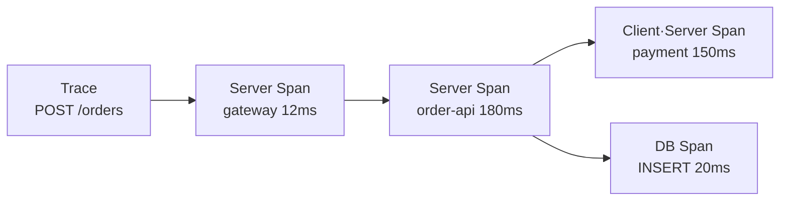

# 5. Distributed Tracing과 Instrumentation

## Trace와 Span

Trace는 하나의 요청이 여러 Process·Service를 지나간 전체 경로다. Span은 그 경로 안의 한 작업이며 시작 시간, Duration, Parent, Attribute, Event와 Status를 가진다.



- Trace ID: 전체 요청 경로를 식별
- Span ID: 개별 작업을 식별
- Parent Span ID: 호출 관계 구성
- Resource: `service.name`, 환경, Cluster 같은 Process Identity
- Attribute: HTTP Method, Route, DB System 같은 검색 정보
- Event: Exception이나 중요한 시점
- Status: 성공·오류 판단

Span 이름에 `/users/12345` 같은 실제 ID를 넣지 않고 `GET /users/{id}`처럼 안정적인 Route를 사용한다.

## Context Propagation

Service가 다른 Service를 호출할 때 Trace Context를 함께 전달해야 같은 Trace로 연결된다. HTTP에서는 W3C Trace Context의 `traceparent` Header가 기본 표준이다.

```text
traceparent: 00-4bf92f3577b34da6a3ce929d0e0e4736-00f067aa0ba902b7-01
             │  └──────────── trace-id ────────────┘ └─ span-id ─────┘ │
          version                                               flags
```

Instrumentation Library가 Incoming Header에서 Context를 Extract하고 Outgoing Request에 Inject한다. HTTP뿐 아니라 gRPC, Message Queue와 Background Job에서도 Producer·Consumer Propagation을 연결해야 한다.

Gateway나 Proxy가 임의로 `traceparent`를 삭제·재생성하면 Trace가 끊어진다. 외부 Client가 보낸 Header를 무조건 신뢰하지 말고 형식 검증과 새 Root 정책도 정한다.

## Instrumentation 방식

### 자동 Instrumentation

Framework, HTTP Client, Database Driver를 Agent나 Library Hook으로 자동 계측한다.

- 빠르게 기본 Server·Client Span 확보
- Code 변경이 적음
- 지원 Library와 Version에 따라 Coverage가 달라짐
- 불필요한 Attribute와 Span Volume을 검토해야 함

### 수동 Instrumentation

Business Operation을 직접 Span으로 표현한다.

```python
from opentelemetry import trace
from opentelemetry.trace import Status, StatusCode

tracer = trace.get_tracer("order-domain")

def reserve_stock(order_id: str) -> None:
    with tracer.start_as_current_span("reserve-stock") as span:
        span.set_attribute("order.type", "standard")
        try:
            inventory.reserve(order_id)
        except Exception as exc:
            span.record_exception(exc)
            span.set_status(Status(StatusCode.ERROR))
            raise
```

Order ID처럼 Cardinality가 높은 값이나 개인정보를 Span Attribute에 넣을지는 보안·비용 정책으로 결정한다. 단순히 검색이 편하다는 이유로 모든 Business ID를 기록하지 않는다.

자동 계측으로 Network·Framework 경계를 만들고, 수동 계측으로 중요한 Business 구간만 보강하는 방식이 일반적이다.

## OTLP 설정

Application은 OpenTelemetry SDK나 Agent를 통해 Collector의 OTLP Endpoint로 Trace를 보낸다.

```yaml
env:
  - name: OTEL_SERVICE_NAME
    value: order-api
  - name: OTEL_RESOURCE_ATTRIBUTES
    value: deployment.environment.name=prod,k8s.cluster.name=seoul-prod
  - name: OTEL_EXPORTER_OTLP_ENDPOINT
    value: http://otel-gateway.observability.svc:4318
  - name: OTEL_EXPORTER_OTLP_PROTOCOL
    value: http/protobuf
  - name: OTEL_PROPAGATORS
    value: tracecontext,baggage
```

이 값은 Application SDK가 해당 환경 변수를 지원할 때 적용된다. 언어별 SDK·Auto Instrumentation Agent의 지원 범위와 기본값을 확인한다. Production에서는 OTLP Traffic의 TLS·인증과 NetworkPolicy를 적용한다.

## 언어별 시작 예시

### Python

```bash
opentelemetry-bootstrap --action=install
opentelemetry-instrument \
  --traces_exporter otlp \
  uvicorn app:app --host 0.0.0.0 --port 8080
```

### Java

```bash
java \
  -javaagent:/otel/opentelemetry-javaagent.jar \
  -Dotel.service.name=order-api \
  -Dotel.exporter.otlp.endpoint=http://otel-gateway.observability.svc:4318 \
  -jar app.jar
```

Agent와 Package Version은 Image Build에서 고정하고 SBOM·취약점 검사 대상에 포함한다. 예제 Command를 Production에 그대로 복사하기보다 지원 Matrix와 필요한 Instrumentation만 활성화한다.

## Log에 Trace Context 넣기

현재 Span Context를 구조화 Log Field에 포함한다.

```json
{
  "severity": "ERROR",
  "service.name": "order-api",
  "message": "payment request failed",
  "trace_id": "4bf92f3577b34da6a3ce929d0e0e4736",
  "span_id": "00f067aa0ba902b7"
}
```

OpenTelemetry Logging Integration이나 Framework MDC·Context 기능을 사용하면 요청 처리 Context의 ID를 자동 주입할 수 있다. 비동기 작업에서 Context가 유실되지 않는지 Test한다.

## Baggage 주의

Baggage는 Context와 함께 Service 경계를 넘어 전달하는 Key·Value다. 모든 Outgoing Request Header로 전파될 수 있고 무결성이 자동 보장되지 않으므로 Password, Token, 개인정보와 권한 판단 값을 넣지 않는다.

Baggage는 Span Attribute가 아니다. 검색하려면 명시적으로 Attribute나 Log Field로 복사해야 하며, 이때 Cardinality와 민감정보 정책을 다시 적용한다.

## Sampling

모든 Trace를 저장하면 Volume과 비용이 빠르게 증가한다.

| 방식 | 결정 시점 | 장점 | 한계 |
| --- | --- | --- | --- |
| Head Sampling | 요청 시작 | 단순하고 Resource 절약 | 나중에 Error·Latency를 보고 선택할 수 없음 |
| Tail Sampling | Trace 완료 후 | Error·느린 Trace 보존 가능 | 전체 Trace Buffer와 일관된 Routing 필요 |

기본 요청의 일부만 Head Sampling하되 Error와 중요한 Transaction을 더 많이 남기거나, Gateway에서 Tail Sampling을 적용할 수 있다. Parent의 Sampling 결정을 존중하지 않으면 Service별로 Span이 빠진 불완전한 Trace가 생긴다.

Sampling Rate 변경은 관측 데이터의 의미를 바꾼다. Trace에서 생성한 Metric이나 건수 해석에는 Sampling 보정 여부를 명확히 한다.

## 좋은 Span 설계

- 사용자가 이해할 Operation 이름 사용
- Route·RPC Method처럼 안정적인 Attribute 사용
- 같은 작업을 너무 작은 Span 수백 개로 나누지 않음
- Exception Event와 Error Status를 함께 기록
- Payload·SQL 원문·Credential의 무조건 기록 금지
- Async Producer와 Consumer의 Link·Parent 관계 정의
- SDK·Semantic Convention Upgrade 때 Attribute 변경 Review

## 참고 자료

- [OpenTelemetry Traces](https://opentelemetry.io/docs/concepts/signals/traces/)
- [OpenTelemetry Context Propagation](https://opentelemetry.io/docs/concepts/context-propagation/)
- [OpenTelemetry Instrumentation](https://opentelemetry.io/docs/concepts/instrumentation/)
- [OpenTelemetry Sampling](https://opentelemetry.io/docs/concepts/sampling/)
- [OpenTelemetry Baggage](https://opentelemetry.io/docs/concepts/signals/baggage/)
