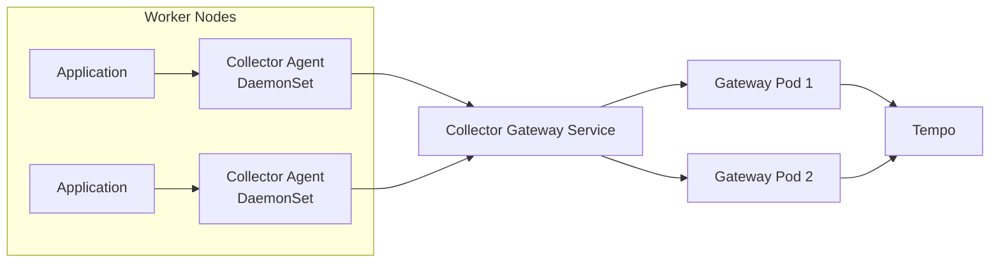

# 6. OpenTelemetry Collector

## Collector의 역할

OpenTelemetry Collector는 Telemetry를 Receive하고 Process한 뒤 하나 이상의 Backend로 Export하는 Vendor 중립 Data Pipeline이다.

```text
Receiver → Processor → Exporter
```

- Receiver: OTLP, Filelog, Prometheus 등에서 데이터 수신
- Processor: Memory 제한, Batch, Metadata 추가, Filter, Sampling
- Exporter: Tempo, Loki, Prometheus 호환 Backend나 외부 Service로 전달
- Connector: Pipeline의 출력을 다른 Pipeline의 입력으로 연결
- Extension: Health Check, 인증, 진단 기능

Component를 설정 파일에 정의하는 것만으로 활성화되지 않는다. 반드시 `service.pipelines`에 연결해야 한다.

## Agent와 Gateway Pattern



### Agent DaemonSet

- Node Filelog·Host Metric처럼 Node Local Source 수집
- Application이 가까운 OTLP Endpoint로 전송 가능
- Node·Pod Metadata 추가
- Node 수만큼 Resource가 증가

### Gateway Deployment

- Application과 Agent가 보내는 중앙 OTLP Endpoint
- Tail Sampling, Redaction과 Backend Credential 집중 관리
- 수평 확장과 Queue 운영 가능
- 장애 시 전체 Cluster Telemetry에 영향을 줄 수 있어 HA 필요

File Log를 이미 Fluent Bit가 수집한다면 Collector의 `filelog` Receiver를 같은 경로에 추가하지 않는다. OpenTelemetry Collector 하나로 통합하려면 Contrib 또는 Kubernetes Distribution에 필요한 Component가 포함되어 있는지 확인한다.

## Gateway Trace Pipeline 예시

```yaml
receivers:
  otlp:
    protocols:
      grpc:
        endpoint: 0.0.0.0:4317
      http:
        endpoint: 0.0.0.0:4318

processors:
  memory_limiter:
    check_interval: 5s
    limit_percentage: 75
    spike_limit_percentage: 15
  resource:
    attributes:
      - key: k8s.cluster.name
        value: seoul-prod
        action: upsert
  batch:
    send_batch_size: 8192
    timeout: 5s

exporters:
  otlp/tempo:
    endpoint: tempo.observability.svc:4317
    tls:
      insecure: true
    sending_queue:
      enabled: true
      queue_size: 5000
    retry_on_failure:
      enabled: true

extensions:
  health_check:
    endpoint: 0.0.0.0:13133

service:
  extensions: [health_check]
  pipelines:
    traces:
      receivers: [otlp]
      processors: [memory_limiter, resource, batch]
      exporters: [otlp/tempo]
```

`tls.insecure: true`는 TLS가 없는 학습용 Cluster 내부 예시다. Production에서는 Backend 인증서 검증과 Credential을 적용하며, ClusterIP라는 이유만으로 평문 전송을 당연하게 두지 않는다.

Processor 순서는 의미가 있다. 일반적으로 Memory 제한을 앞쪽에 두고, Metadata·Filter·Sampling 이후 Batch로 묶어 Export한다.

## Kubernetes Metadata

`k8sattributes` Processor는 Pod IP나 Connection 정보와 Kubernetes API를 이용해 다음 Resource Attribute를 추가할 수 있다.

```text
k8s.namespace.name
k8s.pod.name
k8s.pod.uid
k8s.node.name
k8s.deployment.name
container.id
```

Application SDK가 이미 `service.name`과 환경을 정확히 설정하도록 하고, Collector는 Kubernetes 실행 위치를 보강한다. 모든 Pod Label·Annotation을 Attribute로 복사하면 데이터 크기와 민감정보 위험이 증가하므로 Allowlist를 사용한다.

Gateway가 Client의 원래 Pod IP를 볼 수 없는 Proxy 경로에서는 Association이 실패할 수 있다. Agent에서 Metadata를 먼저 추가하거나, Downward API로 Resource Attribute를 Application에 주입하는 방식을 검토한다.

## Tail Sampling 주의

Tail Sampling은 Trace의 모든 Span이 같은 Sampling Collector에 도달해야 올바르게 결정할 수 있다.

```yaml
processors:
  tail_sampling:
    decision_wait: 10s
    num_traces: 50000
    policies:
      - name: errors
        type: status_code
        status_code:
          status_codes: [ERROR]
      - name: slow
        type: latency
        latency:
          threshold_ms: 1000
      - name: baseline
        type: probabilistic
        probabilistic:
          sampling_percentage: 5
```

여러 Gateway Pod 앞에 일반 Round Robin Service만 두면 같은 Trace의 Span이 서로 다른 Pod로 분산될 수 있다. Trace ID 기반 Load Balancing, Collector 계층 분리와 Stateful Memory Capacity를 함께 설계한다.

Tail Sampling은 Collector의 Memory와 지연을 늘리며 현재 Component Stability도 확인해야 한다. 처음에는 SDK Head Sampling으로 시작하고 요구가 분명할 때 도입하는 편이 단순하다.

## Helm Chart와 Operator

공식 Collector Chart는 `daemonset`, `deployment`, `statefulset` Mode를 명시해야 한다.

```bash
helm repo add open-telemetry https://open-telemetry.github.io/opentelemetry-helm-charts
helm repo update

helm upgrade --install otel-gateway \
  open-telemetry/opentelemetry-collector \
  --namespace observability \
  --version <reviewed-chart-version> \
  --set mode=deployment \
  --values values-otel-gateway.yaml
```

OpenTelemetry Operator는 Collector Custom Resource와 Auto Instrumentation 주입을 관리할 수 있다. 단순 Helm 배포보다 CRD·Webhook·Upgrade 책임이 추가되므로 여러 팀의 Collector와 Instrumentation을 표준화할 필요가 있을 때 선택한다.

## Configuration 검증

선택한 Collector Image로 설정을 검증한다.

```bash
otelcol-k8s validate --config=/etc/otelcol/config.yaml
```

Distribution마다 포함된 Receiver·Processor·Exporter가 다르다. Core, Contrib, Kubernetes Distribution 이름만 보고 Component가 있다고 가정하지 않고 해당 Release의 Component 목록을 확인한다.

## 운영 관측성

Collector 자체 Telemetry를 Prometheus에서 수집한다.

- Receiver accepted·refused spans
- Processor dropped spans
- Exporter sent·failed spans
- Sending Queue Size·Capacity
- Retry와 Backend Latency
- Process Memory·CPU와 Pod Restart
- Config Reload·Startup Failure

Collector Log의 `exporter failed`만 보는 것보다 각 Pipeline 단계의 Accepted·Dropped Counter를 비교해야 유실 지점을 찾을 수 있다.

## 장애 진단 순서

1. Application SDK가 Span을 생성하고 Export하는가?
2. OTLP DNS·Port·Protocol이 일치하는가?
3. Collector Receiver의 Accepted Span이 증가하는가?
4. Processor가 Filter·Sampling으로 Drop했는가?
5. Exporter Queue·Retry·Failure가 증가하는가?
6. Tempo Distributor가 Trace를 수신하는가?
7. Query 시간 범위와 Tenant Header가 맞는가?

## 보안과 유지보수

- OTLP Receiver를 Public LoadBalancer로 직접 공개하지 않는다.
- NetworkPolicy, TLS·mTLS와 인증 Extension을 검토한다.
- Attribute Processor로 Credential·PII를 Redact한다.
- Backend Token은 Secret으로 주입하고 Config에 평문 저장하지 않는다.
- Queue·Retry를 설정하되 최대 장애 시간과 Disk·Memory 한계를 정한다.
- Collector와 Component별 Stability·Breaking Change를 Upgrade 전에 확인한다.

## 참고 자료

- [OpenTelemetry Collector](https://opentelemetry.io/docs/collector/)
- [Collector Configuration](https://opentelemetry.io/docs/collector/configuration/)
- [Collector Kubernetes Helm Chart](https://opentelemetry.io/docs/platforms/kubernetes/helm/collector/)
- [Collector Gateway Pattern](https://opentelemetry.io/docs/collector/deploy/gateway/)
- [Collector Troubleshooting](https://opentelemetry.io/docs/collector/troubleshooting/)
