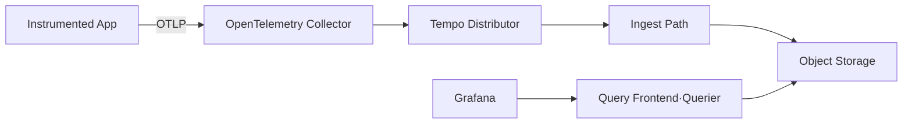

# 7. Tempo와 TraceQL

## Tempo의 역할

Tempo는 OpenTelemetry·Jaeger·Zipkin 등에서 생성한 Distributed Trace를 저장하고 Trace ID와 TraceQL로 조회하는 Backend다. Application이 Tempo에 직접 의존하기보다 OTLP를 OpenTelemetry Collector에 보내고 Collector가 Tempo로 Export하도록 구성한다.



## Tempo 3.0 Architecture

Tempo 3.0은 이전 2.x와 Component 구조가 크게 달라졌다.

- Monolithic Mode: `target=all`, Kafka 없이 한 Process에서 필요한 Component 실행
- Microservices Mode: Distributor와 Read·Write Component를 분리하며 Kafka 호환 Message Queue 필요
- Object Storage: Production Trace Block의 장기 저장소
- Live Store: 최근 Trace Query
- Block Builder: Ingest Record를 장기 Storage Block으로 생성
- Backend Scheduler·Worker: Block 유지보수 작업

과거 Tempo 2.x의 Ingester·Compactor 중심 Diagram을 현재 신규 Architecture로 그대로 사용하지 않는다.

## 배포 Mode 선택

| Mode | 적합한 환경 | 운영 고려사항 |
| --- | --- | --- |
| Monolithic | 학습·개발·중소 규모 | 단순하지만 Component별 독립 확장 불가 |
| Microservices | 높은 Ingestion·Query와 독립 확장 | Kafka, Object Storage와 많은 Component 운영 필요 |

Tempo 3.0 Microservices Mode는 Kafka 호환 System을 요구한다. Trace 양이 적은데 유행만 보고 Microservices로 시작하면 Tempo보다 Kafka 운영 부담이 더 커질 수 있다. Monolithic Mode도 Production에서는 Object Storage와 HA·Backup 요구를 검토한다.

## OTLP Endpoint와 Query Endpoint

```text
4317/tcp  OTLP gRPC Ingestion
4318/tcp  OTLP HTTP Ingestion
3200/tcp  Tempo HTTP Query·Status
```

Collector가 Trace를 보내는 OTLP Endpoint와 Grafana가 Query하는 Tempo HTTP Endpoint를 혼동하지 않는다. 외부에서 Ingestion Port를 직접 공개하지 않고 Cluster Service, TLS·인증과 NetworkPolicy를 사용한다.

## Monolithic 학습 구성의 핵심

다음은 전체 Production 설정이 아니라 구조를 이해하기 위한 핵심 일부다. 정확한 Key는 고정한 Tempo 3.x Release와 Helm Chart에서 검증한다.

```yaml
server:
  http_listen_port: 3200

distributor:
  receivers:
    otlp:
      protocols:
        grpc:
          endpoint: 0.0.0.0:4317
        http:
          endpoint: 0.0.0.0:4318

storage:
  trace:
    backend: local
    local:
      path: /var/tempo/traces
```

Local Backend는 재현이 쉬운 학습용이다. Production에서는 지원되는 Object Storage, Credential, Encryption, Lifecycle과 Bucket Policy를 구성한다.

## Trace ID 조회

Grafana Explore에서 Trace ID를 직접 입력하거나 Tempo HTTP API를 사용할 수 있다.

```bash
kubectl port-forward service/tempo -n observability 3200:3200
curl http://127.0.0.1:3200/ready
curl http://127.0.0.1:3200/api/traces/<trace-id>
```

Trace ID는 정확한 Trace를 찾는 가장 저렴하고 확실한 Key다. 그래서 Application Log에 `trace_id`를 함께 기록하는 것이 중요하다.

## TraceQL 기본

TraceQL은 Trace와 Span Attribute, Duration과 Status를 조건으로 검색한다.

### Service 검색

```traceql
{ resource.service.name = "order-api" }
```

### Error Span

```traceql
{ resource.service.name = "order-api" && status = error }
```

### 느린 Span

```traceql
{ resource.service.name = "order-api" && duration > 1s }
```

### 특정 HTTP Route

```traceql
{ resource.service.name = "order-api" && span.http.route = "/orders/{id}" }
```

Semantic Conventions와 SDK Version에 따라 실제 Attribute Scope·이름이 달라질 수 있다. Grafana의 Trace 상세 화면에서 저장된 Attribute를 확인한 뒤 Query를 작성한다.

## Metrics Generator

Tempo Metrics Generator는 Trace에서 다음과 같은 Prometheus Metric을 만들 수 있다.

- Span Metric: Service·Operation별 Request, Error, Duration
- Service Graph: Service 간 호출 관계
- Exemplar: Metric Sample과 Trace 연결

Trace 기반 Metric은 Instrumentation 누락과 Sampling의 영향을 받는다. Application의 핵심 SLI Metric을 모두 대체하기보다 Service Graph와 Trace Correlation에 우선 사용한다.

Prometheus Remote Write Endpoint, Label Cardinality와 Generator Resource를 함께 관리한다.

## Retention과 용량

Trace 용량은 대략 다음 요소에 비례한다.

```text
요청 수 × 요청당 Span 수 × Span 크기 × Sampling 비율 × 보존 기간
```

- Span Attribute와 Event 크기 제한
- Service별 Sampling 정책
- Tenant별 Ingestion Limit
- Object Storage Lifecycle과 Tempo Retention
- Query 범위·동시성 제한
- Compaction·Block Maintenance Backlog

Error Trace를 오래 보존하고 정상 Trace는 짧게 보존하고 싶다면 Sampling 단계와 Storage Retention이 실제로 그 정책을 지원하는지 검토한다.

## Tempo 2.x에서 3.0 Upgrade

Tempo 3.0은 단순 Image Tag 교체가 아니다.

- Microservices Mode에 Kafka 호환 System 추가
- Ingester·Compactor 중심 설정 제거와 새 Component 배치
- Block Format 요구사항 확인
- 2.x와 3.0 Parallel Migration
- Downgrade 제한과 Rollback 시점 정의
- Helm·Tanka Manifest와 Dashboard·Alert 갱신

Monolithic과 Microservices의 Migration 경로가 다르므로 공식 Migration Guide와 현재 Storage Block Format을 기준으로 별도 Upgrade Project로 수행한다.

## 운영 관측성

- Distributor Accepted·Refused Span
- Kafka Produce·Consume Lag 또는 Monolithic Ingest 상태
- Block Builder와 Object Storage Error
- Live Store Memory·최근 Trace Query
- Query Latency·Failed Query
- Metrics Generator Drop·Remote Write Error
- Tenant별 Ingestion Rate와 Limit 초과

Tempo 자체 Metric과 Log도 중앙 Monitoring 대상이다.

## 참고 자료

- [Tempo Architecture](https://grafana.com/docs/tempo/latest/reference-tempo-architecture/about-tempo-architecture/)
- [Tempo Deployment Modes](https://grafana.com/docs/tempo/latest/set-up-for-tracing/setup-tempo/plan/deployment-modes/)
- [Tempo 3.0 Migration](https://grafana.com/docs/tempo/latest/set-up-for-tracing/setup-tempo/migrate-to-3/)
- [TraceQL](https://grafana.com/docs/tempo/latest/traceql/)
