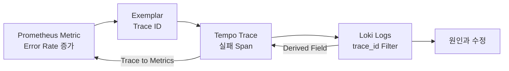

# 8. Grafana Correlation과 운영

## 세 Signal 연결

관측성의 목표는 Dashboard를 많이 만드는 것이 아니라 증상에서 원인으로 이동하는 시간을 줄이는 것이다.



가능한 이동 경로는 다음과 같다.

- Metric→Trace: Prometheus Exemplar
- Trace→Log: Tempo Data Source의 `tracesToLogsV2`
- Log→Trace: Loki Data Source의 Derived Field
- Trace→Metric: Tempo Data Source의 `tracesToMetrics`

## Grafana Data Source Provisioning

UID를 고정해야 Data Source 간 Link가 환경마다 깨지지 않는다.

```yaml
apiVersion: 1

datasources:
  - name: Loki
    uid: loki
    type: loki
    access: proxy
    url: http://loki-gateway.observability.svc
    editable: false
    jsonData:
      maxLines: 1000
      derivedFields:
        - name: TraceID
          datasourceUid: tempo
          matcherRegex: '"trace_id"\s*:\s*"([0-9a-f]+)"'
          url: '$${__value.raw}'
          urlDisplayLabel: View trace

  - name: Tempo
    uid: tempo
    type: tempo
    access: proxy
    url: http://tempo.observability.svc:3200
    editable: false
    jsonData:
      tracesToLogsV2:
        datasourceUid: loki
        spanStartTimeShift: '-2s'
        spanEndTimeShift: '2s'
        tags:
          - key: service.name
            value: service_name
          - key: k8s.namespace.name
            value: namespace
        filterByTraceID: true
        filterBySpanID: false
      tracesToMetrics:
        datasourceUid: prometheus
        spanStartTimeShift: '-2m'
        spanEndTimeShift: '2m'
        tags:
          - key: service.name
            value: service_name
        queries:
          - name: Request rate
            query: 'sum(rate(http_server_request_duration_seconds_count{$$__tags}[5m]))'
      serviceMap:
        datasourceUid: prometheus
      nodeGraph:
        enabled: true
```

이 YAML은 Grafana Provisioning File이며 Kubernetes Resource가 아니다. ConfigMap 등에 담아 Grafana의 `provisioning/datasources` 경로에 Mount한다.

예시의 `loki`, `tempo`, `prometheus`는 서로 참조하는 Data Source UID다. 기존 Metrics Data Source UID가 `thanos`라면 `tracesToMetrics`와 `serviceMap`도 `thanos`로 맞춘다.

Grafana Provisioning은 `$`를 환경 변수로 해석하므로 `${__value.raw}`와 `${__tags}` 같은 Grafana Macro에는 `$$`로 Escape한다.

## Log→Trace

Loki Log에 다음 Field가 있어야 한다.

```json
{"service.name":"order-api","message":"payment failed","trace_id":"4bf92f3577b34da6a3ce929d0e0e4736"}
```

Derived Field가 정규식이나 Structured Metadata Field에서 Trace ID를 추출해 Tempo Data Source로 연결한다. Application마다 `traceId`, `traceID`, `trace_id`를 제각각 사용하면 규칙이 복잡해지므로 `trace_id`로 통일한다.

정규식은 한 개 Capture Group만 사용하고, 많은 Log Line을 Browser에서 처리할 때 비용이 크지 않게 단순하게 유지한다.

## Trace→Log

Trace Span의 Resource Attribute와 Loki Label 이름을 Mapping한다.

```text
Trace resource.service.name   → Loki service_name
Trace k8s.namespace.name      → Loki namespace
Trace k8s.cluster.name        → Loki cluster
```

Grafana는 Span 시작·종료 시간 주변으로 LogQL Query를 만든다. Clock Skew, Async Log와 Buffer 지연을 고려해 Time Shift를 너무 좁게 두지 않되, 전체 시간 범위를 검색하지 않게 한다.

`filterByTraceID: true`를 사용하려면 Log에 같은 Trace ID가 실제로 들어 있어야 한다.

## Metric→Trace

Histogram Metric에 Exemplar가 기록되면 Grafana Panel에서 해당 Sample의 Trace로 이동할 수 있다.

```text
http.server.request.duration Histogram
└─ exemplar: trace_id=4bf92f...
```

SDK가 현재 Sampled Trace Context를 Exemplar에 연결하고 Prometheus가 Exemplar Storage를 처리하며, Grafana Prometheus Data Source가 Tempo UID를 알도록 구성해야 한다.

Exemplar는 모든 요청을 연결하는 Index가 아니라 대표 Sample이다. Exemplar가 없다는 이유만으로 Trace가 생성되지 않았다고 단정하지 않는다.

## 장애 조사 Runbook

### 1. Metric에서 증상 확인

```promql
sum by (service_name) (
  rate(http_server_request_duration_seconds_count{http_response_status_code=~"5.."}[5m])
)
```

영향 Service, 시작 시간과 Error Rate를 좁힌다.

### 2. Trace에서 병목 확인

```traceql
{ resource.service.name = "order-api" && status = error }
```

Critical Path, 실패 Span, Exception Event와 Downstream 호출을 확인한다.

### 3. Log에서 상세 Event 확인

```logql
{namespace="shop", service_name="order-api"}
| json
| trace_id = "<trace-id>"
```

같은 요청의 Retry, Error Code와 Application Decision을 확인한다.

### 4. 변경과 재발 방지

- 배포 Version·Config 변경 확인
- 사용자 영향과 Timeline 기록
- Alert·Dashboard·Instrumentation Gap 보완
- 민감정보가 노출됐다면 즉시 삭제·회전 절차 수행

## Pipeline 유실 진단

```text
Application
  → Node Log File / SDK Export
  → Fluent Bit / OTel Collector Receiver
  → Processor·Queue
  → Loki / Tempo Ingestion
  → Storage
  → Grafana Query
```

각 단계의 입력과 출력 Counter를 비교한다.

| 증상 | 우선 확인 |
| --- | --- |
| `kubectl logs`에는 있지만 Loki에 없음 | Fluent Bit Tail·Filter·Output Error |
| Collector Accepted Span은 증가하지만 Tempo에 없음 | Processor Drop·Exporter Queue·Tempo Ingestion |
| Trace는 있지만 Log Link가 없음 | Trace ID Field·Data Source UID·Time Shift·Label Mapping |
| Log가 중복됨 | 여러 Agent가 같은 File Tail·Position DB 유실·Retry |
| 일부 Service만 Trace가 끊김 | Propagation·Auto Instrumentation Coverage·Sampling |
| Query가 매우 느림 | 시간 범위·Label Cardinality·Object Storage·Query Queue |

## 용량과 비용

### Log

```text
일일 Log 용량 ≈ 초당 Log Byte × 86,400 × 복제·Index Overhead
```

### Trace

```text
일일 Trace 용량 ≈ 요청 수 × Span 수 × Span 크기 × Sampling 비율
```

Peak 기준으로 Agent·Collector Queue와 Backend Ingestion을 산정하고, 평균만 보고 설계하지 않는다. Debug Level, 장애 시 Retry Storm과 배포 직후 Log 폭증도 포함한다.

## 보안과 접근 제어

- Loki·Tempo·OTLP Endpoint를 Public으로 직접 노출하지 않는다.
- Write Credential과 Query Credential을 분리한다.
- Tenant Header를 Client가 임의로 선택하지 못하게 Gateway에서 검증한다.
- Log·Span Attribute에 Token·PII가 없는지 정기적으로 Sampling Audit한다.
- Grafana Folder뿐 아니라 Data Source Query 권한도 검토한다.
- TLS 검증 비활성은 Local 학습에만 제한한다.
- 삭제·Retention 변경은 Audit 가능한 권한으로 분리한다.

## Upgrade 기준

- Fluent Bit Parser와 Position DB Migration
- Loki Schema·Index·Deployment Mode Migration
- Tempo 3.0 Block Format·Kafka Architecture
- OpenTelemetry Component Stability와 Semantic Convention 변경
- Grafana Data Source Provisioning Schema와 UID
- Upgrade 전 Sample Log·Trace Replay와 Query 회귀 Test

Backend만 Upgrade하지 말고 Agent→Collector→Backend→Grafana 전체 호환성을 확인한다.

## 다음 실습 후보

1. JSON Log와 Trace를 생성하는 작은 HTTP Service 준비
2. Fluent Bit→Loki와 Collector→Tempo 배포
3. Error 요청을 발생시켜 LogQL·TraceQL 확인
4. Grafana에서 Log→Trace와 Trace→Log 연결
5. Loki 또는 Tempo를 잠시 중단해 Queue·Retry·Drop 관찰
6. Sampling과 Retention을 바꾸고 비용 차이 계산

## 참고 자료

- [Grafana Loki Data Source](https://grafana.com/docs/grafana/latest/datasources/loki/)
- [Tempo Data Source Provisioning](https://grafana.com/docs/grafana/latest/datasources/tempo/configure-tempo-data-source/provision/)
- [Trace to Logs](https://grafana.com/docs/grafana/latest/datasources/tempo/configure-tempo-data-source/configure-trace-to-logs/)
- [Trace to Metrics](https://grafana.com/docs/grafana/latest/datasources/tempo/configure-tempo-data-source/configure-trace-to-metrics/)
