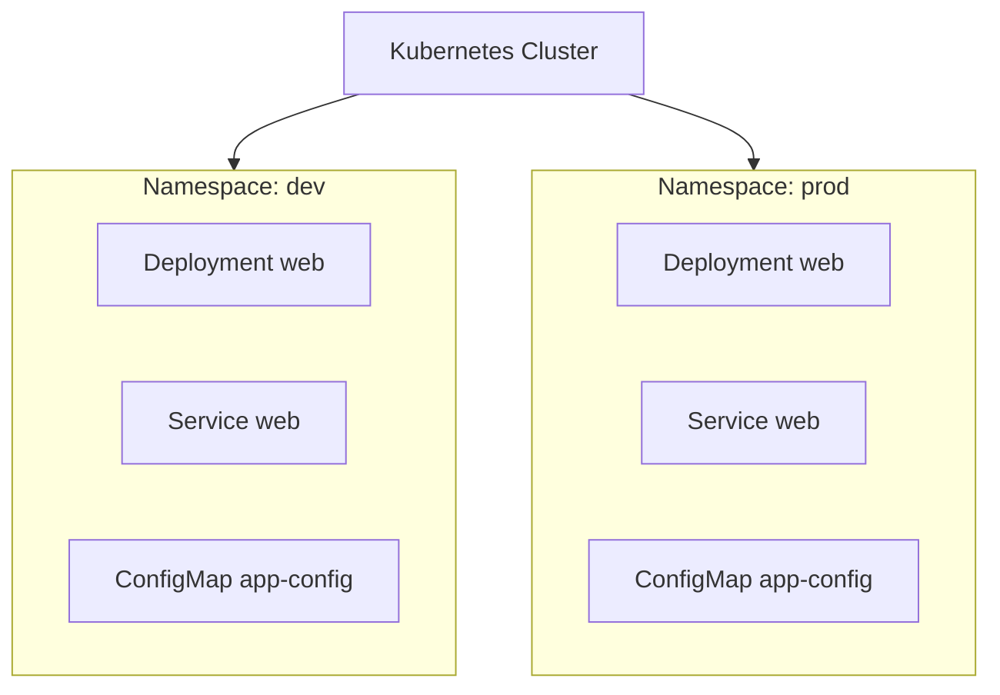
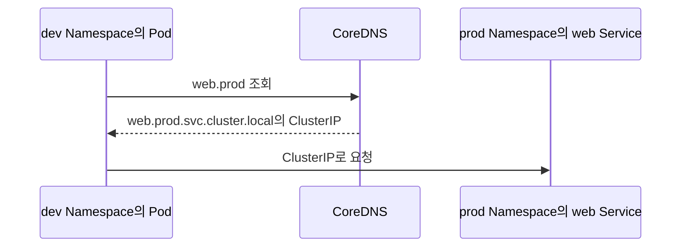

# 1. Namespace: 리소스를 논리적으로 구분하는 범위

Namespace는 하나의 Kubernetes cluster 안에서 리소스 이름과 관리 범위를 논리적으로 나누는 API 오브젝트이다. 팀, 애플리케이션, 환경별로 같은 종류의 리소스를 구분하고 RBAC, ResourceQuota, NetworkPolicy 같은 정책의 적용 범위로 사용할 수 있다.



`dev`와 `prod`에는 같은 이름의 `web` Service가 존재할 수 있다. 리소스 이름은 같은 Namespace 안에서만 고유하면 된다.

## Namespace 기본 개념

Namespace는 리소스를 위한 이름의 scope를 제공한다.

```text
dev/web Service  !=  prod/web Service
dev/app-config   !=  prod/app-config
```

한 리소스는 하나의 Namespace에만 속할 수 있고 Namespace 안에 다른 Namespace를 중첩할 수 없다.

Namespace를 흔히 논리적 장벽이라고 표현하지만 그것만으로 보안과 network가 격리되지는 않는다.

- RBAC: 누가 Namespace의 API 리소스를 읽고 변경할 수 있는지 제한
- ResourceQuota와 LimitRange: Namespace의 리소스 사용량과 기본 request·limit 제한
- NetworkPolicy: Namespace 또는 Pod 사이의 network 통신 제한
- Pod Security Admission: Namespace label을 기준으로 Pod 보안 수준 적용

즉, Namespace는 정책을 적용할 범위이지 완성된 격리 기능 하나가 아니다.

## 기본 Namespace

Kubernetes cluster에는 보통 다음 네 Namespace가 처음부터 존재한다.

| Namespace | 역할 |
| --- | --- |
| `default` | Namespace를 지정하지 않은 일반 namespaced 리소스의 기본 위치 |
| `kube-system` | DNS와 network component 등 Kubernetes system 리소스 |
| `kube-public` | 모든 client가 읽을 수 있도록 의도된 공개 정보. 일반 사용은 드묾 |
| `kube-node-lease` | node heartbeat에 사용하는 Lease 오브젝트 |

```bash
kubectl get namespaces
kubectl get ns
```

`default`에 모든 애플리케이션을 모으기보다 목적이 다른 workload는 명시적인 Namespace로 나누는 편이 관리와 권한 설정에 유리하다.

## Namespace YAML과 여러 리소스 정의

Namespace 오브젝트 자체는 cluster-scoped이므로 `metadata.namespace`를 적지 않는다.

```yaml
apiVersion: v1
kind: Namespace
metadata:
  name: study
  labels:
    purpose: kubernetes-study
```

YAML의 document separator인 `---`를 사용하면 한 파일에 여러 Kubernetes 오브젝트를 정의할 수 있다.

```yaml
apiVersion: v1
kind: Namespace
metadata:
  name: study
---
apiVersion: v1
kind: ConfigMap
metadata:
  name: app-config
  namespace: study
data:
  APP_MODE: study
---
apiVersion: v1
kind: Pod
metadata:
  name: config-reader
  namespace: study
spec:
  containers:
    - name: app
      image: busybox:1.36
      command: ["sh", "-c", "env && sleep 3600"]
      envFrom:
        - configMapRef:
            name: app-config
```

파일 위쪽에 Namespace를 먼저 정의했다고 해서 뒤의 오브젝트가 자동으로 그 Namespace에 들어가는 것은 아니다. 각 namespaced 오브젝트의 `metadata.namespace`를 적거나 적용 명령의 `--namespace`를 사용해야 한다.

```bash
kubectl apply -f study-resources.yaml
```

한 파일에 여러 오브젝트를 넣으면 작은 예제를 함께 배포하기 편하다. 규모가 커지면 리소스별 파일과 Kustomize directory로 나누어 변경 범위를 명확히 관리한다.

## Namespace 지정 방법

### Manifest에 지정

```yaml
metadata:
  name: web
  namespace: study
```

Manifest 자체가 배치 위치를 명시하므로 반복 적용하기 쉽다.

### kubectl 옵션으로 지정

```bash
kubectl get pods --namespace study
kubectl get pods -n study
kubectl apply -f pod.yaml -n study
```

Manifest에 `metadata.namespace`가 이미 있다면 명령의 Namespace와 충돌하지 않는지 확인한다.

### 현재 context의 기본 Namespace 변경

```bash
kubectl config set-context --current --namespace=study
kubectl config view --minify
```

이후 `-n`을 생략한 kubectl 명령은 `study`를 기본값으로 사용한다. 다른 cluster나 context로 전환하면 설정이 달라질 수 있으므로 삭제나 변경 전에는 현재 context와 Namespace를 확인한다.

```bash
kubectl config current-context
kubectl config view --minify --output 'jsonpath={..namespace}'
```

## 다른 Namespace의 Service 접근

Pod에서 Service를 짧은 이름으로 조회하면 현재 Pod와 같은 Namespace부터 찾는다.

| 위치 | 접근 이름 예시 |
| --- | --- |
| 같은 Namespace | `web` |
| 다른 Namespace | `web.prod` |
| 완전한 DNS 이름 | `web.prod.svc.cluster.local` |

`cluster.local`은 일반적인 기본 cluster domain이며 실제 cluster 설정에 따라 다를 수 있다.



다른 Namespace에 있다고 해서 Service 접근이 자동 차단되는 것은 아니다. 접근 제어가 필요하면 CNI가 지원하는 NetworkPolicy와 적절한 policy를 구성한다.

## Namespaced와 Cluster-scoped 오브젝트

모든 Kubernetes 오브젝트가 Namespace에 속하는 것은 아니다.

| Namespaced 예시 | Cluster-scoped 예시 |
| --- | --- |
| Pod | Node |
| Deployment, ReplicaSet, StatefulSet | Namespace |
| Service, Ingress | PersistentVolume |
| ConfigMap, Secret | StorageClass |
| PersistentVolumeClaim | ClusterRole, ClusterRoleBinding |
| Role, RoleBinding | CustomResourceDefinition |

현재 cluster가 지원하는 범위는 API discovery로 확인한다.

```bash
kubectl api-resources --namespaced=true
kubectl api-resources --namespaced=false
```

Cluster-scoped 오브젝트에는 `metadata.namespace`를 지정할 수 없다. 반대로 ConfigMap과 Secret처럼 namespaced인 오브젝트는 Pod와 같은 Namespace에 있어야 이름으로 참조할 수 있다.

## Namespace 확인과 삭제

```bash
kubectl get all -n study
kubectl get configmaps,secrets -n study
kubectl describe namespace study
```

Namespace를 삭제하면 그 안의 namespaced 리소스가 함께 삭제된다.

```bash
kubectl delete namespace study
```

이는 범위가 큰 작업이므로 대상 context와 이름을 먼저 확인한다. 삭제가 `Terminating`에 머무르면 무조건 finalizer를 지우기 전에 남은 API 리소스, admission webhook과 controller 상태를 조사한다.

## 참고

- [Namespaces](https://kubernetes.io/docs/concepts/overview/working-with-objects/namespaces/)
- [DNS for Services and Pods](https://kubernetes.io/docs/concepts/services-networking/dns-pod-service/)
- [Share a Cluster with Namespaces](https://kubernetes.io/docs/tasks/administer-cluster/namespaces/)
- [Resource Quotas](https://kubernetes.io/docs/concepts/policy/resource-quotas/)
