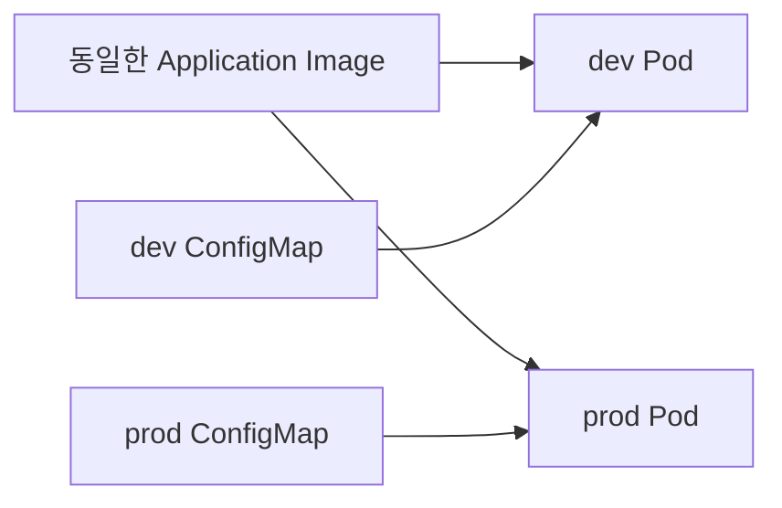
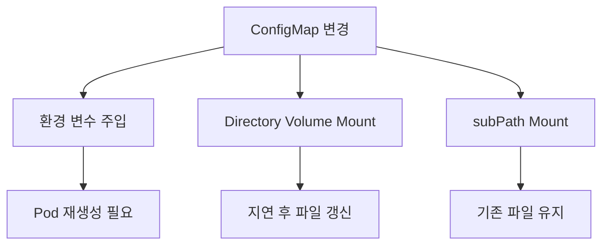

# 2. ConfigMap: 설정값을 Pod에 전달

ConfigMap은 민감하지 않은 설정 데이터를 key-value 형태로 저장하는 namespaced 오브젝트이다. 설정을 container image와 분리하면 같은 image를 개발·테스트·운영 환경에서 서로 다른 설정으로 실행할 수 있다.



비밀번호, token, private key는 ConfigMap이 아니라 Secret을 사용한다. ConfigMap은 보안 저장소가 아니다.

## ConfigMap YAML 정의

```yaml
apiVersion: v1
kind: ConfigMap
metadata:
  name: app-config
  namespace: study
data:
  APP_MODE: study
  LOG_LEVEL: info
  application.yaml: |
    server:
      port: 8080
    feature:
      enabled: true
```

`data`의 key와 value는 문자열이다. 숫자나 boolean처럼 보이는 값도 YAML에서 문자열로 해석되게 따옴표를 사용하는 편이 안전하다.

```yaml
data:
  WORKER_COUNT: "3"
  FEATURE_ENABLED: "true"
```

binary data가 필요하면 `binaryData`에 Base64로 인코딩한 값을 넣을 수 있지만 `data`와 `binaryData`에 같은 key를 중복할 수 없다.

ConfigMap 하나의 데이터는 1 MiB를 초과할 수 없다. 큰 파일이나 대규모 데이터를 저장하는 용도가 아니며 volume, object storage, database 같은 다른 저장 방식을 검토한다.

```bash
kubectl apply -f app-config.yaml
```

ConfigMap과 사용하는 Pod는 같은 Namespace에 있어야 한다.

## ConfigMap 확인

```bash
kubectl get configmaps -n study
kubectl get configmap app-config -n study
kubectl describe configmap app-config -n study
kubectl get configmap app-config -n study -o yaml
```

| 명령 | 확인 목적 |
| --- | --- |
| `get configmaps` | 목록과 key 개수 확인 |
| `describe configmap` | metadata, data key와 Event 확인 |
| `get ... -o yaml` | API에 저장된 전체 data와 필드 확인 |

ConfigMap에는 평문 설정이 저장되므로 출력 결과를 issue나 log에 복사할 때도 민감한 값이 잘못 들어 있지 않은지 확인한다.

## 환경 변수로 사용

원문 메모의 `enfForm`, `valueForm`은 각각 `envFrom`, `valueFrom`이 정확한 필드명이다.

### env와 valueFrom으로 한 key 선택

```yaml
apiVersion: v1
kind: Pod
metadata:
  name: config-env-key
  namespace: study
spec:
  containers:
    - name: app
      image: busybox:1.36
      command: ["sh", "-c", "env && sleep 3600"]
      env:
        - name: APPLICATION_MODE
          valueFrom:
            configMapKeyRef:
              name: app-config
              key: APP_MODE
```

필드 관계:

```text
spec.containers[].env[]
  ├─ name: container 안의 환경 변수 이름
  └─ valueFrom
      └─ configMapKeyRef
          ├─ name: ConfigMap 이름
          └─ key: 가져올 data key
```

ConfigMap의 `APP_MODE`를 container에서는 `APPLICATION_MODE`라는 다른 이름으로 사용할 수 있다. 필요한 key만 선택하므로 의존성이 명확하다.

### envFrom으로 모든 key 가져오기

```yaml
apiVersion: v1
kind: Pod
metadata:
  name: config-env-all
  namespace: study
spec:
  containers:
    - name: app
      image: busybox:1.36
      command: ["sh", "-c", "env && sleep 3600"]
      envFrom:
        - configMapRef:
            name: app-config
```

`envFrom`은 ConfigMap의 각 key를 같은 이름의 환경 변수로 만든다. `application.yaml`처럼 환경 변수 이름 규칙에 맞지 않는 key는 주입되지 않을 수 있으므로 파일용 key와 환경 변수용 key를 구분한다.

`envFrom`은 간단하지만 애플리케이션이 실제로 어떤 key에 의존하는지 Manifest만 보고 파악하기 어렵고 다른 source와 key가 충돌할 수 있다. 선택적 주입이 필요하면 `env[].valueFrom.configMapKeyRef`를 사용한다.

## 파일로 마운트

ConfigMap의 각 key를 Pod 내부 파일로 제공할 수 있다.

```yaml
apiVersion: v1
kind: Pod
metadata:
  name: config-volume
  namespace: study
spec:
  volumes:
    - name: app-config-volume
      configMap:
        name: app-config
        items:
          - key: application.yaml
            path: application.yaml
  containers:
    - name: app
      image: busybox:1.36
      command: ["sh", "-c", "cat /etc/app/application.yaml && sleep 3600"]
      volumeMounts:
        - name: app-config-volume
          mountPath: /etc/app
          readOnly: true
```

두 부분이 이름으로 연결된다.

```text
spec.volumes[].name: app-config-volume
                ▲
                │ 같은 이름
spec.containers[].volumeMounts[].name: app-config-volume
```

- `spec.volumes[].configMap.name`: 사용할 ConfigMap 이름
- `items[].key`: ConfigMap data의 key
- `items[].path`: mount directory 아래에 만들 파일 이름
- `volumeMounts[].mountPath`: container 내부 mount directory

`items`를 생략하면 ConfigMap의 모든 key가 파일로 만들어진다. 기존 파일이 있는 directory에 volume을 mount하면 image에 있던 해당 directory 내용이 가려질 수 있으므로 전용 directory를 사용한다.

## 파일에서 ConfigMap 생성

### Nginx 설정 파일

`nginx.conf`가 현재 directory에 있다고 가정한다.

```bash
kubectl create configmap nginx-config \
  --from-file=nginx.conf \
  --namespace=study \
  --dry-run=client -o yaml
```

바로 생성하려면 마지막 `--dry-run=client -o yaml`을 제외할 수 있지만, 학습에서는 생성 결과를 먼저 검토하고 YAML로 보관한 뒤 적용하는 흐름이 재현하기 쉽다.

```bash
kubectl create configmap nginx-config \
  --from-file=nginx.conf \
  --namespace=study \
  --dry-run=client -o yaml > nginx-config.yaml

kubectl apply -f nginx-config.yaml
```

### 파일 key 이름 지정

```bash
kubectl create configmap mysql-config \
  --from-file=mysql.cnf=./config/mysql-custom.cnf \
  --namespace=study \
  --dry-run=client -o yaml
```

생성되는 ConfigMap key는 `mysql.cnf`이고 value는 파일 전체 내용이다.

### Directory에서 생성

```bash
kubectl create configmap app-files \
  --from-file=./config \
  --namespace=study \
  --dry-run=client -o yaml
```

Directory 안에서 basename이 유효한 key인 일반 파일마다 file name을 key로 사용한다. 하위 directory를 재귀적으로 포함하지 않으므로 생성 결과를 `--dry-run=client -o yaml`로 확인한다.

## ConfigMap 갱신 동작

ConfigMap을 변경했다고 모든 애플리케이션 설정이 같은 방식으로 바뀌지는 않는다.

| 사용 방식 | ConfigMap 변경 후 동작 |
| --- | --- |
| 환경 변수 | 실행 중인 container에는 자동 반영되지 않음. Pod 재생성 필요 |
| ConfigMap volume | kubelet sync와 cache 전파 후 파일이 갱신될 수 있음 |
| `subPath` volume mount | 자동 갱신되지 않음 |



Volume 파일이 바뀌더라도 애플리케이션 process가 파일을 다시 읽지 않으면 실제 동작은 변하지 않는다. 애플리케이션의 reload 지원 여부까지 확인해야 한다.

Deployment의 Pod를 명시적으로 재생성하려면 다음 방식을 사용할 수 있다.

```bash
kubectl rollout restart deployment/<DEPLOYMENT_NAME> -n study
kubectl rollout status deployment/<DEPLOYMENT_NAME> -n study
```

설정 변경마다 자동 rollout을 만들고 싶다면 Kustomize의 hash suffix를 활용할 수 있다.

### Immutable ConfigMap

실수로 내용을 변경하지 못하게 할 수 있다.

```yaml
apiVersion: v1
kind: ConfigMap
metadata:
  name: app-config-v1
  namespace: study
immutable: true
data:
  APP_MODE: study
```

`immutable: true`가 된 뒤에는 data를 변경하거나 다시 mutable로 되돌릴 수 없다. 새 이름의 ConfigMap을 만들고 workload 참조를 교체하는 방식으로 version을 관리한다.

## Docker Swarm Config와 비교

| 구분 | Kubernetes ConfigMap | Docker Swarm Config |
| --- | --- | --- |
| 범위 | Namespace | Swarm |
| 대상 | Pod | Swarm Service task |
| 전달 방식 | 환경 변수, command argument, volume file | 기본적으로 container file mount |
| 저장 | Kubernetes API와 etcd | Swarm manager의 encrypted Raft log |
| 변경 | 기본적으로 data 수정 가능 | 기존 Config 대신 새 Config를 만들고 Service 참조 교체 |
| 독립 실행 | Kubernetes Pod에서 사용 | standalone container가 아닌 Swarm Service 기능 |

두 기능 모두 설정을 image에서 분리하지만 security model과 update 방식은 같다거나 자동으로 안전하다고 가정하면 안 된다. Kubernetes ConfigMap은 민감 정보용이 아니며 etcd 암호화 정책은 cluster 운영 설정에 달려 있다.

## 리소스 정리

```bash
kubectl delete configmap app-config -n study
```

사용 중인 ConfigMap을 삭제해도 기존 환경 변수 값은 실행 중인 container에 남을 수 있다. 새 Pod는 존재하지 않는 ConfigMap 때문에 시작하지 못할 수 있으므로 먼저 참조 workload를 확인한다.

## 참고

- [ConfigMaps](https://kubernetes.io/docs/concepts/configuration/configmap/)
- [Configure a Pod to Use a ConfigMap](https://kubernetes.io/docs/tasks/configure-pod-container/configure-pod-configmap/)
- [Docker Swarm Configs](https://docs.docker.com/engine/swarm/configs/)
