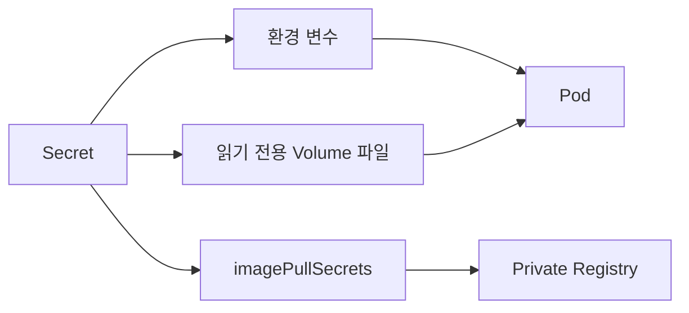
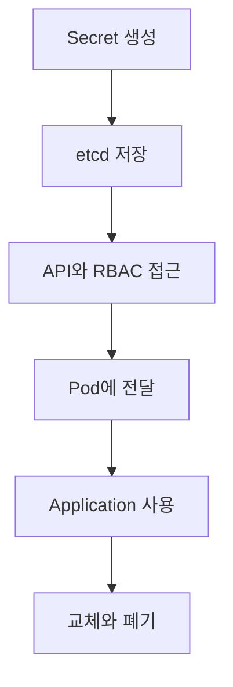

# 3. Secret: 민감한 설정값 전달

Secret은 password, token, key와 certificate처럼 민감한 데이터를 저장하고 Pod에 전달하기 위한 namespaced 오브젝트이다. 사용 방식은 ConfigMap과 비슷하지만 type별 데이터 규칙과 보안 통제가 추가된다.



Secret 오브젝트를 사용했다는 사실만으로 값이 완전히 보호되는 것은 아니다. 저장 암호화, RBAC, Pod 생성 권한, log와 Git 노출까지 함께 관리해야 한다.

## Base64와 보안

Secret Manifest의 `data` 값은 Base64 인코딩이 필요하다.

```yaml
apiVersion: v1
kind: Secret
metadata:
  name: database-credentials
  namespace: study
type: Opaque
data:
  username: YXBw
  password: REPLACE_WITH_BASE64_VALUE
```

Base64는 binary를 text로 표현하는 encoding일 뿐 encryption이 아니다. Secret을 읽을 권한이 있으면 누구나 원래 값을 복원할 수 있다.

```text
Base64 encoding: 표현 방식 변경, key 없음, 누구나 decode 가능
Encryption:       key 없이는 원문을 얻기 어렵게 보호
```

직접 Base64로 변환하지 않고 `stringData`에 평문을 작성할 수도 있다. API Server가 저장할 때 `data` 형태로 변환한다.

```yaml
apiVersion: v1
kind: Secret
metadata:
  name: database-credentials
  namespace: study
type: Opaque
stringData:
  username: app
  password: REPLACE_WITH_REAL_SECRET_OUTSIDE_GIT
```

`stringData`는 YAML 작성은 편하지만 파일에 실제 비밀값이 평문으로 남는다. 예제의 placeholder를 실제 값으로 교체한 파일은 Git에 commit하지 않는다. `stringData`는 server-side apply와도 잘 맞지 않을 수 있다.

Secret 하나의 크기는 1 MiB로 제한된다.

### etcd 저장 암호화

Kubernetes API Server는 별도 encryption provider 설정이 없으면 Secret을 포함한 API 데이터를 etcd에 평문 형태로 저장한다. Base64는 이를 암호화하지 않는다.

운영 cluster에서는 다음을 함께 적용한다.

- API Server encryption at rest 또는 KMS provider 구성
- Secret `get`, `list`, `watch` 권한을 최소화한 RBAC
- Namespace에서 Pod나 Deployment를 생성할 수 있는 주체 제한
- 필요한 container에만 Secret mount
- 필요하면 외부 Secret store와 Secrets Store CSI Driver 검토

Pod 생성 권한이 있으면 Secret을 직접 읽는 API 권한이 없어도 Secret을 mount한 Pod를 만들어 값을 노출할 수 있다. RBAC를 설계할 때 workload 생성 권한까지 고려한다.

## Generic Secret

특정 내장 type이 필요하지 않은 key-value 비밀값은 `Opaque` Secret으로 관리한다.

### 파일에서 생성

```bash
kubectl create secret generic database-credentials \
  --from-file=username=./secure/username.txt \
  --from-file=password=./secure/password.txt \
  --namespace=study \
  --dry-run=client -o yaml
```

출력 YAML에는 Base64 값이 포함되므로 terminal history, CI log와 저장 파일의 접근 권한을 주의한다.

### Literal에서 생성

```bash
kubectl create secret generic database-credentials \
  --from-literal=username=app \
  --from-literal=password='<REDACTED>' \
  --namespace=study
```

실제 password를 command line에 직접 입력하면 shell history와 process 정보에 노출될 수 있다. 학습 예시 외에는 보호된 파일, CI secret injection 또는 외부 secret manager를 사용한다.

### Secret 확인

```bash
kubectl get secrets -n study
kubectl describe secret database-credentials -n study
kubectl get secret database-credentials -n study -o yaml
```

`kubectl describe secret`은 일반적으로 key 이름과 byte 수만 표시하지만 `get -o yaml`은 decode 가능한 Base64 데이터를 출력한다. 출력 결과를 공유하거나 log에 남기지 않는다.

## 환경 변수와 파일로 사용

### secretKeyRef로 한 key 선택

```yaml
apiVersion: v1
kind: Pod
metadata:
  name: secret-env-key
  namespace: study
spec:
  containers:
    - name: app
      image: busybox:1.36
      command: ["sh", "-c", "sleep 3600"]
      env:
        - name: DB_USERNAME
          valueFrom:
            secretKeyRef:
              name: database-credentials
              key: username
        - name: DB_PASSWORD
          valueFrom:
            secretKeyRef:
              name: database-credentials
              key: password
```

```text
spec.containers[].env[].valueFrom.secretKeyRef
  ├─ name: Secret 이름
  └─ key: Secret data key
```

### secretRef로 모든 key 가져오기

```yaml
envFrom:
  - secretRef:
      name: database-credentials
```

각 key가 같은 이름의 환경 변수로 주입된다. 필요한 key가 적으면 `secretKeyRef`로 의존성을 명시하는 편이 좋다.

환경 변수는 process와 crash report, debug endpoint에 노출될 가능성이 있어 애플리케이션이 지원한다면 읽기 전용 파일 전달을 우선 검토한다.

### Volume 파일로 마운트

```yaml
apiVersion: v1
kind: Pod
metadata:
  name: secret-volume
  namespace: study
spec:
  volumes:
    - name: credentials
      secret:
        secretName: database-credentials
        defaultMode: 0400
  containers:
    - name: app
      image: busybox:1.36
      command: ["sh", "-c", "sleep 3600"]
      volumeMounts:
        - name: credentials
          mountPath: /var/run/app-secrets
          readOnly: true
```

Pod 내부에는 key 이름을 사용한 파일이 생긴다.

```text
/var/run/app-secrets/username
/var/run/app-secrets/password
```

Secret volume은 항상 read-only로 mount된다. `defaultMode`는 JSON과 달리 YAML에서 `0400`처럼 8진수 표기를 사용할 수 있다.

환경 변수로 주입한 Secret 변경은 기존 container에 자동 반영되지 않으므로 Pod를 재생성해야 한다. Secret volume의 projected file은 kubelet 전파 후 갱신될 수 있지만 `subPath` mount는 자동 갱신되지 않으며 애플리케이션도 파일을 다시 읽어야 한다.

## Private Registry Secret

Private registry credential은 `kubernetes.io/dockerconfigjson` type으로 저장하고 Pod의 `imagePullSecrets`에서 참조한다.

```bash
kubectl create secret docker-registry registry-credential \
  --docker-server=registry.example.com \
  --docker-username='<USERNAME>' \
  --docker-password='<PASSWORD>' \
  --namespace=study
```

실제 credential을 command line에 쓰면 shell history에 남을 수 있다. 실무에서는 기존 보호된 Docker config, credential provider 또는 CI secret 전달 방식을 검토한다.

Pod에서 사용한다.

```yaml
apiVersion: v1
kind: Pod
metadata:
  name: private-app
  namespace: study
spec:
  imagePullSecrets:
    - name: registry-credential
  containers:
    - name: app
      image: registry.example.com/team/app:1.0.0
```

`imagePullSecrets`는 Pod와 같은 Namespace에 있어야 한다. Image pull에 실패하면 다음을 확인한다.

- registry hostname이 image reference와 credential에 동일한가?
- Secret type이 `kubernetes.io/dockerconfigjson`인가?
- Pod가 올바른 Namespace의 Secret을 참조하는가?
- credential에 pull 권한이 있고 만료되지 않았는가?

```bash
kubectl describe pod private-app -n study
kubectl get secret registry-credential -n study -o yaml
```

## TLS Secret

`kubernetes.io/tls` type은 PEM certificate와 private key를 정해진 key 이름으로 저장한다.

```bash
kubectl create secret tls web-tls \
  --cert=./tls/tls.crt \
  --key=./tls/tls.key \
  --namespace=study
```

YAML 구조:

```yaml
apiVersion: v1
kind: Secret
metadata:
  name: web-tls
  namespace: study
type: kubernetes.io/tls
data:
  tls.crt: REPLACE_WITH_BASE64_CERTIFICATE
  tls.key: REPLACE_WITH_BASE64_PRIVATE_KEY
```

필수 key는 `tls.crt`와 `tls.key`이다. API Server는 이 key의 존재는 확인하지만 Manifest의 value가 실제로 유효한 certificate와 matching private key인지 모든 경우에 보장하는 것은 아니다. 배포 전 certificate hostname, validity와 key pair를 검증한다.

Private key 파일과 Secret Manifest를 Git에 commit하지 않는다.

## Secret 보안 원칙



Secret 보안은 전체 lifecycle을 포함한다.

1. 생성: command history, 임시 파일과 CI log에 실제 값이 남지 않게 한다.
2. 저장: encryption at rest 또는 KMS를 사용하고 etcd backup도 보호한다.
3. 접근: `list`도 전체 Secret 값을 가져올 수 있으므로 최소 권한 RBAC를 적용한다.
4. 전달: 실제로 필요한 Pod와 container만 참조한다.
5. 사용: log, exception, metric과 debug endpoint에 값을 출력하지 않는다.
6. 교체: 만료와 유출에 대비해 rotation 절차와 폐기 순서를 준비한다.

Secret 값을 Base64로 넣은 YAML은 Secret이 아니라 credential이 포함된 평문 자산으로 취급한다.

## Docker Swarm Secret과 비교

| 구분 | Kubernetes Secret | Docker Swarm Secret |
| --- | --- | --- |
| 범위 | Namespace | Swarm |
| 대상 | Pod와 ServiceAccount 등 | 권한을 부여한 Swarm Service task |
| 전달 | 환경 변수 또는 read-only volume 등 | Linux에서 기본적으로 `/run/secrets`의 in-memory file |
| 저장 암호화 | 별도 설정 없으면 etcd에 암호화되지 않음 | Swarm의 encrypted Raft log에 저장 |
| 변경 | 기본적으로 data 변경 가능, immutable 선택 가능 | 생성 후 content 변경 불가, 새 Secret으로 rotation |
| 독립 실행 | Kubernetes workload | standalone container가 아닌 Swarm Service 기능 |

Docker Swarm Secret의 기본 저장 암호화가 Kubernetes Secret보다 자동화되어 있다는 차이가 있다. 반대로 어느 환경이든 workload 내부에서 값을 읽을 수 있는 주체, application log와 권한 설계를 별도로 보호해야 한다.

## 참고

- [Kubernetes Secrets](https://kubernetes.io/docs/concepts/configuration/secret/)
- [Good Practices for Kubernetes Secrets](https://kubernetes.io/docs/concepts/security/secrets-good-practices/)
- [Pull an Image from a Private Registry](https://kubernetes.io/docs/tasks/configure-pod-container/pull-image-private-registry/)
- [Encrypting Confidential Data at Rest](https://kubernetes.io/docs/tasks/administer-cluster/encrypt-data/)
- [Docker Swarm Secrets](https://docs.docker.com/engine/swarm/secrets/)
