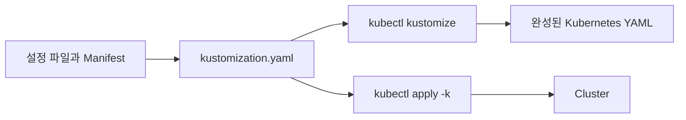
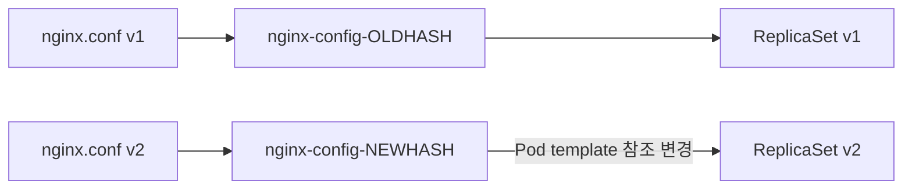
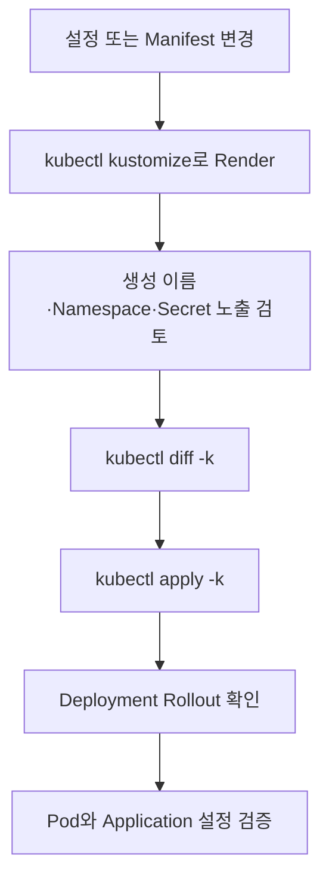

# 4. Kustomize: ConfigMap과 Secret 배포

Kustomize는 원본 YAML을 template 문법으로 바꾸지 않고 여러 Kubernetes Manifest를 조합하고 변형하는 도구이다. `kubectl`에 내장되어 있어 `kubectl kustomize`, `kubectl apply -k` 형태로 사용할 수 있다.

ConfigMap과 Secret generator를 사용하면 파일이나 literal에서 오브젝트를 만들고 내용 hash가 포함된 이름으로 workload를 갱신할 수 있다.



Kustomize의 정확한 철자는 `kustomize`이다.

## Kustomize 기본 구조

예제 directory:

```text
config-example/
├── deployment.yaml
├── nginx.conf
├── app.env
└── kustomization.yaml
```

`deployment.yaml`은 생성될 ConfigMap의 논리적 이름인 `nginx-config`를 참조한다.

```yaml
apiVersion: apps/v1
kind: Deployment
metadata:
  name: nginx
spec:
  replicas: 2
  selector:
    matchLabels:
      app: nginx
  template:
    metadata:
      labels:
        app: nginx
    spec:
      containers:
        - name: nginx
          image: nginx:1.27
          ports:
            - name: http
              containerPort: 80
          envFrom:
            - configMapRef:
                name: app-environment
          volumeMounts:
            - name: nginx-config
              mountPath: /etc/nginx/nginx.conf
              subPath: nginx.conf
              readOnly: true
      volumes:
        - name: nginx-config
          configMap:
            name: nginx-config
```

기본 `kustomization.yaml`:

```yaml
apiVersion: kustomize.config.k8s.io/v1beta1
kind: Kustomization

namespace: study

resources:
  - deployment.yaml

configMapGenerator:
  - name: nginx-config
    files:
      - nginx.conf
  - name: app-environment
    envs:
      - app.env
```

Kustomize는 `nginx-config` 같은 참조를 실제 생성된 hash suffix 이름으로 함께 바꾼다.

`namespace: study`는 렌더링할 namespaced 리소스에 Namespace를 지정하지만 Namespace 오브젝트 자체를 생성하지는 않는다. `study` Namespace를 먼저 만들거나 Namespace Manifest를 `resources`에 포함한다.

## configMapGenerator

ConfigMap은 `files`, `envs`, `literals`에서 생성할 수 있다.

### files

```yaml
configMapGenerator:
  - name: nginx-config
    files:
      - nginx.conf
```

결과는 `nginx.conf`라는 하나의 key에 파일 전체가 value로 들어간다.

다른 파일 이름을 key로 지정할 수도 있다.

```yaml
configMapGenerator:
  - name: mysql-config
    files:
      - mysql.cnf=./config/mysql-custom.cnf
```

### envs

`app.env`:

```dotenv
APP_MODE=study
LOG_LEVEL=info
```

```yaml
configMapGenerator:
  - name: app-environment
    envs:
      - app.env
```

각 줄이 별도의 ConfigMap key-value가 된다. `.env` 파일 자체가 하나의 파일 key로 들어가는 `files` 방식과 다르다.

### literals

```yaml
configMapGenerator:
  - name: feature-flags
    literals:
      - FEATURE_ALPHA=true
      - MAX_WORKERS=3
```

작은 공개 설정에 편리하지만 값이 많아지면 별도 env file이 검토하기 쉽다.

## secretGenerator

Secret도 유사하게 생성할 수 있다.

```yaml
secretGenerator:
  - name: database-credentials
    envs:
      - database.env
```

`database.env` 예시 형식:

```dotenv
username=app
password=REPLACE_OUTSIDE_GIT
```

Deployment에서는 논리적 이름을 참조한다.

```yaml
envFrom:
  - secretRef:
      name: database-credentials
```

Kustomize는 Secret value를 Base64 형태로 렌더링하지만 encryption하지 않는다. 실제 credential이 담긴 `database.env`, 렌더링 결과와 CI output을 Git이나 공개 log에 남기지 않는다.

Generator를 secret manager로 오해하지 않는다. source secret의 안전한 주입과 저장은 별도 시스템이 담당해야 한다.

## 생성 결과 확인과 배포

### Render 결과 확인

```bash
kubectl kustomize ./config-example
```

API에 적용하지 않고 완성될 Manifest를 표준 출력으로 확인한다. Secret이 포함되면 Base64 data가 출력되므로 log 공유를 주의한다.

### 차이 확인

```bash
kubectl diff -k ./config-example
```

Cluster와 비교하는 명령이므로 kubeconfig context와 권한을 확인한다. Secret diff가 terminal이나 CI log에 노출될 수 있다는 점도 고려한다.

### 적용

```bash
kubectl apply -k ./config-example
```

`-k`의 인자는 개별 YAML 파일이 아니라 `kustomization.yaml`이 있는 directory이다.

### 확인과 삭제

```bash
kubectl get deployments,configmaps,secrets -n study
kubectl get pods -n study
kubectl delete -k ./config-example
```

## 설정 변경과 자동 Rollout

Generator가 만드는 ConfigMap과 Secret 이름에는 기본적으로 content hash suffix가 붙는다.

```text
nginx-config-6t7hh8h8k4
app-environment-7g6kttm5h6
```

설정 내용이 바뀌면 hash와 오브젝트 이름도 바뀐다.



Kustomize는 Deployment의 ConfigMap 참조도 새 이름으로 바꾼다. Pod template이 변경되므로 Deployment는 새 ReplicaSet과 Pod를 만드는 rollout을 시작한다.

```bash
kubectl apply -k ./config-example
kubectl rollout status deployment/nginx -n study
kubectl get replicasets -n study
kubectl get configmaps -n study
```

이 방식은 환경 변수와 `subPath`가 실행 중인 Pod에서 자동 갱신되지 않는 문제를 새 Pod 생성으로 해결한다.

오래된 hash ConfigMap과 Secret이 계속 남는지는 apply 방식과 관리 도구에 따라 확인하고 정리한다. 현재 Deployment가 참조하는 오브젝트를 확인하지 않고 이름 pattern만으로 일괄 삭제하지 않는다.

Hash suffix를 끌 수도 있다.

```yaml
generatorOptions:
  disableNameSuffixHash: true
```

그러면 이름은 안정적이지만 설정 변경만으로 Deployment Pod template의 참조가 달라지지 않아 자동 rollout이 생기지 않는다. 특별한 이유가 없으면 기본 hash 동작을 유지한다.

## Base와 Overlay

공통 Manifest를 base로 두고 환경별 차이만 overlay에서 추가할 수 있다.

```text
k8s/
├── base/
│   ├── deployment.yaml
│   └── kustomization.yaml
└── overlays/
    ├── dev/
    │   └── kustomization.yaml
    └── prod/
        └── kustomization.yaml
```

`base/kustomization.yaml`:

```yaml
apiVersion: kustomize.config.k8s.io/v1beta1
kind: Kustomization

resources:
  - deployment.yaml
```

`overlays/dev/kustomization.yaml`:

```yaml
apiVersion: kustomize.config.k8s.io/v1beta1
kind: Kustomization

namespace: dev
namePrefix: dev-

resources:
  - ../../base

configMapGenerator:
  - name: app-environment
    literals:
      - APP_MODE=development
```

Base는 공통 구조를 유지하고 overlay는 Namespace, replica, image tag와 환경 설정 차이만 표현한다. 실제 Secret value를 overlay Git 파일에 직접 넣지는 않는다.

환경별 최종 결과는 적용 전에 각각 확인한다.

```bash
kubectl kustomize ./k8s/overlays/dev
kubectl kustomize ./k8s/overlays/prod
```

## Kustomize 배포 흐름 정리



Kustomize가 YAML 조합과 이름 갱신을 자동화하더라도 렌더링 결과, 실제 Secret 관리와 애플리케이션 동작 검증은 사용자의 책임이다.

## 참고

- [Declarative Management Using Kustomize](https://kubernetes.io/docs/tasks/manage-kubernetes-objects/kustomization/)
- [ConfigMaps](https://kubernetes.io/docs/concepts/configuration/configmap/)
- [Secrets](https://kubernetes.io/docs/concepts/configuration/secret/)
