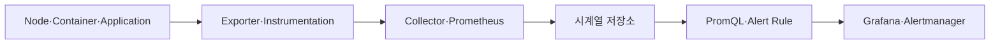

# 1. 모니터링과 Observability 기본 구조

## 왜 반드시 필요한가

Kubernetes는 실패한 Pod를 다시 만들 수 있지만 서비스가 사용자 요구를 만족하는지는 판단하지 못한다. 모니터링은 장애 탐지뿐 아니라 Capacity, 배포 검증, SLO와 비용 판단에 필요하다.



Dashboard만 만드는 것이 끝이 아니다. 수집 실패, 저장 기간, Alert 책임자와 Runbook까지 운영해야 한다.

## /metrics Endpoint

Prometheus 방식의 Application은 HTTP `/metrics`에서 현재 Metric Sample을 OpenMetrics/Prometheus Text 형식으로 노출한다.

```text
# HELP http_requests_total Total HTTP requests.
# TYPE http_requests_total counter
http_requests_total{method=\"GET\",route=\"/orders\",status=\"200\"} 1280

# HELP http_request_duration_seconds Request latency.
# TYPE http_request_duration_seconds histogram
http_request_duration_seconds_bucket{route=\"/orders\",le=\"0.1\"} 920
```

Prometheus가 주기적으로 Pull하므로 Endpoint는 빠르고 반복 호출에 안전해야 한다. Metric Endpoint에 사용자 ID, Email, Token과 원문 Request를 노출하지 않는다.

## Exporter

직접 수정하기 어려운 System이나 Software 앞에서 상태를 Prometheus Metric으로 변환하는 Process다.

```text
Linux Host → node_exporter → /metrics
Kubernetes API → kube-state-metrics → /metrics
Database → database exporter → /metrics
Custom App → Client Library → /metrics
```

Exporter가 대상 시스템을 과도하게 Query하지 않도록 Scrape Interval, Timeout과 Collector 비용을 관리한다.

## Pull과 Push

Prometheus는 기본적으로 Target을 Pull한다. 짧게 끝나는 Batch Job은 Scrape 전에 사라질 수 있어 Pushgateway를 검토할 수 있지만, 일반 Service Metric을 무조건 Pushgateway로 보내면 Lifecycle과 Stale Series 관리가 어려워진다.

## Metrics·Logs·Traces

Tracing Data는 애플리케이션 수준 Metric이 아니라 별도 Telemetry Signal이다.

| Signal | 답하는 질문 | 대표 Backend |
|---|---|---|
| Metrics | 얼마나 많이·빠르게·실패하는가 | Prometheus·Thanos |
| Logs | 어떤 Event와 Message가 있었는가 | Loki·OpenSearch |
| Traces | 요청이 어느 Service에서 지연됐는가 | Tempo·Jaeger |

Trace ID를 Log에 포함하고 Dashboard에서 관련 Trace로 이동하도록 Correlation한다.

## 운영 기본 원칙

- Monitoring System 자체도 이중화하고 감시한다.
- Alert는 증상이 아니라 사용자 영향과 Action을 중심으로 만든다.
- 모든 Dashboard Panel에 Owner와 Data Source를 알 수 있게 한다.
- Metric 이름·Label Contract 변경을 API 변경처럼 Review한다.
- Retention·Cardinality·Scrape 비용을 Capacity Planning에 포함한다.
- Monitoring Endpoint는 Cluster 내부라도 인증·NetworkPolicy로 보호한다.

## 참고 자료

- [Kubernetes System Metrics](https://kubernetes.io/docs/concepts/cluster-administration/system-metrics/)
- [OpenTelemetry Signals](https://opentelemetry.io/docs/concepts/signals/)

