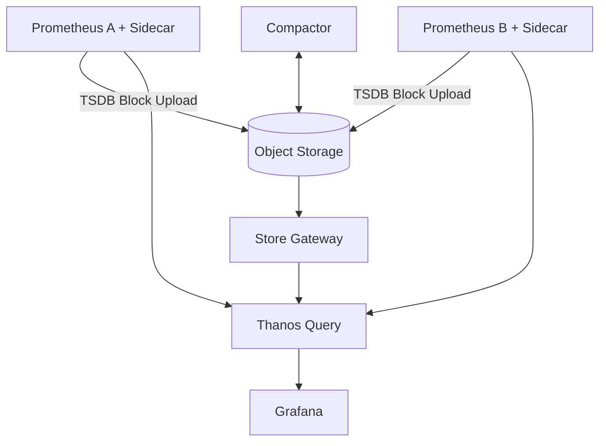

# 10. Thanos 장기 저장과 HA

## Thanos를 사용하는 이유

Prometheus Local TSDB는 단순하고 빠르지만 Cluster 여러 개의 통합 Query, 장기 Object Storage와 Global View에는 한계가 있다. Thanos는 Prometheus 호환 API 위에 이 기능을 추가한다.



## 핵심 Component

| Component | 역할 |
|---|---|
| Sidecar | Prometheus와 연결, Block Upload와 StoreAPI 제공 |
| Query | 여러 StoreAPI를 하나의 PromQL Endpoint로 통합·Dedup |
| Store Gateway | Object Storage Block Query |
| Compactor | Block Compaction, Downsampling과 Retention |
| Query Frontend | Query 분할·Cache |
| Ruler | Object Storage Data를 대상으로 Rule 평가 |
| Receive | Remote Write 수신과 Multi-tenant Ingestion |

## External Label과 Dedup

```yaml
spec:
  externalLabels:
    cluster: prod-seoul
```

Cluster와 Replica를 구분하는 External Label이 없으면 Global Query와 HA Dedup이 정확하지 않다. Prometheus Operator는 각 Replica를 구분하는 `prometheus_replica` Label을 주입할 수 있으므로 모든 Replica에 같은 정적 값을 직접 설정하지 않는다. Thanos Query의 Replica Label 설정과 Operator가 생성한 Label 이름을 일치시킨다.

## Object Storage Secret

```yaml
apiVersion: v1
kind: Secret
metadata:
  name: thanos-object-storage
  namespace: monitoring
type: Opaque
stringData:
  objstore.yml: |
    type: S3
    config:
      bucket: metrics-prod
      endpoint: object-storage.example.com
```

예시는 구조만 보여준다. 정적 Access Key보다 Cloud Workload Identity를 우선하고 Bucket Versioning·Encryption·Lifecycle·Network 경로를 관리한다.

## Compactor Singleton

Compactor는 같은 Bucket에 대해 일반적으로 Singleton으로 운영한다. Object Storage 삭제 권한은 Compactor에만 주고 Sidecar·Store Gateway는 최소 권한으로 분리한다.

## Thanos가 Backup을 완전히 대체하는가?

Object Storage에 Block이 있어도 잘못된 Retention, Compactor 삭제와 Credential 사고가 가능하다. Bucket Versioning·Object Lock 또는 별도 Backup 정책을 요구사항에 따라 둔다.

## 도입 기준

Thanos는 단일 작은 Cluster에 무조건 필요한 구성은 아니다.

- 여러 Prometheus·Cluster의 통합 Query 필요
- Local Disk보다 긴 Retention 필요
- Prometheus Replica의 Global Dedup 필요
- Object Storage 운영 역량이 있음

Managed Prometheus, Mimir, Cortex와 비용·운영 복잡도를 비교한다.

## 확인

```bash
kubectl port-forward service/thanos-query -n monitoring 10902:9090
curl --fail http://127.0.0.1:10902/-/ready
curl --fail 'http://127.0.0.1:10902/api/v1/query?query=up'
```

Store 연결, Block Upload 지연, Compaction Error, Object Storage Request와 Query Partial Response를 Alert한다.

## 참고 자료

- [Thanos Components](https://thanos.io/tip/components/)
- [Thanos Compactor](https://thanos.io/tip/components/compact.md/)
- [Thanos Storage](https://thanos.io/tip/thanos/storage.md/)
