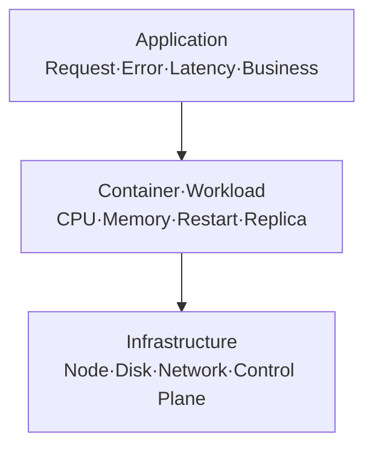

# 3. 메트릭 분류와 데이터 모델

## 세 수준의 메트릭



| 수준 | 대표 Source | 예시 |
|---|---|---|
| Infrastructure | node_exporter·Kubernetes Component | Disk, Load, API Latency |
| Container·Kubernetes Object | kubelet/cAdvisor·kube-state-metrics | CPU, Memory, Desired/Ready |
| Application | Client Library·Exporter | Request Rate, Error, Duration |

Trace는 Application 요청 경로를 나타내는 별도 Signal이며 Metric과 함께 사용한다.

## 네 가지 Metric Type

| Type | 성질 | 예시 |
|---|---|---|
| Counter | 증가하다 Process 재시작 시 Reset | 요청·Error 총수 |
| Gauge | 증가·감소 가능한 현재값 | Queue Depth·Temperature |
| Histogram | Bucket별 관측 횟수와 Sum | Request Latency |
| Summary | Client가 Quantile 계산 | 제한적인 Client-side 백분위 |

Server 전체를 집계해야 하면 Histogram을 우선한다. Summary Quantile은 Instance 간 단순 합산할 수 없다.

## Metric 이름

```text
<namespace>_<subsystem>_<name>_<unit>

shop_http_request_duration_seconds
shop_orders_processed_total
node_filesystem_avail_bytes
```

- Counter에는 `_total`을 사용한다.
- 단위를 이름 끝에 두고 Seconds·Bytes 같은 Base Unit을 사용한다.
- 하나의 Metric은 하나의 논리적 단위를 표현한다.

## Label과 Cardinality

```text
http_requests_total{
  method=\"GET\",
  route=\"/orders/{id}\",
  status=\"200\"
}
```

Time Series 수는 Label 값 조합마다 증가한다.

```text
method 5 × route 100 × status 10 × pod 50 = 최대 250,000 Series
```

User ID, Email, Request ID, Raw URL과 Timestamp를 Label로 사용하지 않는다. 이런 값은 Log·Trace에 둔다.

## /metrics는 현재 Snapshot

Exporter와 kube-state-metrics의 `/metrics`는 현재 Sample을 노출할 뿐 장기 기록을 저장하지 않는다. Prometheus가 Scrape해야 시계열 History가 생긴다.

## Golden Signals와 SLI

- Latency
- Traffic
- Errors
- Saturation

Node CPU가 높다는 Alert보다 “성공 요청 비율이 SLO를 위반한다”는 사용자 관점 Alert를 우선하고, Infrastructure Metric은 원인 분석과 조기 경보에 사용한다.

## Metric Stability

Kubernetes Component와 kube-state-metrics Metric에는 STABLE·BETA·ALPHA·DEPRECATED 같은 Stability 정보가 있을 수 있다. Dashboard·Rule에서 사용하는 Metric이 Upgrade 대상 Version에 남아 있는지 Release Note와 `/metrics`를 확인한다.

## 참고 자료

- [Prometheus Metric Types](https://prometheus.io/docs/concepts/metric_types/)
- [Metric and Label Naming](https://prometheus.io/docs/practices/naming/)
- [Kubernetes Metrics Reference](https://kubernetes.io/docs/reference/instrumentation/metrics/)
