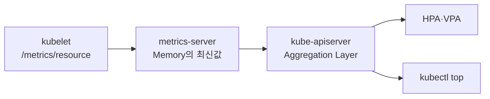

# 4. Metrics Server와 kubectl top

## 역할

Metrics Server는 각 kubelet의 CPU·Memory Resource Metric을 수집해 `metrics.k8s.io` API로 제공한다.



장기 History, Dashboard, 정확한 Billing과 Application Metric 수집용이 아니다. Prometheus를 대체하지 않는다.

## 설치

공식 Release Manifest 또는 Helm Chart의 Version을 고정해 설치한다.

```bash
kubectl apply -f metrics-server-components-v0.8.x.yaml
kubectl rollout status deployment/metrics-server -n kube-system
```

Internet의 `latest` URL을 Production에서 바로 Apply하기보다 검토한 Manifest를 Git에 저장하고 Image Digest·Compatibility Matrix를 관리한다.

## 핵심 Deployment 일부

```yaml
apiVersion: apps/v1
kind: Deployment
metadata:
  name: metrics-server
  namespace: kube-system
spec:
  selector:
    matchLabels:
      k8s-app: metrics-server
  template:
    metadata:
      labels:
        k8s-app: metrics-server
    spec:
      serviceAccountName: metrics-server
      containers:
        - name: metrics-server
          image: registry.k8s.io/metrics-server/metrics-server:<supported-version>
          args:
            - --secure-port=10250
            - --kubelet-preferred-address-types=InternalIP,Hostname
```

전체 설치에는 Service, ServiceAccount, RBAC, APIService와 Certificate 구성이 필요하므로 이 Deployment만 단독 적용하지 않는다.

## TLS 요구사항

Metrics Server가 연결하는 kubelet Serving Certificate는 Cluster CA로 검증 가능해야 한다. `--kubelet-insecure-tls`는 인증서 검증을 끄는 Test 우회책이므로 신규 Production 구성에 사용하지 않는다.

## kubectl top

```bash
kubectl top nodes
kubectl top pods -A
kubectl top pods -n apps --containers
kubectl top nodes --sort-by=cpu
```

Pod 생성 직후에는 Pipeline 지연으로 Metric이 잠시 없을 수 있다. 출력은 순간 사용량이며 Request·Limit은 `kubectl describe`에서 확인한다.

## Docker에서 가능한가?

Metrics Server는 kube-apiserver Aggregation Layer, Node Object, kubelet 인증·인가가 필요한 Kubernetes Add-on이다. Docker Container만 단독 실행해 일반 Docker Host를 모니터링하는 용도가 아니다. Docker Host는 node_exporter·cAdvisor와 Prometheus를 사용한다.

## 문제 해결

```bash
kubectl get deployment,pod,service -n kube-system \
  -l k8s-app=metrics-server
kubectl get apiservice v1beta1.metrics.k8s.io
kubectl describe apiservice v1beta1.metrics.k8s.io
kubectl logs -n kube-system deployment/metrics-server
kubectl get --raw /apis/metrics.k8s.io/v1beta1/nodes
```

`Metrics not available yet`, Kubelet TLS, Node Address와 Control Plane→Pod/Service Network 경로를 확인한다.

## 참고 자료

- [Metrics Server](https://github.com/kubernetes-sigs/metrics-server)
- [Resource Metrics Pipeline](https://kubernetes.io/docs/tasks/debug/debug-cluster/resource-metrics-pipeline/)
