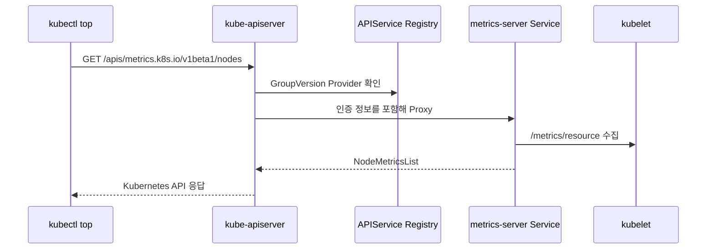

# 5. Aggregation API와 APIService

## APIService의 역할

Metrics Server는 CRD가 아니라 Aggregated API Server다. `APIService`가 `metrics.k8s.io/v1beta1` 요청을 Metrics Server Service로 Proxy한다.



## APIService YAML 핵심

```yaml
apiVersion: apiregistration.k8s.io/v1
kind: APIService
metadata:
  name: v1beta1.metrics.k8s.io
spec:
  group: metrics.k8s.io
  groupPriorityMinimum: 100
  version: v1beta1
  versionPriority: 100
  service:
    name: metrics-server
    namespace: kube-system
  caBundle: <base64-encoded-serving-ca>
```

공식 설치 Manifest가 Aggregated Server 구간에 `insecureSkipTLSVerify: true`를 사용하는 경우도 있다. Platform이 검증된 TLS를 요구하면 Serving Certificate 발급과 `caBundle` 갱신을 자동화한다. 이 설정은 Metrics Server→kubelet 검증을 끄는 `--kubelet-insecure-tls`와 다른 구간이므로 혼동하지 않는다.

## Available Condition

```bash
kubectl get apiservice v1beta1.metrics.k8s.io
kubectl get apiservice v1beta1.metrics.k8s.io \
  -o jsonpath='{.status.conditions}{"\n"}'
```

`Available=False`의 Reason:

- Service 또는 Endpoint 없음
- Service Port·Target Port 불일치
- TLS Certificate·CA Bundle 오류
- Control Plane에서 Metrics Server로 연결 불가
- Aggregation Layer RequestHeader 설정 오류

## 직접 API 확인

```bash
kubectl get --raw /apis/metrics.k8s.io/v1beta1
kubectl get --raw /apis/metrics.k8s.io/v1beta1/nodes
kubectl get --raw \
  /apis/metrics.k8s.io/v1beta1/namespaces/apps/pods
```

Local API Proxy를 사용할 수도 있다.

```bash
kubectl proxy --port=8001
curl --fail \
  http://127.0.0.1:8001/apis/metrics.k8s.io/v1beta1/nodes
```

Proxy는 Local 진단용이며 외부에 Bind하지 않는다.

## Aggregation Layer 보안

kube-apiserver는 Aggregated Server에 원래 User 정보를 Request Header로 전달한다. Front Proxy CA와 허용 Header 설정이 잘못되면 인증 경계가 깨질 수 있으므로 kubeadm·Managed Provider의 지원 설정을 사용한다.

## 참고 자료

- [Configure the Aggregation Layer](https://kubernetes.io/docs/tasks/extend-kubernetes/configure-aggregation-layer/)
- [APIService API](https://kubernetes.io/docs/reference/kubernetes-api/cluster-resources/api-service-v1/)
