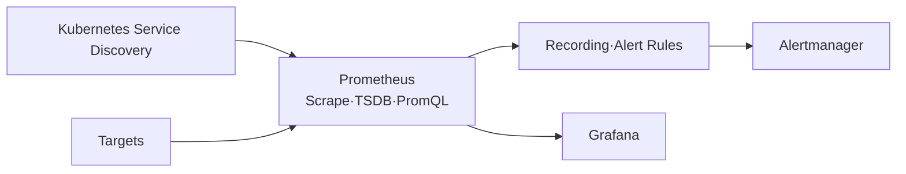

# 8. Prometheus 설치와 운영

## Prometheus의 역할

Prometheus는 Target을 발견하고 `/metrics`를 주기적으로 Scrape해 Local TSDB에 저장하며 PromQL과 Rule 평가를 제공한다.



## Docker 학습 구성

```yaml
services:
  prometheus:
    image: prom/prometheus:<pinned-version>
    command:
      - --config.file=/etc/prometheus/prometheus.yml
      - --storage.tsdb.path=/prometheus
      - --storage.tsdb.retention.time=15d
    ports:
      - \"127.0.0.1:9090:9090\"
    volumes:
      - ./prometheus.yml:/etc/prometheus/prometheus.yml:ro
      - prometheus-data:/prometheus
volumes:
  prometheus-data:
```

Local 학습에는 적합하지만 Kubernetes Service Discovery·ServiceAccount RBAC·PVC·HA 동작을 그대로 재현하지 못한다.

## Kubernetes 설치 선택

| 방식 | 사용 |
|---|---|
| kube-prometheus-stack Helm Chart | Prometheus Operator, Grafana, Alertmanager와 기본 Rule을 빠르게 통합 |
| kube-prometheus | Jsonnet 기반 Reference Stack을 관리할 Platform Team |
| Prometheus Operator CR 직접 작성 | 구성 요소와 CRD를 직접 통제 |
| 단일 Deployment 수동 YAML | 학습 외에는 유지보수 부담 큼 |

Chart Version과 Image Digest를 Git에서 고정하고 Upgrade 전에 CRD·Rule·Dashboard Diff를 검토한다.

## Prometheus CR 핵심

```yaml
apiVersion: monitoring.coreos.com/v1
kind: Prometheus
metadata:
  name: platform
  namespace: monitoring
spec:
  replicas: 2
  serviceAccountName: prometheus-platform
  serviceMonitorSelector:
    matchLabels:
      monitoring.example.com/stack: platform
  podMonitorSelector:
    matchLabels:
      monitoring.example.com/stack: platform
  ruleSelector:
    matchLabels:
      monitoring.example.com/stack: platform
  retention: 15d
  resources:
    requests:
      cpu: 500m
      memory: 2Gi
  storage:
    volumeClaimTemplate:
      spec:
        accessModes:
          - ReadWriteOnce
        storageClassName: fast-rwo
        resources:
          requests:
            storage: 100Gi
```

`Prometheus`는 Kubernetes 기본 Resource가 아니라 Prometheus Operator CRD다.

## DaemonSet Target 연결

node_exporter DaemonSet 앞에 Headless Service를 두고 ServiceMonitor가 각 Endpoint를 Scrape한다. DaemonSet Pod를 Prometheus에 직접 “연결”하는 것이 아니라 Service Discovery Label을 연결한다.

## 확인

```bash
kubectl get prometheus -n monitoring
kubectl get statefulset,pod,pvc -n monitoring
kubectl port-forward service/prometheus-operated \
  -n monitoring 9090:9090
curl --fail http://127.0.0.1:9090/-/ready
curl --fail http://127.0.0.1:9090/api/v1/targets
```

Prometheus UI와 API를 LoadBalancer로 인증 없이 공개하지 않는다.

## 운영 기준

- Replica 두 개는 독립 Scrape라 Local PVC도 각각 필요하다.
- Retention은 Disk 사용량·Series·Scrape Interval로 산정한다.
- WAL·TSDB Corruption, Disk Full과 Compaction 시간을 Alert한다.
- HA Replica Alert 중복 제거는 Alertmanager·Thanos Query에서 설계한다.
- Prometheus·Operator·CRD·Chart Compatibility를 하나의 Release로 Test한다.

## 참고 자료

- [Prometheus Operator Getting Started](https://prometheus-operator.dev/docs/developer/getting-started/)
- [Prometheus Storage](https://prometheus.io/docs/prometheus/latest/storage/)

