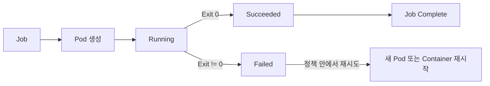
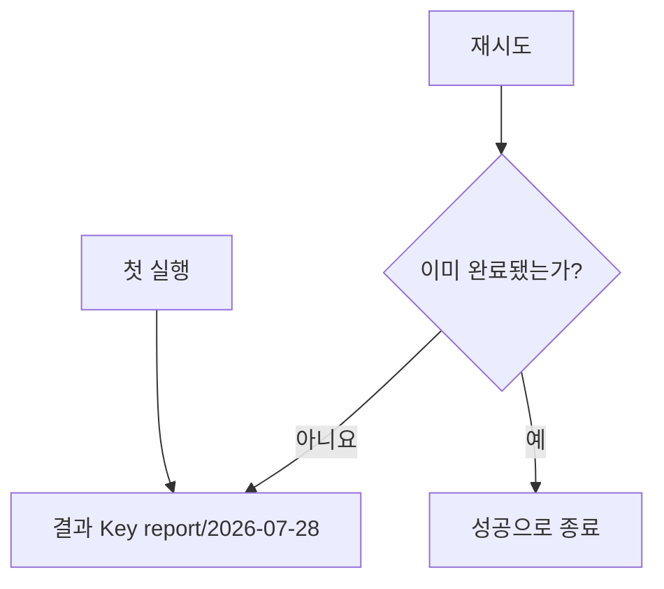

# 1. Job 기본과 실행

## Job이란?

Job은 하나 이상의 Pod가 성공적으로 끝날 때까지 실행을 관리하는 Workload다. Deployment처럼 Pod를 항상 Running으로 유지하는 것이 목표가 아니다.



Backup, Report 생성, Data Migration, Batch 변환처럼 시작과 종료가 명확한 작업에 적합하다.

## 기본 YAML

```yaml
apiVersion: batch/v1
kind: Job
metadata:
  name: report-generator
  namespace: batch
spec:
  backoffLimit: 3
  activeDeadlineSeconds: 1800
  ttlSecondsAfterFinished: 3600
  template:
    spec:
      restartPolicy: Never
      containers:
        - name: report
          image: ghcr.io/example/report@sha256:<digest>
          args:
            - --date=2026-07-28
          resources:
            requests:
              cpu: 250m
              memory: 256Mi
            limits:
              memory: 512Mi
```

Job Pod의 `restartPolicy`는 `Never` 또는 `OnFailure`만 사용할 수 있다.

## 실행 결과 확인

```bash
kubectl apply -f report-job.yaml
kubectl get job -n batch
kubectl get pod -n batch -l job-name=report-generator
kubectl logs -n batch job/report-generator
kubectl describe job report-generator -n batch
kubectl wait --for=condition=complete \
  job/report-generator -n batch --timeout=30m
```

성공 예시:

```text
NAME               STATUS     COMPLETIONS   DURATION
report-generator   Complete   1/1           24s
```

Job이 Complete가 되어도 Pod는 Log와 결과 확인을 위해 남을 수 있다. `ttlSecondsAfterFinished`를 설정하면 완료·실패 후 지정 시간이 지나 Job과 Dependent를 정리한다.

## Job과 멱등성

Controller 장애, Node 장애와 CronJob Scheduling 특성 때문에 같은 작업이 다시 실행될 수 있다. Job은 가능하면 Idempotent하게 설계한다.

- 같은 Input으로 다시 실행해도 결과가 중복되지 않게 한다.
- Database Insert에는 Unique Key나 Upsert를 사용한다.
- Object Storage 출력은 결정적인 Key와 Atomic Rename을 사용한다.
- 외부 결제·Email 같은 Side Effect에는 Idempotency Key를 둔다.
- “Pod가 한 번만 실행된다”는 가정으로 정확성을 만들지 않는다.



## 실패와 재시도 옵션

| Field | 역할 |
|---|---|
| `backoffLimit` | Job 전체 실패 재시도 한도 |
| `activeDeadlineSeconds` | 시작 후 전체 실행 가능 시간 |
| `podFailurePolicy` | Exit Code·Pod Condition별 재시도·무시·즉시 실패 |
| `suspend` | 새 Pod 생성을 중지 |
| `ttlSecondsAfterFinished` | 종료된 Job 자동 정리 |

`activeDeadlineSeconds`가 `backoffLimit`보다 먼저 도달하면 Job은 DeadlineExceeded로 실패한다.

## Pod Failure Policy

재시도해도 해결되지 않는 Application 오류는 즉시 Job을 실패시킬 수 있다.

```yaml
spec:
  backoffLimit: 6
  podFailurePolicy:
    rules:
      - action: FailJob
        onExitCodes:
          containerName: report
          operator: In
          values:
            - 42
  template:
    spec:
      restartPolicy: Never
```

`podFailurePolicy`는 Kubernetes 1.31부터 Stable이며 `restartPolicy: Never`와 함께 사용한다. Network Timeout과 잘못된 Input처럼 재시도 가능 여부가 다른 오류를 Exit Code로 구분한다.

## Job은 결과 저장소가 아니다

Container Filesystem에만 결과를 쓰면 Pod 정리와 함께 사라진다. 결과는 Object Storage, Database, PVC 또는 외부 시스템에 저장하고 성공 여부를 검증한 뒤 Exit 0으로 종료한다.

## 참고 자료

- [Jobs](https://kubernetes.io/docs/concepts/workloads/controllers/job/)
- [Pod Failure Policy](https://kubernetes.io/docs/tasks/job/pod-failure-policy/)

