# 2. Job 병렬성과 완료 조건

## completions와 parallelism

| 설정 | 의미 |
|---|---|
| `completions` | 성공해야 하는 Pod 완료 횟수 |
| `parallelism` | 동시에 실행할 수 있는 최대 Pod 수 |

실제 동시 실행 수는 남은 Completion 수, Resource, Quota와 Scheduling 상태 때문에 `parallelism`보다 작을 수 있다.

## 옵션 조합 비교

### 둘 다 생략

```yaml
spec:
  template:
    spec:
      restartPolicy: Never
```

Pod 하나가 성공하면 Job이 완료되는 Non-parallel Job이다.

### completions만 지정

```yaml
spec:
  completions: 5
  parallelism: 1
```

성공 Pod 5개를 한 번에 하나씩 순차 실행한다.

### completions와 parallelism

```yaml
spec:
  completions: 10
  parallelism: 3
```

최대 3개씩 실행하고 누적 성공이 10개가 되면 완료한다.

```mermaid
gantt
    title completions 6 / parallelism 2
    dateFormat X
    axisFormat %s
    section Worker A
    Pod 1 :0, 2
    Pod 3 :2, 4
    Pod 5 :4, 6
    section Worker B
    Pod 2 :0, 2
    Pod 4 :2, 4
    Pod 6 :4, 6
```



## Job은 작업을 자동 분할하지 않는다

Job은 여러 Pod를 동시에 실행할 수 있지만 하나의 큰 File이나 Table을 자동으로 나누지 않는다. Application이 다음 중 하나로 작업을 분배해야 한다.

- Work Queue에서 각 Pod가 다음 Item을 가져간다.
- Indexed Job의 Completion Index로 고정 Partition을 선택한다.
- 외부 Coordinator가 Shard를 배정한다.

따라서 “병렬처리를 위해 사용하는 것이 아니다”보다는 “병렬 실행은 지원하지만 작업 분할은 Application 책임”이 정확하다.

## Indexed Job

```yaml
apiVersion: batch/v1
kind: Job
metadata:
  name: image-shards
spec:
  completionMode: Indexed
  completions: 4
  parallelism: 2
  backoffLimitPerIndex: 2
  maxFailedIndexes: 1
  template:
    spec:
      restartPolicy: Never
      containers:
        - name: worker
          image: ghcr.io/example/image-worker:1.0.0
          args:
            - --shard=$(JOB_COMPLETION_INDEX)
```

Indexed Pod에는 `JOB_COMPLETION_INDEX` Environment와 `batch.kubernetes.io/job-completion-index` Label이 제공된다. Index는 0부터 `completions-1`까지다.

`backoffLimitPerIndex`를 사용하면 특정 Partition 실패가 다른 Index의 재시도 예산을 모두 소비하지 않게 할 수 있다.

## Success Policy

모든 Index가 아니라 지정된 성공 조건만 만족해도 충분한 분산 계산에 사용할 수 있다.

```yaml
spec:
  completionMode: Indexed
  completions: 10
  parallelism: 5
  successPolicy:
    rules:
      - succeededCount: 8
```

Success Policy는 Indexed Job에서만 사용하며 조건이 충족되면 남은 Pod를 종료한다. 데이터 정확성상 일부 결과가 없어도 정말 성공인지 Domain 기준을 먼저 정의한다.

## Scaling과 suspend

```bash
kubectl patch job image-shards \
  --type=merge \
  -p '{\"spec\":{\"parallelism\":4}}'

kubectl patch job image-shards \
  --type=merge \
  -p '{\"spec\":{\"suspend\":true}}'
```

Suspend하면 Active Pod가 삭제될 수 있으므로 Checkpoint가 없는 긴 작업은 손실될 수 있다. Resume 시 Start Time과 Deadline 동작도 확인한다.

## 상태 확인

```bash
kubectl get job image-shards -o yaml
kubectl get pods -l job-name=image-shards \
  -L batch.kubernetes.io/job-completion-index
kubectl logs -l job-name=image-shards \
  --all-containers --prefix
```

`status.active`, `succeeded`, `failed`, `completedIndexes`와 Conditions를 함께 본다.

## 유지보수 기준

- 모든 Pod가 같은 Item을 처리하지 않도록 Partition 계약을 Test한다.
- At-least-once 실행을 전제로 멱등성을 확보한다.
- Parallelism이 외부 DB·API Connection 한도를 넘지 않게 한다.
- ResourceQuota와 Node Capacity 안에서 동시 실행량을 정한다.
- 대규모 분산 학습의 All-or-nothing Scheduling은 Kubernetes 1.36의 Alpha Gang Scheduling을 기본값으로 가정하지 않고 별도 Batch Scheduler도 비교한다.

## 참고 자료

- [Parallel Execution for Jobs](https://kubernetes.io/docs/concepts/workloads/controllers/job/#parallel-execution-for-jobs)
- [Indexed Jobs](https://kubernetes.io/docs/concepts/workloads/controllers/job/#completion-mode)

