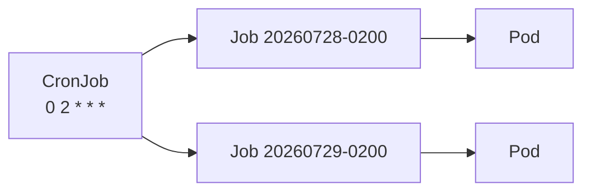

# 3. CronJob으로 Job 주기 실행

## 동작 구조

CronJob은 Schedule마다 Job을 만들고 Job이 Pod를 만든다. CronJob이 Pod를 직접 실행하지 않는다.



## YAML

```yaml
apiVersion: batch/v1
kind: CronJob
metadata:
  name: daily-report
  namespace: batch
spec:
  schedule: \"0 2 * * *\"
  timeZone: Asia/Seoul
  concurrencyPolicy: Forbid
  startingDeadlineSeconds: 600
  successfulJobsHistoryLimit: 3
  failedJobsHistoryLimit: 5
  jobTemplate:
    metadata:
      labels:
        app.kubernetes.io/name: daily-report
    spec:
      backoffLimit: 3
      activeDeadlineSeconds: 1800
      ttlSecondsAfterFinished: 86400
      template:
        spec:
          restartPolicy: Never
          containers:
            - name: report
              image: ghcr.io/example/report@sha256:<digest>
              args:
                - --previous-day
              resources:
                requests:
                  cpu: 250m
                  memory: 256Mi
```

`timeZone` Field를 사용하고 `schedule` 문자열 안에 `TZ`나 `CRON_TZ`를 넣지 않는다.

## concurrencyPolicy 비교

| 값 | 이전 Job이 실행 중일 때 |
|---|---|
| `Allow` | 새 Job도 실행 |
| `Forbid` | 이번 실행을 건너뜀 |
| `Replace` | 이전 Job을 종료하고 새 Job 실행 |

`Forbid`는 지연 실행이 아니라 해당 시각의 실행을 놓칠 수 있다. `Replace`는 이전 작업이 안전하게 중단·재시작될 수 있을 때만 사용한다.

## 시작 Deadline

Controller 장애 등으로 Schedule을 놓쳤을 때 `startingDeadlineSeconds` 안이면 늦게 Job을 만들 수 있다. 너무 작은 값, 특히 10초 미만은 Controller 확인 주기 때문에 실행되지 않을 수 있다.

## 중복 실행과 멱등성

CronJob Scheduling은 정확히 한 번 실행을 보장하지 않는다. 특정 상황에서 Job이 두 번 생성되거나 생성되지 않을 수 있으므로 Job은 멱등성을 가져야 한다.

Kubernetes 1.32부터 생성된 Job의 다음 Annotation으로 원래 Schedule 시각을 확인할 수 있다.

```text
batch.kubernetes.io/cronjob-scheduled-timestamp
```

이 시각을 Idempotency Key나 처리 대상 날짜 계산에 활용할 수 있다.

## 확인과 수동 실행

```bash
kubectl get cronjob daily-report -n batch
kubectl describe cronjob daily-report -n batch
kubectl get jobs -n batch \
  -l app.kubernetes.io/name=daily-report

kubectl create job \
  --from=cronjob/daily-report \
  daily-report-manual-001 \
  -n batch
```

수동 Job 이름은 재실행 시 충돌하지 않게 정한다.

## Suspend

```yaml
spec:
  suspend: true
```

새 Job 생성을 중지하지만 이미 시작된 Job은 종료하지 않는다. 다시 Resume할 때 Missed Schedule이 한꺼번에 처리될 가능성을 `startingDeadlineSeconds`와 함께 검토한다.

## 운영 체크리스트

- CronJob 이름은 Child Job 이름 제약 때문에 52자 이하로 둔다.
- Database Backup은 생성뿐 아니라 Restore Test까지 운영한다.
- History Limit와 TTL로 API Object·Log 보존 책임을 구분한다.
- Time Zone과 DST 전환 시 실행 시간을 확인한다.
- Alert는 CronJob Object보다 마지막 성공 Job 시각을 기준으로 한다.
- Controller Clock Skew와 100회 이상 Missed Schedule Event를 확인한다.

## 참고 자료

- [CronJobs](https://kubernetes.io/docs/concepts/workloads/controllers/cron-jobs/)
- [Automated Tasks with CronJobs](https://kubernetes.io/docs/tasks/job/automated-tasks-with-cron-jobs/)
