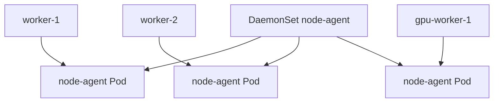

# 4. DaemonSet 기본

## DaemonSet이란?

DaemonSet은 모든 적격 Node 또는 선택된 Node마다 Pod 하나를 유지한다. Node가 추가되면 Pod를 만들고 Node가 제거되면 해당 Pod도 정리한다.



대표 용도:

- Log 수집 Agent
- Node Monitoring Agent
- CNI Network Agent
- CSI Node Plugin
- Node-local Cache·Security Agent

Replica 수를 임의로 정하는 일반 Application은 Deployment가 더 적합하다.

## 기본 YAML

```yaml
apiVersion: apps/v1
kind: DaemonSet
metadata:
  name: node-agent
  namespace: observability
spec:
  selector:
    matchLabels:
      app.kubernetes.io/name: node-agent
  template:
    metadata:
      labels:
        app.kubernetes.io/name: node-agent
    spec:
      serviceAccountName: node-agent
      containers:
        - name: agent
          image: ghcr.io/example/node-agent@sha256:<digest>
          resources:
            requests:
              cpu: 100m
              memory: 128Mi
            limits:
              memory: 256Mi
          securityContext:
            allowPrivilegeEscalation: false
            readOnlyRootFilesystem: true
```

## 핵심 YAML 관계

- `kind: DaemonSet`은 `apps/v1` API를 사용한다.
- `spec.selector`는 관리할 Pod Label을 선택한다.
- `spec.template.metadata.labels`는 Selector와 일치해야 한다.
- Selector는 생성 후 변경할 수 없다.
- Pod `restartPolicy`는 생략하거나 `Always`여야 한다.

Selector가 다른 Workload와 겹치지 않도록 Component 전용 Label을 사용한다.

## 모든 노드인가, 적격 노드인가?

NodeSelector, Node Affinity와 Taint 조건을 통과한 Node만 대상이다.

```yaml
spec:
  template:
    spec:
      nodeSelector:
        kubernetes.io/os: linux
        observability.example.com/enabled: \"true\"
```

Windows·GPU·Edge Node가 섞인 Cluster에서는 OS와 Node Pool별 DaemonSet을 나누고 Image·Resource·Mount를 각각 관리할 수 있다.

## 자원 할당량

DaemonSet Pod도 Request·Limit이 필요하다. Node 수가 100개면 100개 Pod의 Request가 Cluster 전반에서 소비된다.

```text
Node 100개 × CPU Request 100m = 총 10 CPU
Node 100개 × Memory Request 128Mi = 총 12.5Gi
```

Request가 너무 크면 새 Node에서 핵심 Agent조차 Scheduling되지 않을 수 있고, 너무 작으면 Node Pressure에서 Agent가 불안정해진다. Log Burst·Startup Peak를 측정한다.

## 확인 결과

```bash
kubectl get daemonset node-agent -n observability
kubectl get pod -n observability \
  -l app.kubernetes.io/name=node-agent -o wide
kubectl describe daemonset node-agent -n observability
```

예시:

```text
DESIRED   CURRENT   READY   UP-TO-DATE   AVAILABLE
3         3         3       3            3
```

| Status | 의미 |
|---|---|
| `DESIRED` | 실행되어야 하는 적격 Node 수 |
| `CURRENT` | 현재 Daemon Pod가 있는 Node 수 |
| `READY` | Ready Pod 수 |
| `UP-TO-DATE` | 최신 Template Revision Pod 수 |
| `AVAILABLE` | Available 조건을 만족한 Pod 수 |

## 보안 주의

Node Agent는 `hostPath`, `hostNetwork`와 Privileged 권한을 요구하는 경우가 많다. 편의를 위해 모두 허용하지 않고 필요한 Path·Capability·Socket만 제공한다.

- Container Runtime Socket Mount는 사실상 Node 제어 권한일 수 있다.
- Host Log는 Read-only Mount를 우선한다.
- 전용 ServiceAccount와 최소 RBAC을 사용한다.
- System Namespace에도 NetworkPolicy·Image 검증과 Audit을 적용한다.

## 참고 자료

- [DaemonSet](https://kubernetes.io/docs/concepts/workloads/controllers/daemonset/)
- [DaemonSet API](https://kubernetes.io/docs/reference/kubernetes-api/workload-resources/daemon-set-v1/)

