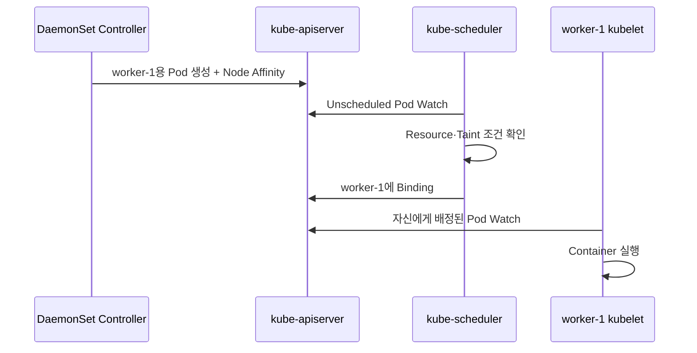

# 5. DaemonSet 스케줄링과 업데이트

## Daemon Pod Scheduling

DaemonSet Controller는 적격 Node마다 Pod를 만들고 해당 Node 이름에 맞는 Node Affinity를 주입한다. 기본 Scheduler가 Resource와 다른 조건을 확인한 뒤 Node에 Binding한다.



직접 `nodeName`을 Template에 쓰지 않는다.

## Control Plane Node에 실행

Control Plane Node는 일반적으로 Taint가 있어 기본 DaemonSet Pod가 배치되지 않는다.

```yaml
spec:
  template:
    spec:
      tolerations:
        - key: node-role.kubernetes.io/control-plane
          operator: Exists
          effect: NoSchedule
```

Cluster Network·Node Monitoring처럼 Control Plane에도 꼭 필요한 Agent에만 추가한다. 일반 Log Agent가 Control Plane의 민감한 File까지 읽지 않도록 Mount와 RBAC을 별도 검토한다. 과거 `node-role.kubernetes.io/master` Taint는 기존 Cluster 호환이 필요할 때만 추가한다.

## 자동 Toleration

DaemonSet Controller는 Node Agent의 Bootstrap과 장애 관찰을 위해 NotReady, Unreachable, MemoryPressure, DiskPressure, PIDPressure, Unschedulable 등에 일부 Toleration을 자동 추가한다.

따라서 Cordon한 Node에도 DaemonSet Pod가 남거나 배치될 수 있다. `kubectl drain --ignore-daemonsets`가 필요한 이유이기도 하다.

## RollingUpdate

```yaml
spec:
  minReadySeconds: 10
  updateStrategy:
    type: RollingUpdate
    rollingUpdate:
      maxUnavailable: 1
      maxSurge: 0
```

기본 전략은 RollingUpdate다. 한 번에 너무 많은 Node Agent를 교체하면 Log·Network·Storage 기능이 동시에 끊길 수 있으므로 가용성 범위를 제한한다.

`maxSurge`를 사용하면 기존 Pod를 내리기 전에 새 Pod를 만들 수 있지만 같은 Node에서 두 Agent가 Host Port·Socket·Lock을 동시에 사용할 수 있는지 확인한다.

## OnDelete

```yaml
spec:
  updateStrategy:
    type: OnDelete
```

Template을 바꿔도 기존 Pod를 자동 교체하지 않는다. 관리자가 Pod를 삭제해야 새 Revision으로 생성된다. 특별한 수동 Node Rollout이 아니라면 RollingUpdate가 유지보수하기 쉽다.

## 업데이트 확인

```bash
kubectl rollout status daemonset/node-agent \
  -n observability --timeout=10m
kubectl rollout history daemonset/node-agent -n observability
kubectl get controllerrevision -n observability
kubectl get pod -n observability \
  -l app.kubernetes.io/name=node-agent -o wide
```

Pod가 특정 Node에서 Pending이면 해당 Node의 Allocatable, Taint, Host Port, Volume Mount와 Image Architecture를 확인한다.

## Node별 설정

하나의 DaemonSet에 복잡한 조건문을 넣기보다 Node Group별 DaemonSet과 ConfigMap을 나누는 편이 명확할 수 있다.

```text
node-agent-general → nodepool=general
node-agent-gpu     → nodepool=gpu
node-agent-edge    → nodepool=edge
```

Selector와 Label이 서로 겹쳐 같은 Node에 중복 Agent가 실행되지 않게 검증한다.

## 운영 점검

- Desired와 Ready 차이를 Alert한다.
- 새 Node가 Ready가 된 뒤 핵심 DaemonSet도 Ready인지 확인한다.
- Update 전 Host Resource 충돌과 Version Compatibility를 검증한다.
- PriorityClass는 핵심 Agent에만 사용하고 Preemption 영향을 확인한다.
- Drain에서 DaemonSet Data와 Node-local State 정리 책임을 명확히 한다.
- Image는 Multi-architecture 지원 여부와 Digest를 검증한다.

## 참고 자료

- [How Daemon Pods are Scheduled](https://kubernetes.io/docs/concepts/workloads/controllers/daemonset/#how-daemon-pods-are-scheduled)
- [Perform a Rolling Update on a DaemonSet](https://kubernetes.io/docs/tasks/manage-daemon/update-daemon-set/)
