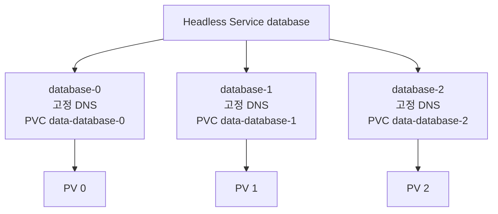

# 6. StatefulSet 고유성과 Headless Service

## StatefulSet을 사용하는 이유

일반적인 Stateless Application은 Pod가 새 UID와 이름으로 교체되어도 동일하게 동작한다. Database·Consensus Member처럼 Identity, Storage와 순서가 중요한 Workload는 StatefulSet을 검토한다.

StatefulSet이 제공하는 것:

- 안정적인 Pod 이름과 Ordinal
- 안정적인 Network Identity
- Pod마다 고유한 PVC
- 순서가 있는 생성·축소·RollingUpdate

StatefulSet이 자동으로 제공하지 않는 것:

- Database Replication과 Leader Election
- Backup·Restore와 Data Consistency
- Quorum 보호와 안전한 Schema Migration
- Application-level Failover

Production Database는 유지보수되는 전용 Operator나 Managed Service를 우선 검토한다.

## Headless Service

`clusterIP: None`인 Service가 Stateful Pod의 Network Domain을 제공한다.

```yaml
apiVersion: v1
kind: Service
metadata:
  name: database
  namespace: data
spec:
  clusterIP: None
  selector:
    app: database
  ports:
    - name: client
      port: 5432
      targetPort: 5432
```

Headless Service는 하나의 Virtual IP로 Load Balancing하지 않고 선택된 Pod Endpoint를 DNS로 반환한다.

## StatefulSet YAML

```yaml
apiVersion: apps/v1
kind: StatefulSet
metadata:
  name: database
  namespace: data
spec:
  serviceName: database
  replicas: 3
  selector:
    matchLabels:
      app: database
  template:
    metadata:
      labels:
        app: database
    spec:
      terminationGracePeriodSeconds: 60
      containers:
        - name: database
          image: ghcr.io/example/database@sha256:<digest>
          ports:
            - name: client
              containerPort: 5432
          readinessProbe:
            tcpSocket:
              port: client
          volumeMounts:
            - name: data
              mountPath: /var/lib/database
  volumeClaimTemplates:
    - metadata:
        name: data
      spec:
        accessModes:
          - ReadWriteOncePod
        storageClassName: fast-rwo
        resources:
          requests:
            storage: 50Gi
```

`spec.serviceName`은 미리 만든 Headless Service 이름과 일치해야 한다. Selector와 Pod Template Label도 일치해야 한다.

## Pod 이름과 DNS

```text
Pod:
database-0
database-1
database-2

개별 Pod DNS:
database-0.database.data.svc.cluster.local
database-1.database.data.svc.cluster.local
database-2.database.data.svc.cluster.local

Service DNS:
database.data.svc.cluster.local
```



Pod가 다른 Node에서 재생성되어도 같은 Ordinal 이름과 PVC를 다시 사용한다. IP 주소는 바뀔 수 있으므로 Stable DNS를 사용한다.

## OrderedReady

기본 `podManagementPolicy: OrderedReady`는 다음 순서를 사용한다.

```text
Scale Up:   database-0 Ready → database-1 Ready → database-2 Ready
Scale Down: database-2 종료 → database-1 종료 → database-0 종료
```

앞 Ordinal이 Ready가 되지 않으면 다음 Pod 생성이 막힐 수 있다. Application Bootstrap과 Readiness가 정확해야 한다.

## Parallel Pod Management

```yaml
spec:
  podManagementPolicy: Parallel
```

Pod를 동시에 생성·삭제하지만 이름과 Storage 고유성은 유지한다. Start 순서가 필요 없는 독립 Shard에 적합하며, Database Cluster가 순서를 요구한다면 사용하지 않는다.

## 확인

```bash
kubectl get statefulset database -n data
kubectl get pod -n data -l app=database -o wide
kubectl get endpointslice -n data \
  -l kubernetes.io/service-name=database
kubectl get pvc -n data
```

예상 PVC:

```text
data-database-0
data-database-1
data-database-2
```

## 참고 자료

- [StatefulSets](https://kubernetes.io/docs/concepts/workloads/controllers/statefulset/)
- [Headless Services](https://kubernetes.io/docs/concepts/services-networking/service/#headless-services)

