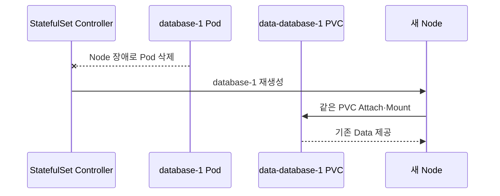

# 7. StatefulSet 스토리지와 운영

## volumeClaimTemplates

`volumeClaimTemplates`의 Template 하나마다 각 Ordinal 전용 PVC가 생성된다.

```text
<claim-template-name>-<statefulset-name>-<ordinal>

data-database-0
data-database-1
data-database-2
```

StorageClass Dynamic Provisioning이 가능하거나 관리자가 조건에 맞는 PV를 미리 준비해야 한다. Production에서 단일 Pod 전용 Storage라면 Kubernetes 문서는 `ReadWriteOncePod`를 권장한다.

## Pod 교체와 PVC 재연결



Multi-Attach가 불가능한 Volume은 이전 Node의 Detach가 끝나야 새 Node에 Attach된다. 강제 Pod 삭제는 실제 Process가 살아 있는 상태에서 두 Node가 같은 Storage를 쓰는 Split-brain 위험을 만들 수 있다.

## PVC Retention Policy

기본은 StatefulSet 삭제와 Scale Down 모두 PVC를 Retain한다.

```yaml
spec:
  persistentVolumeClaimRetentionPolicy:
    whenDeleted: Retain
    whenScaled: Retain
```

자동 삭제가 필요한 Ephemeral 성격이라면 명시할 수 있다.

```yaml
spec:
  persistentVolumeClaimRetentionPolicy:
    whenDeleted: Delete
    whenScaled: Delete
```

`Delete`는 PVC 삭제이며 실제 Volume 삭제 여부는 PV Reclaim Policy와 Storage Driver에 따라 이어진다. Database에는 Backup·승인·복구 절차 없이 Delete를 사용하지 않는다.

## Scale Down과 Scale Up

기본 Retain 정책에서 3→1로 축소하면 `database-1`과 `database-2` Pod는 사라지지만 PVC는 남는다. 다시 3으로 확장하면 같은 PVC를 재사용한다.

```bash
kubectl scale statefulset database -n data --replicas=1
kubectl get pod,pvc -n data
```

Application Cluster Membership을 먼저 안전하게 변경하지 않고 Pod 수만 줄이면 Quorum과 Data Replication이 깨질 수 있다.

## RollingUpdate

```yaml
spec:
  minReadySeconds: 10
  updateStrategy:
    type: RollingUpdate
    rollingUpdate:
      partition: 0
```

기본적으로 높은 Ordinal부터 하나씩 교체하며 새 Pod가 Ready·Available해야 다음 Ordinal로 진행한다.

Partition을 2로 설정하면 Ordinal 2 이상만 새 Revision으로 갱신해 Canary로 사용할 수 있다.

```text
replicas=5, partition=2

database-4 → 새 Revision
database-3 → 새 Revision
database-2 → 새 Revision
database-1 → 이전 Revision
database-0 → 이전 Revision
```

`maxUnavailable` 기반 StatefulSet Update는 Kubernetes 1.36에서도 Feature Gate가 꺼진 Alpha 기능이므로 신규 운영 기본값으로 사용하지 않는다.

## OnDelete

```yaml
spec:
  updateStrategy:
    type: OnDelete
```

Template 변경 후 Pod를 수동 삭제해야 새 Revision이 적용된다. Application Operator가 자체 Upgrade 순서를 관리하는 경우가 아니라면 RollingUpdate를 우선한다.

## 잘못된 Update 복구

OrderedReady RollingUpdate에서 새 Pod가 계속 Ready가 되지 않으면 Rollout이 멈춘다.

```bash
kubectl rollout status statefulset/database -n data
kubectl get controllerrevision -n data
kubectl describe pod database-2 -n data
```

Template을 정상 Version으로 되돌린 뒤에도 이미 실패한 Pod가 자동 복구되지 않는 경우 해당 Pod를 확인 후 삭제해 재생성해야 할 수 있다. Data와 Cluster Membership을 확인하지 않고 여러 Pod를 동시에 삭제하지 않는다.

## PVC 용량 확장

StorageClass의 `allowVolumeExpansion`과 CSI Driver가 지원하면 생성된 PVC를 개별 확장할 수 있다. StatefulSet `volumeClaimTemplates`의 Storage 요청은 일반적으로 직접 변경할 수 없는 Field이므로 기존 PVC 확장과 향후 Replica Template 관리 절차를 별도로 설계한다.

```bash
kubectl patch pvc data-database-0 -n data \
  --type=merge \
  -p '{\"spec\":{\"resources\":{\"requests\":{\"storage\":\"100Gi\"}}}}'
```

Filesystem 확장이 Online인지, Pod 재시작이 필요한지 Driver 문서를 확인한다.

## 삭제와 Backup

StatefulSet 삭제가 Application의 순차적 종료를 완전히 보장하지 않는다. 안전한 종료가 필요하면 Application 절차에 따라 Replica를 0으로 축소한 뒤 삭제하는 방식을 검토한다.

- PVC 보존은 Backup이 아니다.
- Snapshot과 Backup Repository는 Cluster·계정 장애에서 격리한다.
- Restore Test와 RPO·RTO를 검증한다.
- Headless Service, Secret, Config와 CRD/Operator Version도 복구 대상이다.
- PDB와 Drain이 Quorum을 실제로 보호하는지 장애 시험한다.

## 운영 선택 기준

- 단순 Stateless Replica: Deployment
- Stable Identity·PVC·순서 필요: StatefulSet
- 복잡한 DB Lifecycle·Backup·Failover: 유지보수되는 Operator 또는 Managed Service

## 참고 자료

- [StatefulSet Storage](https://kubernetes.io/docs/concepts/workloads/controllers/statefulset/#stable-storage)
- [PVC Retention](https://kubernetes.io/docs/concepts/workloads/controllers/statefulset/#persistentvolumeclaim-retention)
- [Update StatefulSets](https://kubernetes.io/docs/tutorials/stateful-application/basic-stateful-set/)
