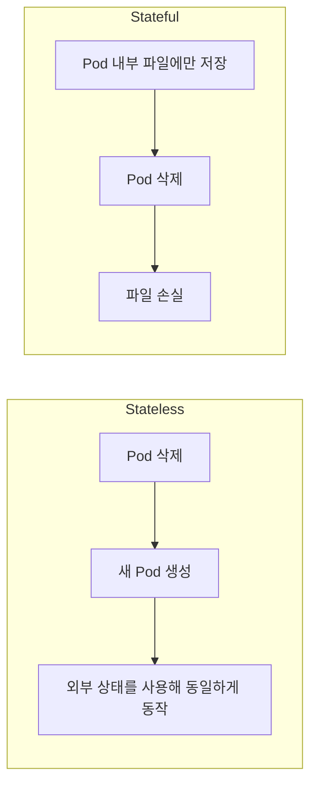
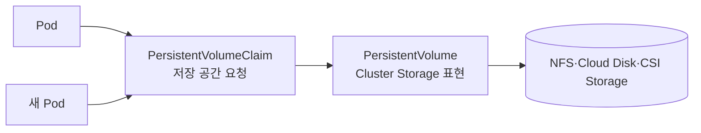
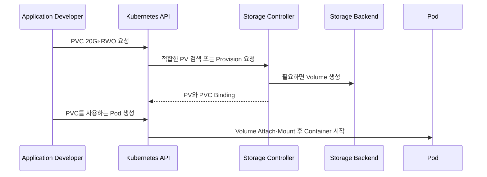

# 1. PersistentVolume이 필요한 이유

## Stateless와 Stateful 애플리케이션

Stateless 애플리케이션은 처리 중인 상태를 외부 저장소에 두므로 Pod가 교체되어도 같은 Image와 설정으로 다시 시작하기 쉽다. 반면 Database처럼 Stateful 애플리케이션은 데이터가 프로세스의 수명보다 오래 유지되어야 한다.



Container의 writable layer는 Container에 종속된다. Pod가 재생성되면 새 Container가 만들어지므로 그 안에만 기록한 데이터는 보존 대상으로 볼 수 없다.

## 데이터의 수명과 Volume

저장 방식마다 데이터가 살아남는 범위가 다르다.

| 저장 위치 | Container 재시작 | Pod 재생성 | Node 장애 | 용도 |
|---|---:|---:|---:|---|
| Container writable layer | 보장하지 않음 | 손실 | 손실 | 임시 실행 상태 |
| `emptyDir` | 유지 | 손실 | 손실 | 같은 Pod의 임시 공유 |
| `hostPath` | 유지 가능 | 같은 Node라면 가능 | 손실 가능 | Node Agent와 제한된 실습 |
| Local PersistentVolume | 유지 | 같은 Node에서 유지 | Node Disk에 종속 | 고성능 Local Data |
| Network·Cloud PV | 유지 | 유지 | Backend 설계에 따라 복구 | 운영 데이터 |

`emptyDir`와 `hostPath`는 이름에 Volume이 들어가지만 데이터 영속성 문제를 일반적으로 해결하는 PersistentVolume과 목적이 다르다.

## PersistentVolume의 역할

PersistentVolume(PV)은 Pod와 독립적인 Lifecycle을 가진 Cluster Storage 리소스다.



Pod가 교체되어도 새 Pod가 같은 PersistentVolumeClaim(PVC)을 사용하면 바인딩된 Storage를 다시 Mount할 수 있다.

### PV

- 실제 NFS Share, Cloud Disk나 CSI Volume을 Kubernetes 리소스로 표현한다.
- Cluster-scoped 리소스다.
- 용량, Access Mode, StorageClass와 Reclaim Policy를 가진다.
- 관리자가 미리 만들거나 StorageClass를 통해 동적으로 만들어진다.

### PVC

- 애플리케이션이 필요한 Storage 조건을 요청한다.
- Namespace에 속하는 리소스다.
- Pod는 PV 이름이나 NFS Server 주소 대신 PVC를 참조한다.
- Control plane이 조건에 맞는 PV와 PVC를 일대일로 Binding한다.

## Stateful 애플리케이션 요청 흐름



## 영속성이 필요한 대표 사례

- Database의 Data file과 Transaction log
- Message broker의 Queue와 Commit log
- Object Storage나 Artifact Repository의 Metadata
- Monitoring System의 Time-series Data
- 사용자가 Upload한 파일
- Backup Repository

애플리케이션이 Stateful이라고 해서 항상 Pod 안에 Database를 배치해야 하는 것은 아니다. 운영 복잡도, 고가용성, Backup과 Restore 요구를 고려해 관리형 Database나 Cluster 외부 Storage를 선택할 수도 있다.

## Persistence와 Backup은 다르다

PersistentVolume은 Pod 삭제 후에도 데이터가 남도록 하지만 다음 문제까지 자동으로 해결하지 않는다.

- 사용자가 잘못 삭제하거나 덮어쓴 데이터
- 애플리케이션의 논리적 손상
- Storage Backend 전체 장애
- Ransomware나 권한 오용
- 재해 복구 지점과 보관 기간

따라서 운영 환경에는 별도의 Backup·Snapshot 정책, 외부 보관 위치와 Restore Test가 필요하다. 같은 NFS Share 안의 다른 Directory로 복사하는 것만으로는 독립된 Backup이라고 보기 어렵다.

## StatefulSet과 PVC

복제본마다 독립된 Storage가 필요한 Stateful Workload는 StatefulSet의 `volumeClaimTemplates`를 사용한다.

```yaml
spec:
  volumeClaimTemplates:
    - metadata:
        name: data
      spec:
        accessModes:
          - ReadWriteOnce
        storageClassName: fast-csi
        resources:
          requests:
            storage: 20Gi
```

StatefulSet Pod마다 별도 PVC가 생성되므로 각 Replica가 자신의 Storage Identity를 유지한다. Database 복제와 Failover 자체는 Kubernetes Volume이 아니라 Database 또는 Operator가 담당한다.

## 현재 Storage 선택 방향

신규 Cluster에서는 Kubernetes와 Storage Vendor가 지원하는 CSI(Container Storage Interface) Driver와 StorageClass를 우선 검토한다.

1. 필요한 Access Mode를 지원하는가?
2. Multi-zone 또는 Node 장애 시 복구 방식은 무엇인가?
3. Volume Expansion, Snapshot과 Clone을 지원하는가?
4. Backup과 Restore 도구가 검증되어 있는가?
5. CSI Driver의 Kubernetes 호환 Version과 유지보수 정책은 무엇인가?

## 참고 자료

- [Kubernetes Persistent Volumes](https://kubernetes.io/docs/concepts/storage/persistent-volumes/)
- [Kubernetes Volumes](https://kubernetes.io/docs/concepts/storage/volumes/)
- [Kubernetes Storage](https://kubernetes.io/docs/concepts/storage/)

