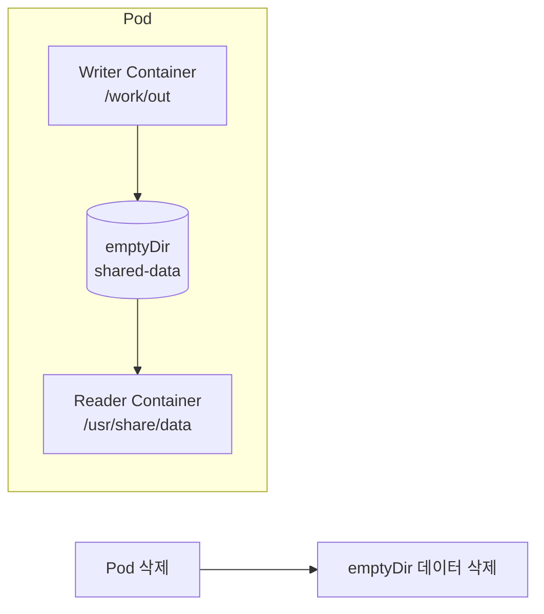
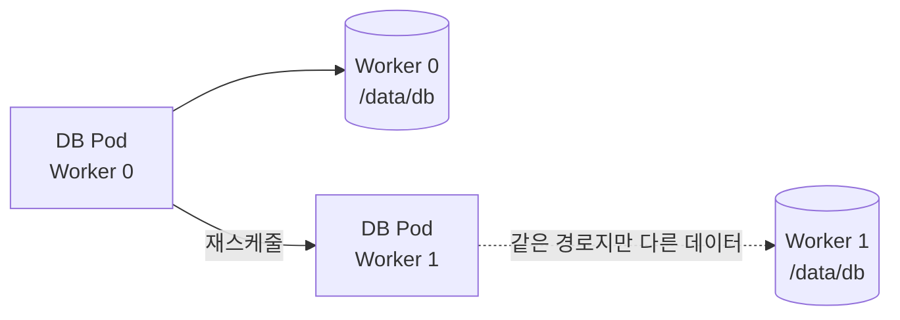

# 2. 로컬 Volume과 임시 Volume

`emptyDir`, `hostPath`와 Local PersistentVolume은 모두 Node Storage를 사용할 수 있지만 Lifecycle과 안전성이 서로 다르다.

## 한눈에 비교

| 종류 | 선언 위치 | 수명 | Scheduling 연결 | 신규 운영 사용 방향 |
|---|---|---|---|---|
| `emptyDir` | Pod `spec.volumes` | Pod가 Node에서 제거될 때까지 | Pod와 같은 Node | Cache·Scratch·Container 간 임시 공유 |
| `hostPath` | Pod `spec.volumes` | Node File이 남아 있는 동안 | 명시적 Binding 없음 | Node Agent의 제한된 Read-only 접근 |
| Local PV | PersistentVolume | Pod와 독립 | `nodeAffinity` 필수 | Node-local Disk가 필요한 Stateful Workload |

## emptyDir

`emptyDir`는 Pod가 Node에 할당될 때 생성되고 처음에는 비어 있다. 같은 Pod의 모든 Container가 서로 다른 Mount Path로 같은 Directory를 사용할 수 있다.

### Container 간 임시 데이터 공유



```yaml
apiVersion: v1
kind: Pod
metadata:
  name: shared-data-demo
spec:
  containers:
    - name: writer
      image: busybox:1.36
      command:
        - sh
        - -c
        - while true; do date > /work/out/current.txt; sleep 10; done
      volumeMounts:
        - name: shared-data
          mountPath: /work/out
    - name: reader
      image: nginx:1.27-alpine
      volumeMounts:
        - name: shared-data
          mountPath: /usr/share/nginx/html
          readOnly: true
  volumes:
    - name: shared-data
      emptyDir:
        sizeLimit: 500Mi
```

- Container Process가 재시작되어도 같은 Pod라면 데이터가 남는다.
- Pod가 삭제·Eviction되거나 다른 Node에 새로 만들어지면 데이터가 사라진다.
- `sizeLimit`를 설정해 Node Ephemeral Storage 고갈 위험을 줄인다.
- `medium: Memory`를 사용하면 tmpfs가 되며 기록 데이터가 Container Memory 사용량에 포함된다.

`emptyDir`은 Database 영속 Storage가 아니라 Cache, Build Scratch, Init Container와 Main Container의 파일 전달에 적합하다.

## hostPath

`hostPath`는 Worker Node의 File이나 Directory를 Container에 직접 Mount한다.

```yaml
apiVersion: v1
kind: Pod
metadata:
  name: node-log-reader
spec:
  containers:
    - name: log-reader
      image: busybox:1.36
      command:
        - sh
        - -c
        - tail -F /node-logs/syslog
      volumeMounts:
        - name: node-logs
          mountPath: /node-logs
          readOnly: true
  volumes:
    - name: node-logs
      hostPath:
        path: /var/log
        type: Directory
```

### 적합한 사례

- DaemonSet Monitoring Agent가 Node Log를 Read-only로 읽는다.
- Node-level System Component가 특정 Socket이나 설정 파일에 접근한다.
- 단일 Node 학습 환경에서 Volume 동작을 빠르게 확인한다.

### DB에 바로 사용하지 않는 이유



- Pod Spec에는 특정 Node에 데이터가 있다는 Binding 정보가 없다.
- 다른 Node의 같은 Path는 전혀 다른 Directory다.
- Node가 사라지면 데이터에 접근할 수 없다.
- Read-write hostPath는 Host Credential과 Runtime Socket 노출 등 Container Escape 위험을 키울 수 있다.
- Disk 사용량을 Kubernetes가 Volume 용량으로 격리하지 않으므로 Node Disk Pressure를 직접 감시해야 한다.

운영 DB의 Node-local Disk가 필요하면 hostPath보다 Local PersistentVolume과 `nodeAffinity`를 사용한다. Node 장애를 견뎌야 한다면 복제 Storage나 Network·Cloud CSI Volume을 선택한다.

## hostPath type

| type | 동작 |
|---|---|
| `Directory` | Directory가 반드시 존재해야 한다 |
| `DirectoryOrCreate` | 없으면 Kubelet이 Directory를 생성한다 |
| `File` | File이 반드시 존재해야 한다 |
| `FileOrCreate` | 없으면 File을 만들지만 Parent Directory는 만들지 않는다 |
| `Socket` | UNIX Socket이 존재해야 한다 |
| `BlockDevice` | Linux Block Device가 존재해야 한다 |

`type`을 생략하면 존재 여부와 종류를 사전에 검사하지 않는다. 가능한 경우 정확한 type과 `readOnly: true`를 함께 사용한다.

## Local PersistentVolume

Local PV는 Node의 Disk나 Directory를 PV로 표현하고 Scheduler가 Storage의 Node 위치를 고려하게 한다.

```yaml
apiVersion: storage.k8s.io/v1
kind: StorageClass
metadata:
  name: local-storage
provisioner: kubernetes.io/no-provisioner
volumeBindingMode: WaitForFirstConsumer
---
apiVersion: v1
kind: PersistentVolume
metadata:
  name: local-pv-worker-0
spec:
  capacity:
    storage: 100Gi
  volumeMode: Filesystem
  accessModes:
    - ReadWriteOnce
  persistentVolumeReclaimPolicy: Retain
  storageClassName: local-storage
  local:
    path: /mnt/disks/ssd1
  nodeAffinity:
    required:
      nodeSelectorTerms:
        - matchExpressions:
            - key: kubernetes.io/hostname
              operator: In
              values:
                - worker-0
```

Kubernetes의 Local Volume은 기본 Dynamic Provisioning을 제공하지 않는다. `WaitForFirstConsumer`를 사용하면 PVC가 생성된 즉시 잘못된 Node의 PV를 고르지 않고 Pod Scheduling 조건까지 함께 고려한다.

Local PV도 Node 또는 Disk 장애 시 자동으로 다른 Node에 데이터를 복제하지 않는다. 애플리케이션 복제, RAID, Backup과 장애 교체 절차가 별도로 필요하다.

## 선택 기준

```text
Pod가 사라져도 데이터가 필요 없는가?
  └─ 예: emptyDir

Node 자체의 Log·Socket을 읽어야 하는가?
  └─ 예: 제한된 read-only hostPath

Node-local Disk 성능이 필요하고 장애 복제를 앱이 담당하는가?
  └─ 예: Local PersistentVolume

Pod가 다른 Node로 이동해도 같은 데이터가 필요한가?
  └─ 예: Network 또는 Cloud CSI PersistentVolume
```

## 참고 자료

- [Kubernetes emptyDir와 hostPath](https://kubernetes.io/docs/concepts/storage/volumes/)
- [Kubernetes Ephemeral Volumes](https://kubernetes.io/docs/concepts/storage/ephemeral-volumes/)
- [Kubernetes Local StorageClass](https://kubernetes.io/docs/concepts/storage/storage-classes/#local)

