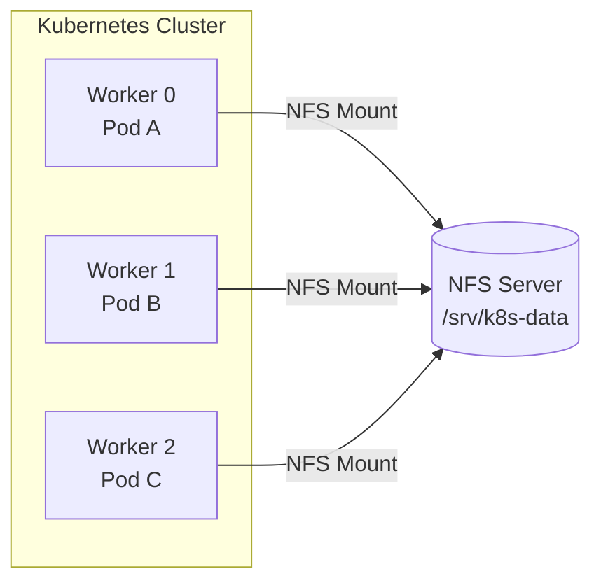
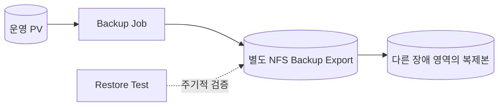

# 3. NFS Network Volume

NFS(Network File System)는 여러 Node가 Network를 통해 같은 Filesystem을 Mount할 수 있다. Kubernetes에서는 정적으로 준비한 NFS Share를 PV로 등록하거나, NFS CSI Driver와 StorageClass를 이용해 PVC별 Directory를 동적으로 만들 수 있다.

## NFS 구조



NFS는 여러 Node에서 ReadWriteMany(RWX)가 필요한 공유 파일에 적합할 수 있다. 그러나 Database가 요구하는 File Lock, fsync, Latency와 장애 복구 조건을 충족하는지는 제품별로 검증해야 한다.

## 학습용 NFS Server 설치

다음은 Ubuntu 계열 Linux 한 대를 학습용 NFS Server로 준비하는 예시다. 운영 환경에서는 단일 Server 대신 관리형 File Storage, HA NFS 또는 복제된 Storage를 검토한다.

### Server Package와 Directory

```bash
sudo apt-get update
sudo apt-get install -y nfs-kernel-server
sudo mkdir -p /srv/k8s-data
sudo chown 65534:2000 /srv/k8s-data
sudo chmod 2770 /srv/k8s-data
```

예시는 NFS의 익명 UID 65534와 Pod에서 사용할 `fsGroup: 2000`에 맞춘 학습용 권한이다. 실제 환경의 UID·GID와 Pod `securityContext`에 맞춰 설계한다. 문제를 피하려고 무조건 `0777`이나 `no_root_squash`를 사용하는 것은 권장하지 않는다.

### Export 설정

`/etc/exports`에 Cluster Node가 속한 Network만 허용한다.

```text
/srv/k8s-data 10.0.0.0/24(rw,sync,no_subtree_check,root_squash)
```

```bash
sudo exportfs -rav
sudo exportfs -v
```

- `rw`: 읽기·쓰기를 허용한다.
- `sync`: 변경을 안정적인 Storage에 반영한 뒤 응답한다.
- `root_squash`: Client root를 Server의 비특권 사용자로 Mapping한다.
- Network 대역과 Firewall을 Kubernetes Node로 제한한다.

### Worker Node Client Package

Linux Worker Node마다 NFS Client Package가 필요하다.

```bash
sudo apt-get update
sudo apt-get install -y nfs-common
showmount -e 10.0.0.20
```

관리형 Kubernetes에서는 Node Package를 직접 바꿀 수 없거나 이미 Image에 포함되어 있을 수 있다. 사용하는 Platform과 CSI Driver의 요구사항을 확인한다.

## NFS를 직접 사용하는 Pod YAML

NFS 동작 자체를 확인하는 가장 짧은 예시다.

```yaml
apiVersion: v1
kind: Pod
metadata:
  name: direct-nfs-demo
spec:
  containers:
    - name: writer
      image: busybox:1.36
      command:
        - sh
        - -c
        - while true; do date >> /data/events.log; sleep 10; done
      volumeMounts:
        - name: nfs-data
          mountPath: /data
  volumes:
    - name: nfs-data
      nfs:
        server: 10.0.0.20
        path: /srv/k8s-data
        readOnly: false
```

이 방식은 Pod가 Server 주소와 Export Path를 직접 알아야 한다. 애플리케이션 정의와 Storage 세부사항을 분리하려면 PV와 PVC를 사용한다.

## 정적 NFS PV와 PVC

```yaml
apiVersion: v1
kind: PersistentVolume
metadata:
  name: nfs-shared-pv
  labels:
    storage-purpose: shared-files
spec:
  capacity:
    storage: 100Gi
  volumeMode: Filesystem
  accessModes:
    - ReadWriteMany
  persistentVolumeReclaimPolicy: Retain
  storageClassName: nfs-static
  mountOptions:
    - nfsvers=4.1
  nfs:
    server: 10.0.0.20
    path: /srv/k8s-data
---
apiVersion: v1
kind: PersistentVolumeClaim
metadata:
  name: shared-files
  namespace: apps
spec:
  accessModes:
    - ReadWriteMany
  volumeMode: Filesystem
  storageClassName: nfs-static
  resources:
    requests:
      storage: 20Gi
```

NFS Export의 실제 용량을 Kubernetes가 자동으로 100Gi로 제한하는 것은 아니다. `capacity`는 Binding에 사용되는 선언 값이며 Quota는 NFS Server나 Filesystem 기능으로 별도 적용해야 한다.

## PVC를 사용하는 Pod

```yaml
apiVersion: v1
kind: Pod
metadata:
  name: nfs-consumer
  namespace: apps
spec:
  securityContext:
    fsGroup: 2000
  containers:
    - name: app
      image: nginx:1.27-alpine
      volumeMounts:
        - name: shared-files
          mountPath: /usr/share/nginx/html
  volumes:
    - name: shared-files
      persistentVolumeClaim:
        claimName: shared-files
```

Pod와 PVC는 같은 Namespace에 있어야 한다. PV는 Cluster-scoped이므로 Namespace가 없다.

## NFS CSI Driver를 이용한 Dynamic Provisioning

신규 자동 Provisioning 구성은 Kubernetes SIG Storage가 유지보수하는 NFS CSI Driver 같은 CSI 구현을 우선한다.

- CSI Driver 이름: `nfs.csi.k8s.io`
- 기존 NFSv3 또는 NFSv4 Server가 먼저 필요하다.
- PVC마다 NFS Export 아래 Subdirectory를 생성해 PV로 제공한다.
- 현재 Release와 Kubernetes 호환성은 설치 시점의 공식 표에서 확인한다.

설치 흐름은 다음과 같다.

```text
NFS Server 준비
  → Cluster에 NFS CSI Driver 설치
  → provisioner: nfs.csi.k8s.io StorageClass 생성
  → PVC 생성
  → CSI Driver가 Subdirectory와 PV 생성
  → Pod Mount
```

공식 Helm Chart를 사용할 때는 먼저 지원 Version을 검색하고 Version을 고정한다.

```bash
helm repo add csi-driver-nfs \
  https://raw.githubusercontent.com/kubernetes-csi/csi-driver-nfs/master/charts
helm repo update
helm search repo csi-driver-nfs/csi-driver-nfs --versions
helm upgrade --install csi-driver-nfs \
  csi-driver-nfs/csi-driver-nfs \
  --namespace kube-system \
  --version <검증한-version>
```

`<검증한-version>`은 그대로 실행하는 값이 아니다. 현재 Kubernetes Version과 공식 Compatibility 표에 맞는 Release로 교체한다.

## NFS를 Backup Storage로 사용할 때



NFS Directory가 있다고 Backup이 완성되는 것은 아니다.

- 운영 데이터와 다른 Export·Credential·권한 경계를 사용한다.
- Backup 보존 기간과 삭제 방지 정책을 둔다.
- 가능하면 다른 Server 또는 장애 영역으로 복제한다.
- Application-consistent Backup이 필요하면 DB Dump나 Backup Tool을 사용한다.
- 정기적으로 새로운 Namespace나 Cluster에 Restore한다.
- NFS Server 자체의 Snapshot과 Backup도 별도로 관리한다.

## 운영 주의점

- NFS Server가 Single Point of Failure가 되지 않도록 한다.
- Network Latency, Throughput와 동시 Client 수를 부하 시험한다.
- NFS Version과 Mount Option을 명시하고 표준화한다.
- UID·GID, `root_squash`와 Pod `securityContext`를 함께 설계한다.
- Export Network와 Firewall을 최소 범위로 제한한다.
- NFS CSI Driver와 Sidecar Image의 Security Update를 추적한다.
- `Retain`과 `Delete`가 실제 NFS Directory에 어떤 동작을 하는지 복구 가능한 환경에서 검증한다.

## 참고 자료

- [Kubernetes NFS Volume](https://kubernetes.io/docs/concepts/storage/volumes/#nfs)
- [Kubernetes NFS CSI Driver](https://github.com/kubernetes-csi/csi-driver-nfs)
- [NFS CSI Driver Parameter](https://github.com/kubernetes-csi/csi-driver-nfs/blob/master/docs/driver-parameters.md)
