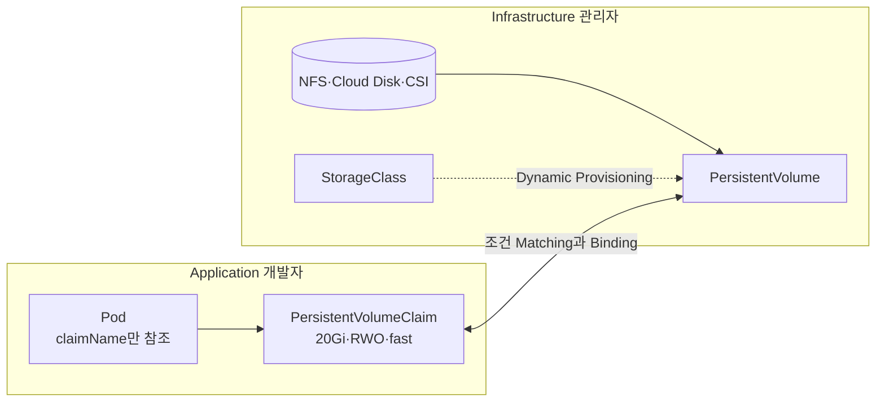
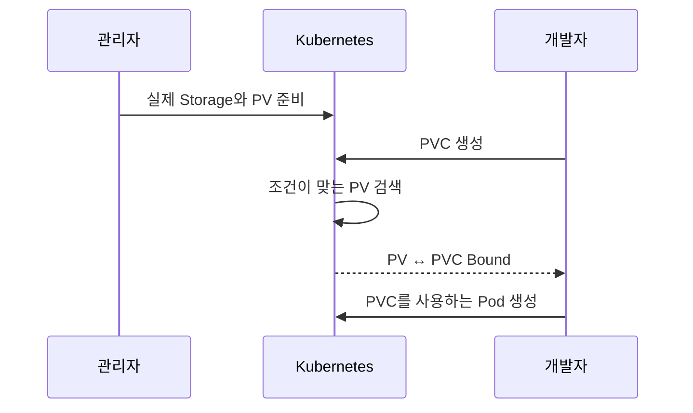
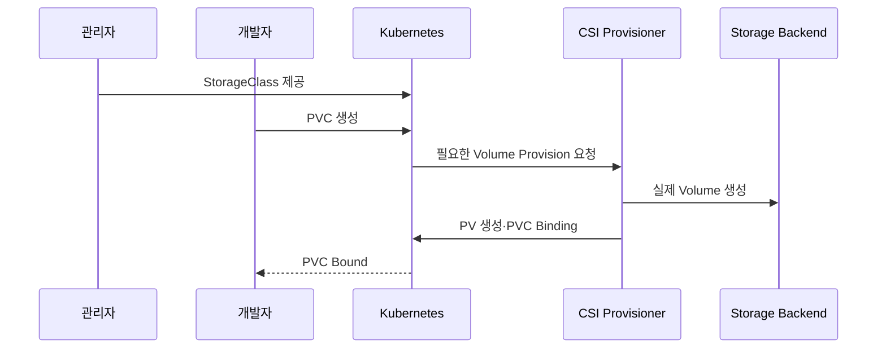
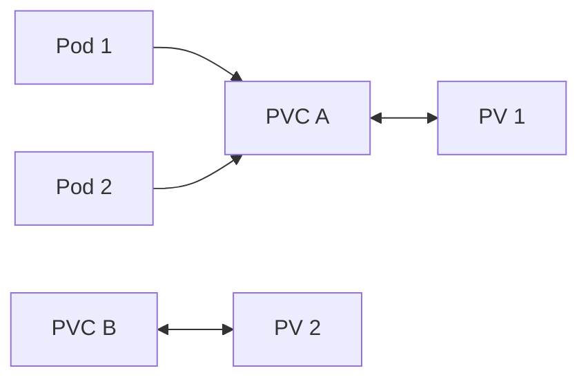

# 4. PV와 PVC를 사용하는 이유

Pod YAML에 NFS Server, Cloud Disk ID나 Node Path를 직접 적으면 애플리케이션 정의와 Infrastructure 세부사항이 강하게 결합된다. PV와 PVC는 Storage 제공과 사용 요청을 분리한다.

## 직접 Volume을 연결할 때의 문제

```yaml
volumes:
  - name: app-data
    nfs:
      server: 10.0.0.20
      path: /srv/team-a
```

이 YAML을 사용하는 개발자는 다음 Infrastructure 정보를 알아야 한다.

- Storage 종류와 Server 주소
- 실제 Directory나 Volume ID
- Mount Option과 장애 특성
- 용량과 접근 권한
- 교체·Migration 방법

Storage Backend가 바뀌면 Workload YAML까지 수정해야 하고, 애플리케이션 권한으로 Infrastructure 세부 설정을 다루게 된다.

## PV와 PVC로 역할 분리



### Infrastructure 관리자

- Storage Backend와 CSI Driver를 설치·Upgrade한다.
- StorageClass, 성능, Zone, Encryption과 Reclaim Policy를 정의한다.
- 정적 방식에서는 PV를 미리 생성한다.
- Capacity, 장애, Backup과 Security 정책을 운영한다.

### Application 개발자

- 필요한 용량, Access Mode와 StorageClass를 PVC로 요청한다.
- Pod에서는 PVC 이름만 참조한다.
- NFS 주소나 Cloud Volume ID를 알 필요가 없다.
- Namespace 안에서 자신의 PVC Lifecycle을 관리한다.

## 리소스의 범위

| 리소스 | 범위 | 주요 소유자 | 역할 |
|---|---|---|---|
| StorageClass | Cluster-scoped | Storage 관리자 | Storage Profile과 Provisioner |
| PersistentVolume | Cluster-scoped | 관리자 또는 Provisioner | 실제 Storage의 Kubernetes 표현 |
| PersistentVolumeClaim | Namespaced | 애플리케이션 팀 | Storage 요구사항 |
| Pod | Namespaced | 애플리케이션 팀 | PVC를 Mount해 사용 |

Pod는 같은 Namespace에 있는 PVC만 참조한다. PV는 Namespace에 속하지 않지만 한 번 Binding되면 특정 PVC와 일대일 관계를 가진다.

## Static Provisioning

관리자가 실제 Storage와 PV를 먼저 준비하고 사용자가 PVC를 생성한다.



Storage 수와 용량을 관리자가 미리 예측해야 하지만, 특정 기존 Volume을 정확히 연결하거나 수동 통제가 필요할 때 유용하다.

## Dynamic Provisioning

관리자가 StorageClass와 CSI Driver를 준비하면 PVC 요청 시 PV와 실제 Volume이 자동 생성된다.



신규 운영 환경에서는 Storage Backend가 지원하는 CSI Driver와 Dynamic Provisioning을 기본 방향으로 검토한다.

## Binding은 일대일이다



- 하나의 PV는 동시에 여러 PVC에 Binding되지 않는다.
- 하나의 PVC도 하나의 PV에 Binding된다.
- Storage와 Access Mode가 허용하면 여러 Pod가 같은 PVC를 사용할 수 있다.
- RWX가 곧 여러 PVC가 한 PV를 공유한다는 뜻은 아니다.

## 추상화가 보장하지 않는 것

PV와 PVC가 Storage 사용법을 통일해도 모든 Backend의 동작이 같아지는 것은 아니다.

- RWO·RWX 지원 여부
- Zone과 Node Attachment 제약
- Snapshot·Clone·Expansion 지원
- Throughput, IOPS와 Latency
- Encryption과 Backup 기능
- 장애 시 Attach 해제와 복구 시간

StorageClass 이름과 운영 문서에 이러한 차이를 명확히 기록한다.

## 현재 권장 구조

```text
Application YAML
  └─ PVC: 필요한 조건만 요청
       └─ StorageClass: 관리자가 제공한 Profile
            └─ CSI Driver: Kubernetes와 Storage 연결
                 └─ 실제 Storage Backend
```

오래된 in-tree Cloud Volume Plugin보다 공급자가 유지보수하는 CSI Driver를 사용한다. Driver Version, Kubernetes 호환 범위와 Upgrade 절차를 Platform Lifecycle에 포함한다.

## 참고 자료

- [PersistentVolume 소개](https://kubernetes.io/docs/concepts/storage/persistent-volumes/#introduction)
- [Dynamic Volume Provisioning](https://kubernetes.io/docs/concepts/storage/dynamic-provisioning/)
- [StorageClass](https://kubernetes.io/docs/concepts/storage/storage-classes/)

