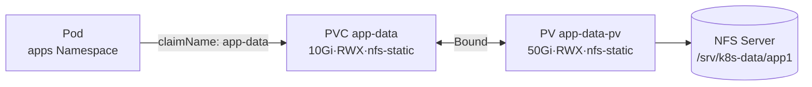
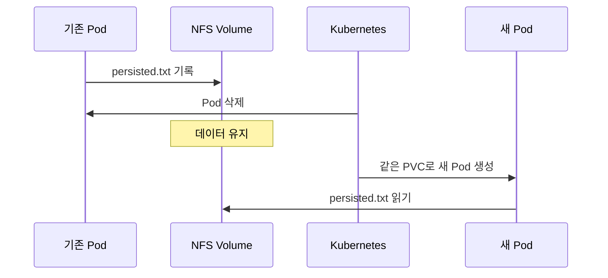

# 5. PV와 PVC 사용하기

이 문서는 미리 준비된 NFS Share를 정적 PV로 등록하고 PVC와 Pod에서 사용하는 전체 흐름을 보여준다.

## 사전 조건

- NFS Server `10.0.0.20`에 `/srv/k8s-data/app1` Export가 존재한다.
- 모든 Worker Node에서 NFS Server로 접근할 수 있다.
- Linux Node에 필요한 NFS Client Package가 준비되어 있다.
- 실제 환경에서는 IP, Export Path, 권한과 용량을 환경에 맞게 바꾼다.

## 전체 연결 구조



## Namespace 생성

```yaml
apiVersion: v1
kind: Namespace
metadata:
  name: apps
```

## PersistentVolume 생성

```yaml
apiVersion: v1
kind: PersistentVolume
metadata:
  name: app-data-pv
  labels:
    storage-purpose: app-data
    environment: study
spec:
  capacity:
    storage: 50Gi
  volumeMode: Filesystem
  accessModes:
    - ReadWriteMany
  persistentVolumeReclaimPolicy: Retain
  storageClassName: nfs-static
  mountOptions:
    - nfsvers=4.1
  nfs:
    server: 10.0.0.20
    path: /srv/k8s-data/app1
```

PV는 Cluster-scoped 리소스이므로 `metadata.namespace`를 사용하지 않는다.

## PersistentVolumeClaim 생성

```yaml
apiVersion: v1
kind: PersistentVolumeClaim
metadata:
  name: app-data
  namespace: apps
spec:
  accessModes:
    - ReadWriteMany
  volumeMode: Filesystem
  storageClassName: nfs-static
  resources:
    requests:
      storage: 10Gi
  selector:
    matchLabels:
      storage-purpose: app-data
      environment: study
```

PVC는 최소 10Gi, RWX, Filesystem, `nfs-static` Class와 두 Label을 모두 가진 PV를 찾는다. 50Gi PV는 요청보다 크므로 조건을 만족할 수 있다.

## Pod에서 PVC 사용

```yaml
apiVersion: v1
kind: Pod
metadata:
  name: app-data-writer
  namespace: apps
spec:
  securityContext:
    fsGroup: 2000
  containers:
    - name: writer
      image: busybox:1.36
      command:
        - sh
        - -c
        - while true; do sleep 3600; done
      volumeMounts:
        - name: data
          mountPath: /data
  volumes:
    - name: data
      persistentVolumeClaim:
        claimName: app-data
```

`volumeMounts[].name`과 `volumes[].name`이 같아야 하며, `claimName`은 같은 Namespace의 PVC 이름이다.

## 생성 순서

위 Manifest를 각각 파일로 저장했다고 가정한다.

```bash
kubectl apply -f namespace.yaml
kubectl apply -f pv.yaml
kubectl apply -f pvc.yaml
kubectl apply -f pod.yaml
```

정적 Provisioning은 일반적으로 실제 Storage → PV → PVC → Pod 순서로 확인하면 문제 원인을 찾기 쉽다.

## Binding 상태 확인

```bash
kubectl get pv
kubectl get pvc -n apps
kubectl describe pv app-data-pv
kubectl describe pvc app-data -n apps
```

예상 상태는 다음과 같다.

```text
PV:
NAME          CAPACITY   ACCESS MODES   RECLAIM POLICY   STATUS   CLAIM
app-data-pv   50Gi       RWX            Retain           Bound    apps/app-data

PVC:
NAME       STATUS   VOLUME        CAPACITY   ACCESS MODES   STORAGECLASS
app-data   Bound    app-data-pv   50Gi       RWX            nfs-static
```

PVC의 요청은 10Gi지만 Binding된 PV의 선언 용량은 50Gi로 표시될 수 있다. 남은 40Gi가 다른 PVC에 자동으로 나뉘어 할당되는 것은 아니다.

## 데이터 영속성 확인 시나리오

```bash
kubectl exec -n apps app-data-writer -- \
  sh -c 'date > /data/persisted.txt'

kubectl delete pod app-data-writer -n apps
kubectl apply -f pod.yaml

kubectl exec -n apps app-data-writer -- \
  cat /data/persisted.txt
```

새 Pod가 같은 PVC를 Mount하면 NFS에 저장된 `persisted.txt`를 다시 읽을 수 있어야 한다.



## PVC와 Pod 삭제

`persistentVolumeReclaimPolicy: Retain`이므로 PVC 삭제 후에도 NFS 데이터는 자동 삭제되지 않는다.

```bash
kubectl delete pod app-data-writer -n apps
kubectl delete pvc app-data -n apps
kubectl get pv app-data-pv
```

PV는 `Released` 상태가 되며 이전 Claim의 데이터와 `claimRef`가 남아 있으므로 다른 PVC에 바로 Binding되지 않는다. 데이터 확인, Backup, 정리와 재등록은 관리자가 수행한다.

## PVC가 Pending일 때

```bash
kubectl describe pvc app-data -n apps
kubectl get pv
kubectl get events -n apps --sort-by=.lastTimestamp
```

다음을 순서대로 비교한다.

1. PV 용량이 PVC 요청 이상인가?
2. `accessModes`가 요청을 포함하는가?
3. `volumeMode`가 같은가?
4. `storageClassName`이 정확히 같은가?
5. Label Selector를 모두 만족하는가?
6. PV가 `Available` 상태인가?
7. PVC가 다른 Namespace 또는 잘못된 이름을 사용하지 않았는가?

## Pod가 ContainerCreating에 머물 때

PVC가 Bound인데 Pod가 시작되지 않는다면 Mount 단계 문제일 수 있다.

```bash
kubectl describe pod app-data-writer -n apps
kubectl get events -n apps --sort-by=.lastTimestamp
```

- Worker Node에서 NFS Server Network와 Port에 접근 가능한가?
- NFS Client Package와 NFS Version이 맞는가?
- Export Path가 존재하고 Node Network가 허용되었는가?
- UID·GID와 `root_squash` 때문에 Permission denied가 발생하지 않았는가?
- `mountOptions`가 Server 설정과 호환되는가?

## Deployment와 StatefulSet에서 사용

하나의 PVC를 여러 Deployment Replica가 사용하려면 Storage가 RWX를 지원해야 한다. Replica마다 별도 Volume이 필요하면 StatefulSet `volumeClaimTemplates`를 사용한다.

Database를 Deployment Replica 여러 개가 같은 RWX Directory에 연결한다고 자동으로 Cluster Database가 되는 것은 아니다. 애플리케이션이 동시 쓰기와 복제를 지원해야 한다.

## 참고 자료

- [PV와 PVC 구성 실습](https://kubernetes.io/docs/tasks/configure-pod-container/configure-persistent-volume-storage/)
- [PersistentVolumeClaims를 Pod에서 사용](https://kubernetes.io/docs/concepts/storage/persistent-volumes/#claims-as-volumes)
- [NFS Volume](https://kubernetes.io/docs/concepts/storage/volumes/#nfs)

