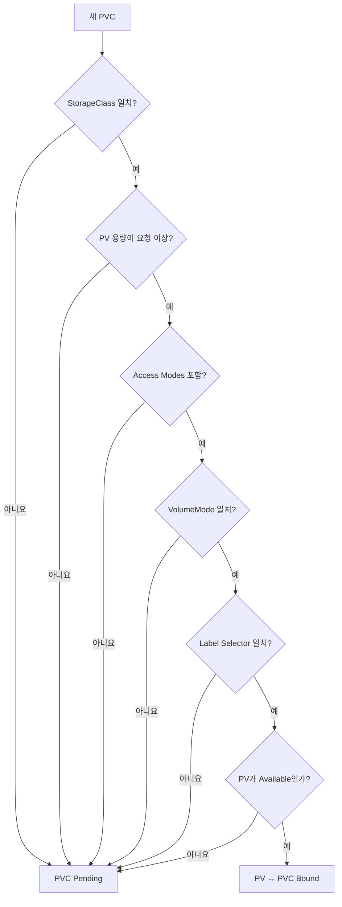

# 6. PV를 선택하기 위한 조건

PVC를 만들면 PersistentVolume Controller가 요청 조건을 모두 만족하는 `Available` PV를 찾는다. 조건은 OR가 아니라 대부분 함께 적용되는 AND 관계다.

## Binding 조건 전체 흐름



## 선택용 PV YAML

```yaml
apiVersion: v1
kind: PersistentVolume
metadata:
  name: production-db-pv
  labels:
    environment: production
    workload: database
    tier: gold
spec:
  capacity:
    storage: 200Gi
  volumeMode: Filesystem
  accessModes:
    - ReadWriteOnce
  persistentVolumeReclaimPolicy: Retain
  storageClassName: fast-csi
  csi:
    driver: csi.example.com
    volumeHandle: production-db-volume-01
    fsType: ext4
  nodeAffinity:
    required:
      nodeSelectorTerms:
        - matchExpressions:
            - key: topology.kubernetes.io/zone
              operator: In
              values:
                - zone-a
```

`csi.example.com`은 구조 설명용 값이다. 실제 Driver와 Volume Handle은 Storage 공급자가 제공한다.

## 모든 선택 조건을 요청하는 PVC

```yaml
apiVersion: v1
kind: PersistentVolumeClaim
metadata:
  name: database-data
  namespace: production
spec:
  accessModes:
    - ReadWriteOnce
  volumeMode: Filesystem
  storageClassName: fast-csi
  resources:
    requests:
      storage: 150Gi
  selector:
    matchLabels:
      environment: production
      workload: database
    matchExpressions:
      - key: tier
        operator: In
        values:
          - gold
          - platinum
```

## Key와 Value 형태

| PVC Key | Value 예시 | Matching 의미 |
|---|---|---|
| `spec.resources.requests.storage` | `150Gi` | PV `capacity.storage`가 요청 이상 |
| `spec.accessModes[]` | `ReadWriteOnce` | PV가 요청 Mode를 포함 |
| `spec.volumeMode` | `Filesystem` 또는 `Block` | PV와 정확히 일치 |
| `spec.storageClassName` | `fast-csi` | PV Class 이름과 정확히 일치 |
| `spec.selector.matchLabels` | `environment: production` | 모든 Label이 일치 |
| `spec.selector.matchExpressions[]` | `In`, `NotIn`, `Exists`, `DoesNotExist` | 모든 Expression이 일치 |
| `spec.volumeName` | `production-db-pv` | 특정 PV를 Pre-binding |

## Capacity

PVC는 최소 용량을 요청한다.

```text
PVC 150Gi → PV 100Gi: 불일치
PVC 150Gi → PV 150Gi: 일치
PVC 150Gi → PV 200Gi: 일치 가능
```

큰 PV가 작은 PVC에 Binding되면 남은 용량을 다른 PVC가 나눠 쓰지 못한다. PV와 PVC는 일대일 Binding이기 때문이다.

## Access Modes

| 긴 이름 | 약어 | 의미 |
|---|---|---|
| `ReadWriteOnce` | RWO | 한 Node에서 Read-write Mount, 같은 Node의 여러 Pod가 사용할 수도 있음 |
| `ReadOnlyMany` | ROX | 여러 Node에서 Read-only Mount |
| `ReadWriteMany` | RWX | 여러 Node에서 Read-write Mount |
| `ReadWriteOncePod` | RWOP | Cluster 전체에서 한 Pod만 Read-write Mount |

RWOP는 안정 기능이며 CSI Volume에서 사용한다. RWO를 한 Pod만 사용한다는 뜻으로 오해하지 않는다.

Access Mode는 PV와 PVC Matching 및 Mount 제약에 사용되지만, RWOP를 제외하면 Mount 후 Filesystem 권한 자체를 강제하는 장치가 아니다. Read-only가 필요하면 Pod의 `volumeMounts.readOnly`와 Storage Export 권한도 함께 설정한다.

## VolumeMode

### Filesystem

```yaml
volumeMode: Filesystem
```

Kubelet이 Filesystem으로 Mount하고 Container는 `mountPath`로 사용한다. 생략 시 기본값이다.

### Block

```yaml
volumeMode: Block
```

Raw Block Device를 Container의 `volumeDevices.devicePath`로 제공한다. 애플리케이션이 Filesystem 없이 Block Device를 직접 다룰 수 있어야 하며 Driver가 지원해야 한다.

Filesystem PVC와 Block PV는 Binding되지 않는다.

## StorageClass

```yaml
storageClassName: fast-csi
```

- PV와 PVC의 Class 이름이 정확히 같아야 한다.
- PVC에서 필드를 생략하면 Default StorageClass가 적용될 수 있다.
- `storageClassName: ""`은 Class가 없는 PV를 요청하며 Dynamic Provisioning을 비활성화한다.
- 과거의 `volume.beta.kubernetes.io/storage-class` Annotation 대신 정식 필드를 사용한다.

## Label Selector

`matchLabels`와 `matchExpressions`의 모든 조건은 AND로 결합된다.

```yaml
selector:
  matchLabels:
    environment: production
  matchExpressions:
    - key: tier
      operator: In
      values:
        - gold
```

중요하게도 현재 PVC에 비어 있지 않은 `selector`를 지정하면 해당 PVC를 위한 Dynamic Provisioning을 사용할 수 없다. Selector는 미리 생성한 정적 PV를 세밀하게 고를 때 사용한다.

## 특정 PV Pre-binding

PVC의 `volumeName`으로 PV를 직접 지정할 수 있다.

```yaml
spec:
  storageClassName: ""
  volumeName: production-db-pv
  accessModes:
    - ReadWriteOnce
  resources:
    requests:
      storage: 150Gi
```

Control plane은 지정된 PV의 Class, Access Mode와 용량을 여전히 검사한다. PV가 이미 다른 Claim에 Binding되었으면 새 PVC는 Pending 상태가 된다.

관리자가 PV의 `claimRef`를 먼저 설정해 특정 Namespace의 PVC를 예약할 수도 있다.

## Node Affinity와 Topology

Local Disk나 단일 Zone Volume은 사용할 수 있는 Node가 제한된다. PV의 `nodeAffinity`와 Pod Scheduling 조건이 맞지 않으면 PVC가 Bound여도 Pod가 Pending이 될 수 있다.

Topology 제약이 있는 Dynamic Storage는 StorageClass의 `volumeBindingMode: WaitForFirstConsumer`를 사용해 Pod가 Scheduling될 위치를 고려한 뒤 Volume을 Provision하는 편이 안전하다.

## Pending 진단

```bash
kubectl describe pvc database-data -n production
kubectl get pv
kubectl get storageclass
kubectl get events -n production --sort-by=.lastTimestamp
```

| Event 또는 상태 | 확인할 내용 |
|---|---|
| no persistent volumes available | Capacity, Mode, Class와 Selector |
| storageclass not found | Class 이름과 StorageClass 존재 여부 |
| waiting for first consumer | Pod 생성 여부와 Scheduling 조건 |
| external provisioner 대기 | CSI Controller 상태와 Driver 이름 |
| volume node affinity conflict | PV Zone과 Pod가 배치될 Node |

## 참고 자료

- [PersistentVolume Access Mode와 Class](https://kubernetes.io/docs/concepts/storage/persistent-volumes/#persistent-volumes)
- [PVC Selector](https://kubernetes.io/docs/concepts/storage/persistent-volumes/#selector)
- [StorageClass Volume Binding Mode](https://kubernetes.io/docs/concepts/storage/storage-classes/#volume-binding-mode)

