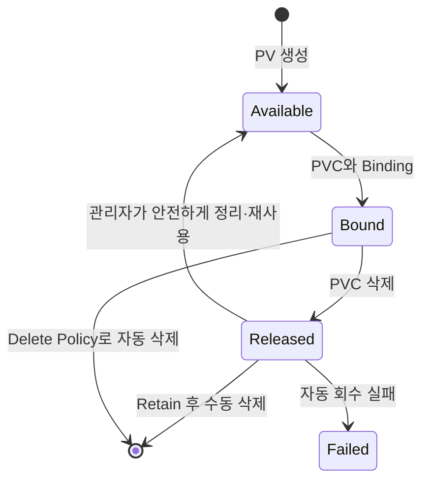
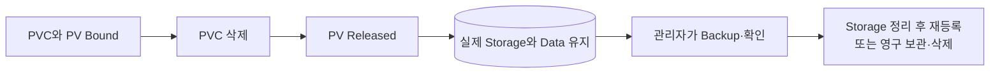
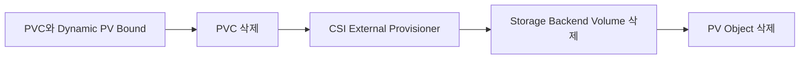
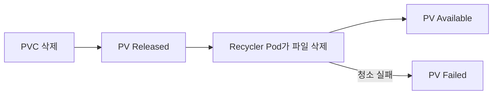
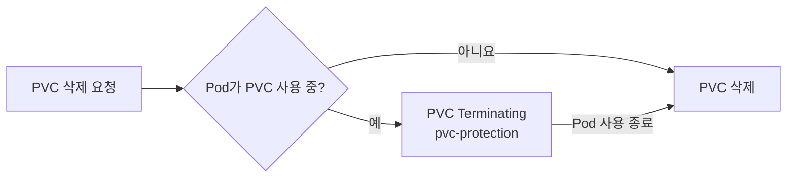

# 7. PV Lifecycle과 Reclaim Policy

PV와 PVC는 생성, Binding, 사용, Claim 삭제와 Storage 회수의 Lifecycle을 가진다. Reclaim Policy는 PVC가 삭제된 뒤 PV와 실제 Storage를 어떻게 처리할지 결정한다.

## PV Phase



| Phase | 의미 |
|---|---|
| `Available` | 아직 Claim에 Binding되지 않은 PV |
| `Bound` | 특정 PVC와 Binding된 PV |
| `Released` | PVC는 삭제됐지만 Storage가 아직 회수되지 않음 |
| `Failed` | 자동 Reclaim 처리 실패 |

PVC는 적합한 PV나 Dynamic Provisioning을 기다릴 때 `Pending`, PV와 연결되면 `Bound` 상태가 된다.

## Reclaim Policy 확인

PV에 직접 지정한다.

```yaml
spec:
  persistentVolumeReclaimPolicy: Retain
```

```bash
kubectl get pv
kubectl get pv app-data-pv \
  -o jsonpath='{.spec.persistentVolumeReclaimPolicy}{"\n"}'
```

Dynamic Provisioning으로 만들어지는 PV는 StorageClass의 `reclaimPolicy`를 상속한다. StorageClass에서 생략하면 기본값은 `Delete`다.

여러 PV의 Policy와 상태를 한 번에 비교할 수 있다.

```bash
kubectl get pv \
  -o custom-columns='NAME:.metadata.name,POLICY:.spec.persistentVolumeReclaimPolicy,PHASE:.status.phase,CLAIM:.spec.claimRef.name'
```

출력 형태는 다음과 같다.

```text
NAME           POLICY    PHASE       CLAIM
important-pv   Retain    Bound       database-data
cache-pv       Delete    Bound       cache-data
legacy-pv      Recycle   Available   <none>
```

`legacy-pv`는 과거 Cluster의 상태를 식별하기 위한 예시이며 새 PV를 Recycle로 만들라는 의미가 아니다.

## Retain

`Retain`은 PVC가 삭제되어도 PV Object와 실제 Storage Data를 자동 삭제하지 않는다.



### YAML

```yaml
apiVersion: v1
kind: PersistentVolume
metadata:
  name: retained-pv
spec:
  capacity:
    storage: 100Gi
  accessModes:
    - ReadWriteOnce
  persistentVolumeReclaimPolicy: Retain
  storageClassName: critical-data
  csi:
    driver: csi.example.com
    volumeHandle: critical-volume-01
```

### PVC 삭제 후 확인

```bash
kubectl delete pvc critical-data -n production
kubectl get pv retained-pv
kubectl describe pv retained-pv
```

PV가 `Released`여도 이전 `claimRef`와 데이터가 남아 있으므로 다른 PVC에 자동 Binding되지 않는다.

### 안전한 수동 회수 절차

1. 애플리케이션 쓰기가 완전히 중지되었는지 확인한다.
2. Snapshot 또는 Backup을 만들고 Restore 가능성을 검증한다.
3. 실제 Storage의 소유권과 데이터를 확인한다.
4. 재사용한다면 이전 데이터를 안전하게 제거한다.
5. PV를 새로 만들거나, 의도적으로 `claimRef`를 제거해 다시 `Available`로 만든다.

```bash
kubectl patch pv retained-pv \
  --type=merge \
  -p '{"spec":{"claimRef":null}}'
```

데이터를 정리하지 않고 `claimRef`만 제거하면 다음 사용자가 이전 데이터를 볼 수 있다. 이 명령은 자동 청소 방법이 아니라 관리자가 모든 안전 절차를 끝낸 뒤 사용하는 수동 조치다.

## Delete

`Delete`는 PVC 삭제 후 PV Object와 Storage Provider의 실제 Volume을 함께 삭제한다.



### StorageClass YAML

```yaml
apiVersion: storage.k8s.io/v1
kind: StorageClass
metadata:
  name: disposable-data
provisioner: csi.example.com
reclaimPolicy: Delete
volumeBindingMode: WaitForFirstConsumer
```

`Delete`는 임시 환경과 다시 만들 수 있는 데이터에는 편리하지만 PVC 오삭제가 실제 데이터 삭제로 이어질 수 있다.

- Backup과 Snapshot 정책을 별도로 둔다.
- Production Data는 삭제 승인과 보호 정책을 검토한다.
- CSI Driver가 실제 Backend를 삭제했는지 Event와 Provider Console에서 확인한다.
- StorageClass 기본값이 Delete임을 알고 명시적으로 선택한다.

## Recycle: 과거 방식

`Recycle`은 Volume Directory에 기본적인 `rm -rf` 청소를 실행한 뒤 PV를 Available로 돌리는 과거 방식이다.



### 역사적 YAML

다음 값은 개념을 읽기 위한 예시이며 신규 환경에 적용하지 않는다.

```yaml
spec:
  persistentVolumeReclaimPolicy: Recycle
```

`Recycle` Reclaim Policy는 Deprecated 상태다. 단순 File 삭제는 안전한 Data Sanitization과 격리를 충분히 보장하지 못하며 현대 CSI Provisioning 흐름과도 맞지 않는다.

신규 구성은 다음 중 하나를 선택한다.

- 자동으로 새 Volume을 만들고 삭제하는 Dynamic Provisioning + `Delete`
- Data를 보존하고 관리자가 승인 후 처리하는 `Retain`

## 세 Policy 비교

| Policy | PVC 삭제 후 PV | 실제 Data | 신규 사용 |
|---|---|---|---|
| `Retain` | Released로 유지 | 유지 | 중요 Data와 수동 승인 |
| `Delete` | 자동 삭제 | Backend Volume 삭제 | Dynamic Provisioning의 일반적 선택 |
| `Recycle` | 청소 후 Available 시도 | 기본 File 삭제 | Deprecated, 신규 사용 금지 |

## 기존 PV의 Policy 변경

PVC를 삭제하기 전에 Reclaim Policy를 바꿀 수 있다.

```bash
kubectl patch pv app-data-pv \
  --type=merge \
  -p '{"spec":{"persistentVolumeReclaimPolicy":"Retain"}}'
```

```bash
kubectl patch pv app-data-pv \
  --type=merge \
  -p '{"spec":{"persistentVolumeReclaimPolicy":"Delete"}}'
```

변경 전 다음을 확인한다.

- 해당 PV가 정적 또는 동적으로 생성되었는가?
- CSI Driver가 Delete를 지원하는가?
- 실제 Storage에 Snapshot과 Backup이 있는가?
- StorageClass의 기본 Policy와 기존 PV Policy가 다른가?
- 운영 중인 PVC를 누가 삭제할 수 있는가?

StorageClass를 바꿔도 이미 생성된 PV의 Policy가 자동 변경되는 것은 아니다. 기존 PV는 각각 확인한다.

## 삭제 보호 Finalizer

사용 중인 PVC와 PV는 삭제 요청이 들어와도 즉시 사라지지 않도록 Finalizer로 보호된다.



```bash
kubectl get pvc critical-data -n production -o yaml
kubectl get pv retained-pv -o yaml
```

- PVC에는 `kubernetes.io/pvc-protection`이 표시될 수 있다.
- PV에는 `kubernetes.io/pv-protection`과 Provisioner Finalizer가 표시될 수 있다.
- Finalizer를 강제로 제거하면 Data Loss나 Backend Resource 누수가 발생할 수 있다.
- 먼저 어떤 Pod, Attachment 또는 CSI 작업이 리소스를 사용 중인지 찾는다.

## 운영 선택 기준

```text
PVC 삭제와 함께 실제 Data도 삭제되어야 하는가?
  ├─ 예: Delete + 검증된 Backup
  └─ 아니요: Retain + 수동 회수 Runbook

Recycle을 사용할 것인가?
  └─ 아니요: Dynamic Provisioning으로 대체
```

## 참고 자료

- [PV Reclaiming](https://kubernetes.io/docs/concepts/storage/persistent-volumes/#reclaiming)
- [PV와 PVC 삭제 보호](https://kubernetes.io/docs/concepts/storage/persistent-volumes/#storage-object-in-use-protection)
- [PV Reclaim Policy 변경](https://kubernetes.io/docs/tasks/administer-cluster/change-pv-reclaim-policy/)
