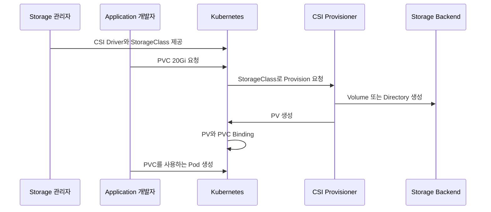
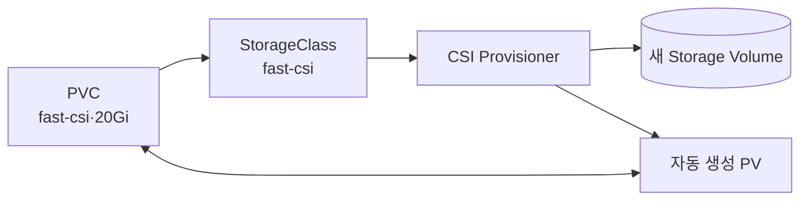
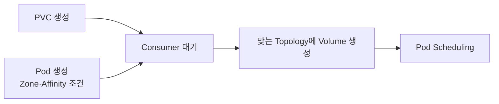

# 8. StorageClass와 Dynamic Provisioning

## Dynamic Provisioning이란?

Dynamic Provisioning은 PVC가 생성될 때 필요한 실제 Storage와 PV를 자동으로 만드는 방식이다. 관리자가 모든 PV를 미리 생성할 필요가 없다.



### 관리자 관점

- CSI Driver를 설치하고 Version을 관리한다.
- StorageClass에 성능, Encryption, Topology와 Reclaim Policy를 정의한다.
- 기본 StorageClass와 사용 가능한 Class 목록을 사용자에게 제공한다.
- Capacity, 비용, Backup과 Security를 운영한다.

### 개발자 관점

- Storage Backend 세부 정보 대신 StorageClass 이름을 선택한다.
- PVC에 용량, Access Mode와 VolumeMode를 요청한다.
- 생성된 PV가 아니라 PVC를 Pod에서 사용한다.

## StorageClass란?

StorageClass는 관리자가 제공하는 Storage Profile이다. 빠른 Disk, 저비용 Disk, RWX File Storage 또는 Backup 보존형 Storage처럼 목적에 따라 여러 Class를 만들 수 있다.

```yaml
apiVersion: storage.k8s.io/v1
kind: StorageClass
metadata:
  name: fast-csi
  annotations:
    storageclass.kubernetes.io/is-default-class: "false"
provisioner: csi.example.com
parameters:
  type: ssd
  encrypted: "true"
reclaimPolicy: Retain
allowVolumeExpansion: true
mountOptions:
  - discard
volumeBindingMode: WaitForFirstConsumer
allowedTopologies:
  - matchLabelExpressions:
      - key: topology.kubernetes.io/zone
        values:
          - zone-a
          - zone-b
```

`csi.example.com`과 `parameters`는 구조 설명용이다. 실제 값은 CSI Driver 공식 문서를 따른다.

## 주요 Field

| Field | 역할 | 유지보수 관점 |
|---|---|---|
| `provisioner` | 사용할 CSI Driver 이름 | 설치된 Driver 이름과 정확히 일치 |
| `parameters` | Storage 종류·Encryption 등 | Driver별로 의미가 다름 |
| `reclaimPolicy` | PVC 삭제 후 Retain 또는 Delete | 생략하면 Delete |
| `allowVolumeExpansion` | PVC 용량 증가 허용 | Driver가 Expansion을 지원해야 함 |
| `mountOptions` | Mount에 전달할 Option | 잘못된 값은 Mount 실패 유발 |
| `volumeBindingMode` | Provision·Binding 시점 | Topology Storage는 WaitForFirstConsumer 권장 |
| `allowedTopologies` | 허용 Zone·Node 범위 | 필요할 때만 제한 |

StorageClass Object는 생성 후 `provisioner`, `parameters` 같은 핵심 Field를 자유롭게 바꾸는 운영 수단이 아니다. 다른 특성이 필요하면 새 이름의 StorageClass를 만들고 Workload를 Migration한다.

## Dynamic PVC

```yaml
apiVersion: v1
kind: PersistentVolumeClaim
metadata:
  name: database-data
  namespace: production
spec:
  accessModes:
    - ReadWriteOncePod
  volumeMode: Filesystem
  storageClassName: fast-csi
  resources:
    requests:
      storage: 20Gi
```

이 PVC를 처리하는 흐름은 다음과 같다.



Dynamic PV 이름과 `volumeHandle`은 Provisioner가 관리한다. 사용자가 자동 생성 PV YAML을 직접 복사해 관리하지 않는다.

## NFS CSI Dynamic Provisioning

NFS Server는 기존에 준비되어 있어야 하며, NFS CSI Driver는 PVC마다 Export 아래에 Subdirectory를 만들어 PV로 제공한다.

```yaml
apiVersion: storage.k8s.io/v1
kind: StorageClass
metadata:
  name: nfs-csi
provisioner: nfs.csi.k8s.io
parameters:
  server: 10.0.0.20
  share: /srv/k8s-data
  subDir: ${pvc.metadata.namespace}-${pvc.metadata.name}-${pv.metadata.name}
  onDelete: retain
reclaimPolicy: Retain
allowVolumeExpansion: true
mountOptions:
  - nfsvers=4.1
volumeBindingMode: Immediate
```

`parameters`는 NFS CSI Driver의 현재 공식 문서를 기준으로 확인한다.

- `server`: NFS Server IP 또는 DNS 이름
- `share`: 기존 NFS Export
- `subDir`: PVC별로 만들 Directory Pattern
- `onDelete`: Driver가 PV 삭제 시 Directory를 처리하는 방식
- `reclaimPolicy`: Kubernetes PV Lifecycle Policy

Kubernetes의 Reclaim Policy와 Driver의 `onDelete`가 함께 실제 Directory 결과를 결정할 수 있으므로, 운영 적용 전 별도 Share에서 삭제·복구 Test를 수행한다.

## Default StorageClass

특정 StorageClass를 기본값으로 지정하려면 Annotation을 사용한다.

```yaml
apiVersion: storage.k8s.io/v1
kind: StorageClass
metadata:
  name: standard-csi
  annotations:
    storageclass.kubernetes.io/is-default-class: "true"
provisioner: csi.example.com
reclaimPolicy: Delete
allowVolumeExpansion: true
volumeBindingMode: WaitForFirstConsumer
```

명령으로도 변경할 수 있다.

```bash
kubectl patch storageclass standard-csi \
  --type=merge \
  -p '{"metadata":{"annotations":{"storageclass.kubernetes.io/is-default-class":"true"}}}'

kubectl patch storageclass old-default \
  --type=merge \
  -p '{"metadata":{"annotations":{"storageclass.kubernetes.io/is-default-class":"false"}}}'
```

Cluster에는 기본 StorageClass를 하나만 유지하는 것이 안전하다. 여러 Class가 Default라면 `storageClassName`을 생략한 새 PVC는 가장 최근에 생성된 Default Class를 선택할 수 있으므로 의도하지 않은 Storage가 만들어질 수 있다.

## storageClassName 세 가지 상태

### Class 이름 명시

```yaml
storageClassName: fast-csi
```

`fast-csi` Class만 사용한다.

### Field 생략

```yaml
spec:
  resources:
    requests:
      storage: 10Gi
```

Default StorageClass가 있으면 해당 Class가 자동 적용될 수 있다.

### 빈 문자열 명시

```yaml
storageClassName: ""
```

Class가 없는 정적 PV만 요청하며 이 PVC에 대한 Dynamic Provisioning을 비활성화한다. Field 생략과 빈 문자열은 의미가 다르다.

## Immediate와 WaitForFirstConsumer

### Immediate

PVC가 생성되는 즉시 Provisioning과 Binding을 시도한다.


NFS처럼 모든 Node에서 같은 Network Storage에 접근하는 구성에는 단순할 수 있다.

### WaitForFirstConsumer

PVC를 사용하는 첫 Pod의 Scheduling 조건을 확인한 뒤 Volume을 Provision·Binding한다.



Cloud Disk나 Local Volume처럼 Zone·Node 제약이 있는 Storage에는 `WaitForFirstConsumer`가 잘못된 Topology에 Volume을 미리 만드는 문제를 줄인다.

`WaitForFirstConsumer`를 사용할 때 Pod의 `nodeName`을 직접 지정하면 Scheduler를 우회해 PVC가 Pending에 머물 수 있다. `nodeSelector`나 Affinity를 사용한다.

## Volume Expansion

StorageClass에 `allowVolumeExpansion: true`가 있고 CSI Driver와 Backend가 지원하면 PVC 요청 용량을 늘릴 수 있다.

```bash
kubectl patch pvc database-data -n production \
  --type=merge \
  -p '{"spec":{"resources":{"requests":{"storage":"40Gi"}}}}'
```

- Volume은 늘릴 수 있지만 줄일 수는 없다.
- Filesystem Expansion 시점과 Pod 재시작 필요 여부는 Driver와 Filesystem에 따라 다르다.
- Backend Quota와 비용도 함께 증가한다.
- 실패 시 PVC Event, CSI Resizer와 Driver 문서를 확인한다.

## CSI Driver 유지보수 기준

신규 환경에서는 Kubernetes에 내장된 과거 Cloud Volume Plugin 예시를 복사하지 않고 현재 공급자의 CSI Driver를 사용한다.

1. Kubernetes Version과 Driver Compatibility 표를 확인한다.
2. GA 상태와 지원되는 CSI 기능을 확인한다.
3. Controller·Node Plugin과 Sidecar Image의 Security Update를 추적한다.
4. Upgrade 전 Volume Attach, Expansion, Snapshot과 Restore를 시험한다.
5. StorageClass `reclaimPolicy`와 Default 여부를 변경 관리 대상으로 둔다.
6. Driver 지원 종료 전에 Migration 계획을 세운다.

Snapshot은 별도의 VolumeSnapshot API, Snapshot Controller와 CSI Driver 지원이 필요하다. PV가 있다는 이유만으로 Snapshot 기능이 자동 제공되는 것은 아니다.

## 상태 확인

```bash
kubectl get storageclass
kubectl get pvc -A
kubectl get pv
kubectl describe pvc database-data -n production
kubectl get csidrivers
kubectl get events -n production --sort-by=.lastTimestamp
```

| 상태 | 확인할 내용 |
|---|---|
| PVC Pending | Default Class, Provisioner, CSI Controller와 Event |
| waiting for first consumer | PVC를 사용하는 Pod와 Scheduling 조건 |
| ProvisioningFailed | Driver Parameter, Credential와 Backend Capacity |
| Bound 후 Pod Mount 실패 | CSI Node Plugin, Mount Package와 Topology |
| Expansion Pending | allowVolumeExpansion, CSI Resizer와 Driver 지원 |

## 참고 자료

- [Kubernetes StorageClass](https://kubernetes.io/docs/concepts/storage/storage-classes/)
- [Dynamic Volume Provisioning](https://kubernetes.io/docs/concepts/storage/dynamic-provisioning/)
- [NFS CSI Driver](https://github.com/kubernetes-csi/csi-driver-nfs)
- [Volume Expansion](https://kubernetes.io/docs/concepts/storage/persistent-volumes/#expanding-persistent-volumes-claims)

